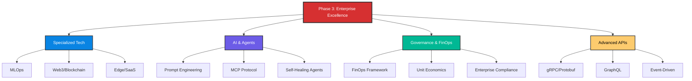

# 🚀 Phase 3: Advanced Concepts - Enterprise Excellence

> **"Where standard DevOps ends, Enterprise Engineering begins. Master the frontier of specialized technology, AI-driven operations, and global governance."**

## 🏛️ Overview

Welcome to the **final frontier** of the Advanced curriculum. Phase 3 is designed for senior engineers and architects who need to manage the most complex, specialized, and emerging landscapes in modern technology.

From **MLOps** and **Web3** to **Agentic AI** and **Global API Architectures**, this phase provides the strategic depth required to lead high-maturity engineering organizations.

## 🎯 Phase 3 Learning Objectives

By completing this phase, you will be able to:

- ✅ **Architect** production-grade MLOps pipelines for scaling intelligence.
- ✅ **Design** autonomous Agentic systems for self-healing infrastructure.
- ✅ **Implement** global FinOps governance to align engineering with business value.
- ✅ **Master** advanced communication protocols (gRPC, GraphQL, MCP) at scale.
- ✅ **Secure** decentralized blockchain infrastructure and specialized Web3 stacks.

---

## 🗺️ Curriculum Structure

---

## 📖 Module Directory

### 🟢 1. Frontier Technologies

Explore the operations side of specialized engineering fields.

- **[Specialized Tech (MLOps, Web3, SaaS)](./11-Specialized-Tech/README.md)**
- **[Blockchain Ops & Security](./14-Blockchain/README.md)**

### 🟡 2. AI-Native DevOps

Master the integration of Large Language Models and Agents into the SDLC.

- **[Prompt Engineering for Agents](./12-Prompt-Engineering/README.md)**
- **[Model Context Protocol (MCP)](./13-MCP/README.md)**

### 🔴 3. Enterprise Strategy

Align technical excellence with organizational and financial goals.

- **[Enterprise FinOps](./15-FinOps/README.md)**
- **[Advanced API Architectures](./16-Advanced-API-Architectures/README.md)**

---

## 📊 Phase Progress

- [x] **Specialized Tech** (3/3 Completed)
- [x] **AI-Driven Ops** (2/2 Completed)
- [x] **FinOps & Governance** (5/5 Completed)
- [x] **API Architectures** (1/1 Completed)

**Total Completion**: 100% ⬛⬛⬛⬛⬛⬛⬛⬛⬛⬛

---

## 🔗 Quick Links

- 📘 **[Full Master Index](./PHASE_3_MASTER_INDEX.md)** - Detailed topic breakdown and time estimates.
- 🎓 **[Certification Path](../README.md)** - How Phase 3 fits into your professional growth.
- 🤝 **[Contribution Guide](../README.md)** - Help us expand the frontier.

**Ready to reach the pinnacle? Start with [Specialized Tech](./11-Specialized-Tech/README.md) or [FinOps](./15-FinOps/README.md)!** 🚀
