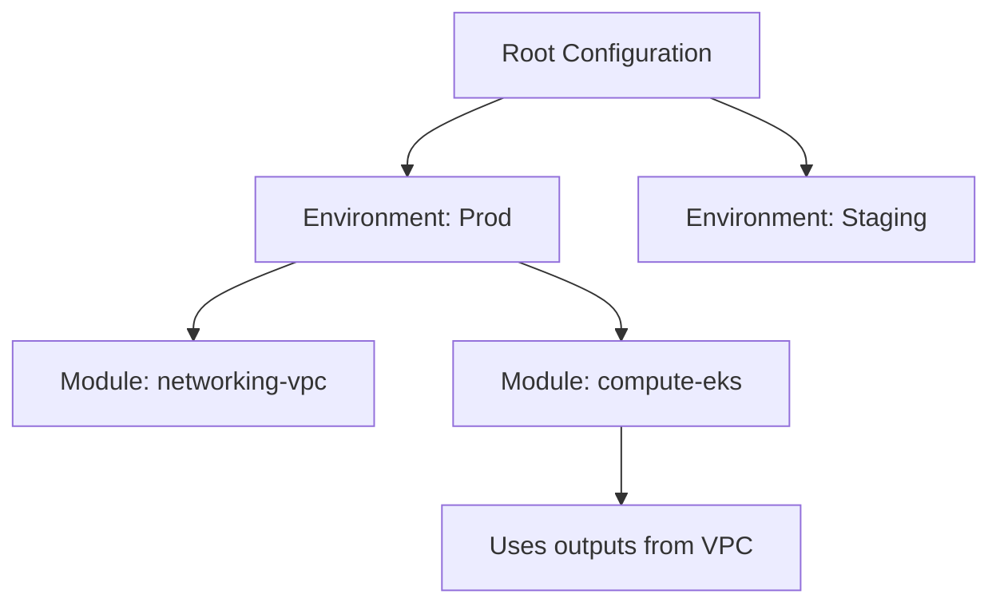
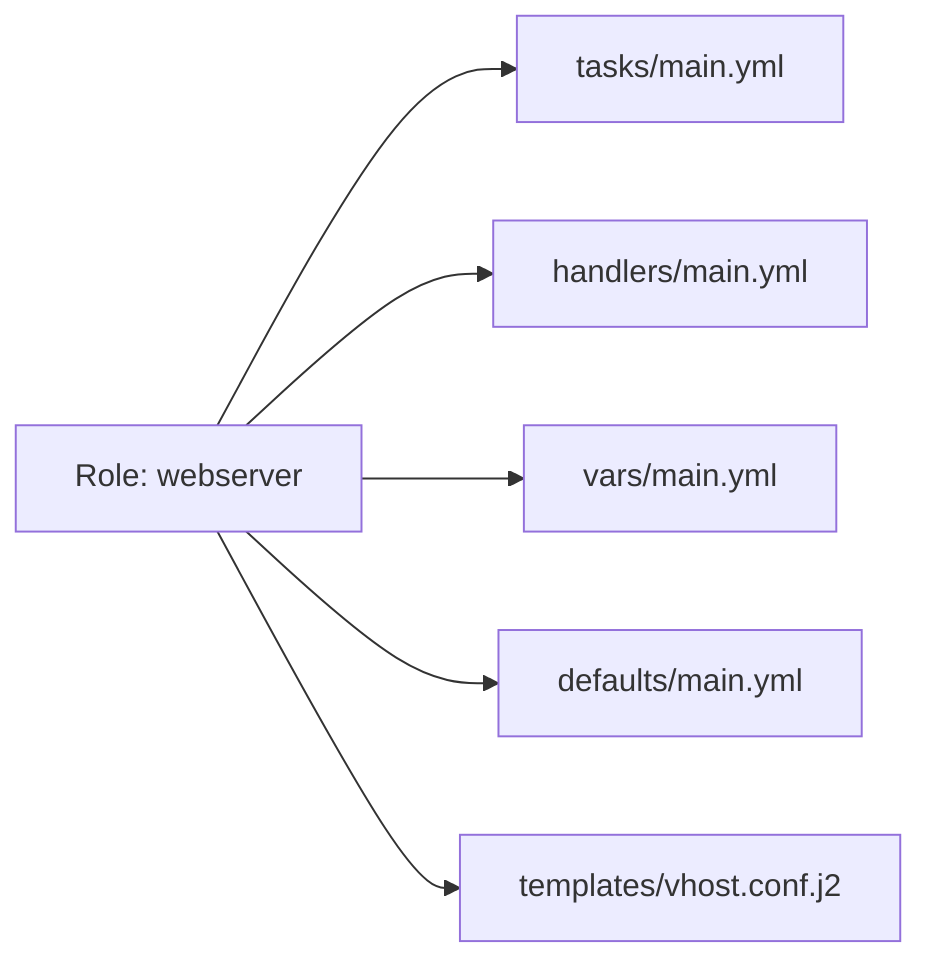

# Advanced Automation: Scaling Infrastructure & Config

Automation is more than just script execution; it's about building resilient, modular, and maintainable systems. This module focuses on enterprise-grade patterns for Ansible and Terraform.

---

## 🏗️ Advanced Terraform (Infrastructure as Code)

### Module Hierarchy Strategy
Instead of a single flat file, production Terraform is organized into a hierarchy to enable reuse and blast-radius isolation.



### Remote State locking
Multiple engineers cannot run `terraform apply` at the same time without risking state corruption.

**Example S3 Backend + DynamoDB Locking:**
```hcl
terraform {
  backend "s3" {
    bucket         = "my-enterprise-tf-state"
    key            = "global/s3/terraform.tfstate"
    region         = "us-east-1"
    dynamodb_table = "terraform-locks"
    encrypt        = true
  }
}
```

---

## ⚙️ Advanced Ansible (Configuration Management)

### Role Structure Architecture
Roles allow you to package variables, tasks, and templates into a logical unit.



### Complex Logic & Filters
Using advanced loops and conditional filters to manage complex system states.

**Example Dynamic Loop with Filter:**
```yaml
- name: Ensure specific users exist with custom shells
  ansible.builtin.user:
    name: "{{ item.name }}"
    shell: "{{ item.shell | default('/bin/bash') }}"
    groups: "wheel"
  loop: "{{ users }}"
  when: item.enabled | default(true)
```

---

## 💡 Key Philosophies
1. **DRY (Don't Repeat Yourself)**: If you use the same config twice, it belongs in a module.
2. **Immutability**: Prefer replacing infrastructure (Terraform) over patching it (Ansible) for core components.
3. **Automated Testing**: Use tools like `tflint`, `ansible-lint`, and `molecule` to verify your code before it hits production.

---
**EKS Automation**: See how these tools combine to build managed Kubernetes clusters in the [Advanced K8s Module](../03-Advanced-K8s/README.md).
