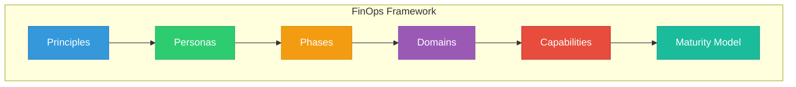
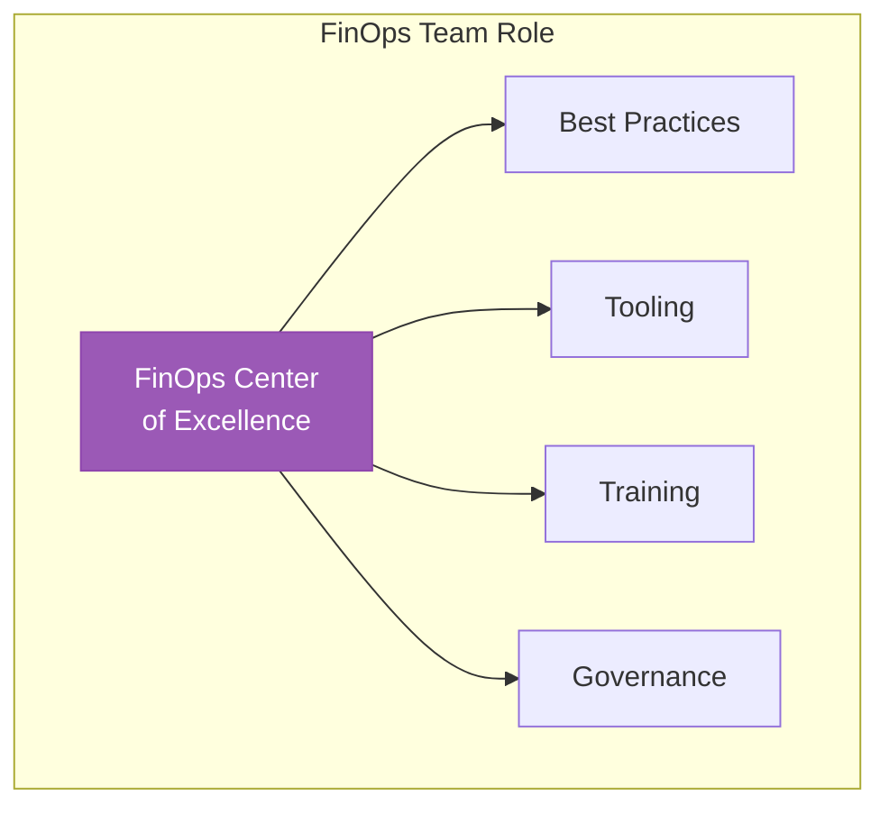
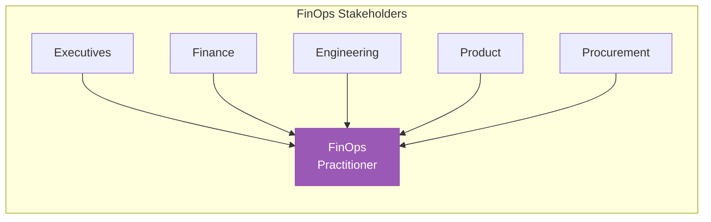
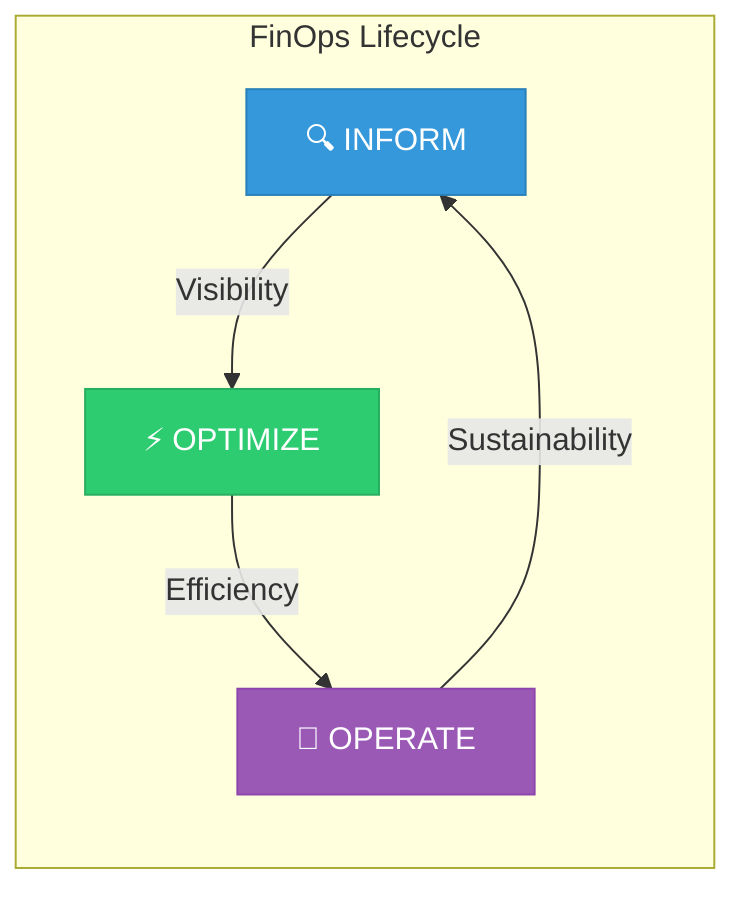
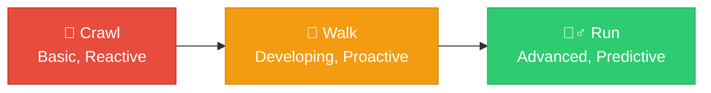
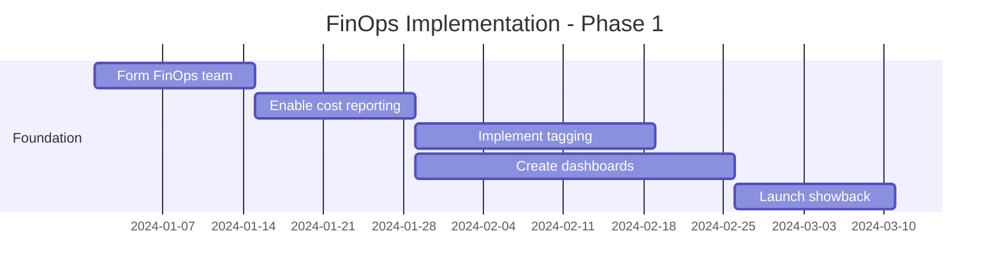

# Lesson 01: FinOps Framework Deep Dive

## Learning Objectives

By the end of this lesson, you will:
- Master the FinOps Foundation framework
- Understand all FinOps domains and capabilities
- Assess organizational FinOps maturity
- Design a FinOps implementation roadmap

---

## The FinOps Foundation Framework

The FinOps Foundation provides a vendor-neutral, industry standard framework for cloud financial management.

---

## The Six FinOps Principles

### 1. Teams Need to Collaborate

Cloud cost management requires cross-functional collaboration:

| Team | Contribution |
|------|--------------|
| **Engineering** | Technical optimization, implementation |
| **Finance** | Budgeting, forecasting, reporting |
| **Product** | Feature prioritization, business value |
| **Executive** | Strategic direction, investment |

### 2. Everyone Takes Ownership for Cloud Usage

- Decentralized decision-making
- Team-level accountability
- Cost visibility to all stakeholders

### 3. A Centralized Team Drives FinOps

### 4. Reports Should Be Accessible and Timely

| Requirement | Standard |
|-------------|----------|
| **Latency** | <24 hours for cost data |
| **Accuracy** | >95% allocation accuracy |
| **Access** | Self-service for all teams |
| **Format** | Multiple views (executive, technical, financial) |

### 5. Decisions Are Driven by Business Value

Cost optimization must consider:
- Revenue impact
- Customer experience
- Time to market
- Technical debt
- Risk tolerance

### 6. Take Advantage of the Variable Cost Model

| Cloud Benefit | FinOps Practice |
|---------------|-----------------|
| Pay-as-you-go | Right-size continuously |
| Scale on demand | Use auto-scaling |
| No upfront cost | Experiment freely |
| Global reach | Optimize regions |

---

## FinOps Personas

### Primary Personas

| Persona | Focus | Key Metrics |
|---------|-------|-------------|
| **Executive** | Strategic investment | Cloud ROI, cost trends |
| **Finance** | Budgeting, forecasting | Variance, accuracy |
| **Engineering** | Technical efficiency | Unit cost, waste |
| **Product Owner** | Feature value | Cost per feature |
| **Procurement** | Vendor management | Commitment savings |
| **FinOps Practitioner** | All of the above | Practice maturity |

---

## The Three Phases of FinOps

### Phase 1: Inform

Build visibility and understanding of cloud costs.

| Capability | Activities | Outcomes |
|------------|------------|----------|
| **Data Ingestion** | Collect billing data | Unified cost view |
| **Allocation** | Tag and categorize | Cost by team/project |
| **Reporting** | Build dashboards | Cost awareness |
| **Benchmarking** | Compare to standards | Performance gaps |

### Phase 2: Optimize

Take action to improve cloud efficiency.

| Capability | Activities | Outcomes |
|------------|------------|----------|
| **Rate Optimization** | Purchase commitments | Reduced unit costs |
| **Usage Optimization** | Right-size, cleanup | Reduced consumption |
| **Architecture** | Design for cost | Structural efficiency |

### Phase 3: Operate

Institutionalize FinOps practices.

| Capability | Activities | Outcomes |
|------------|------------|----------|
| **Governance** | Policies, controls | Consistent behavior |
| **Automation** | Auto-actions | Scalable operations |
| **Culture** | Training, incentives | Sustainable practice |

---

## FinOps Domains

The framework defines six domains of practice:

### Domain 1: Understanding Cloud Usage & Cost

| Capability | Description |
|------------|-------------|
| **Data Ingestion** | Collect and normalize billing data |
| **Cost Allocation** | Assign costs to business units |
| **Shared Cost Management** | Handle common infrastructure |
| **Data Analysis & Showback** | Analyze and report costs |

### Domain 2: Performance Tracking & Benchmarking

| Capability | Description |
|------------|-------------|
| **Measuring Unit Costs** | Cost per business transaction |
| **Forecasting** | Predict future spending |
| **Budget Management** | Track against targets |
| **Trending & Anomalies** | Identify patterns |

### Domain 3: Real-Time Decision Making

| Capability | Description |
|------------|-------------|
| **Anomaly Management** | Detect and respond to issues |
| **Decision Making** | Enable informed choices |
| **Query Optimization** | Optimize data access costs |

### Domain 4: Cloud Rate Optimization

| Capability | Description |
|------------|-------------|
| **Commitment Management** | RI/SP purchasing |
| **Discount Optimization** | Negotiate and apply discounts |
| **Pricing Model Selection** | Choose right pricing |

### Domain 5: Cloud Usage Optimization

| Capability | Description |
|------------|-------------|
| **Resource Optimization** | Right-sizing |
| **Workload Management** | Scheduling, auto-scaling |
| **Sustainability** | Carbon efficiency |

### Domain 6: Organizational Alignment

| Capability | Description |
|------------|-------------|
| **FinOps Practice** | Team structure, processes |
| **FinOps Education** | Training and enablement |
| **Cloud Policy & Governance** | Standards and controls |

---

## Maturity Assessment

### Maturity Levels

### Maturity by Capability

| Capability | Crawl | Walk | Run |
|------------|-------|------|-----|
| **Data Ingestion** | Manual export | Automated daily | Real-time API |
| **Allocation** | Basic tags | Multi-dimensional | Automated enforcement |
| **Forecasting** | Spreadsheet | Trend-based | ML-powered |
| **Optimization** | Ad-hoc | Scheduled reviews | Autonomous |
| **Governance** | Guidelines | Policies | Automated controls |
| **Culture** | Central team | Shared awareness | Embedded practice |

### Self-Assessment Tool

Rate each capability 1-5:

| Capability | Score (1-5) | Evidence |
|------------|-------------|----------|
| Data Ingestion | | |
| Cost Allocation | | |
| Forecasting | | |
| Optimization | | |
| Governance | | |
| Culture | | |
| **Average** | | |

**Interpretation:**
- 1-2: Crawl stage
- 3: Walk stage
- 4-5: Run stage

---

## Implementation Roadmap

### Month 1-3: Foundation (Crawl)

### Month 4-6: Maturation (Walk)

- Refine tagging coverage (>90%)
- Implement shared cost allocation
- Purchase initial commitments
- Automate common optimizations

### Month 7-12: Excellence (Run)

- Real-time cost visibility
- ML-powered forecasting
- Automated governance
- Embedded FinOps culture

---

## Key Success Factors

| Factor | Description |
|--------|-------------|
| **Executive Sponsorship** | VP+ level support |
| **Cross-functional Team** | Engineering + Finance + Product |
| **Quick Wins** | Show value in first 90 days |
| **Education** | Regular training for all teams |
| **Tooling** | Right tools for the organization |

---

## Hands-On Exercise

### Exercise 1: Maturity Assessment

Complete a maturity assessment for your organization:
1. Rate each capability 1-5
2. Calculate average score
3. Identify top 3 gaps

### Exercise 2: Roadmap Planning

Create a 6-month implementation roadmap:
1. Define current state (Crawl/Walk/Run)
2. Set target state
3. Identify key initiatives

### Exercise 3: Stakeholder Mapping

Map your organization's FinOps stakeholders:
1. Identify all personas
2. Assess current engagement level
3. Plan communication strategy

---

## Key Takeaways

- ✅ The FinOps Framework provides structure for cloud financial management
- ✅ Six principles guide FinOps practice
- ✅ Three phases: Inform → Optimize → Operate
- ✅ Maturity progression: Crawl → Walk → Run
- ✅ Success requires cross-functional collaboration

---

## Next Lesson

Continue to **[Lesson 02: Multi-Cloud FinOps](../02-Multi-Cloud-FinOps/README.md)** to learn strategies for managing costs across cloud providers.
