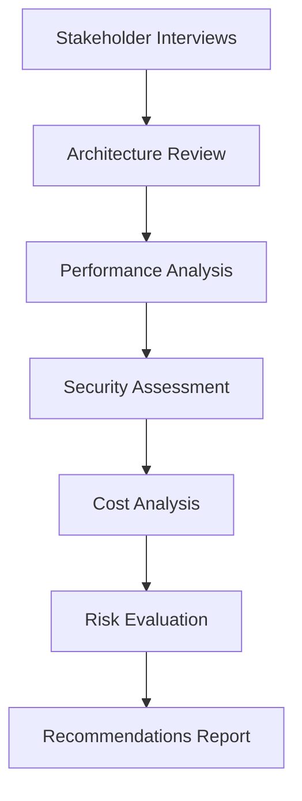
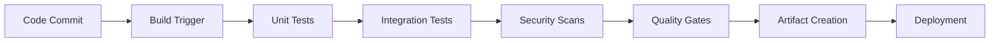
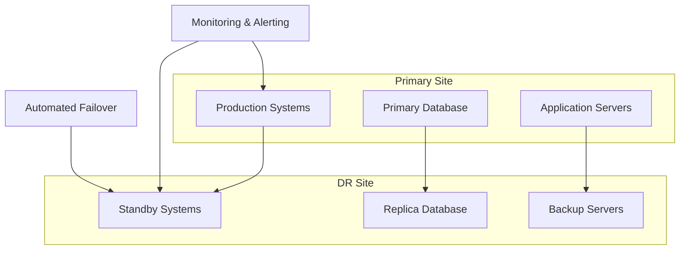
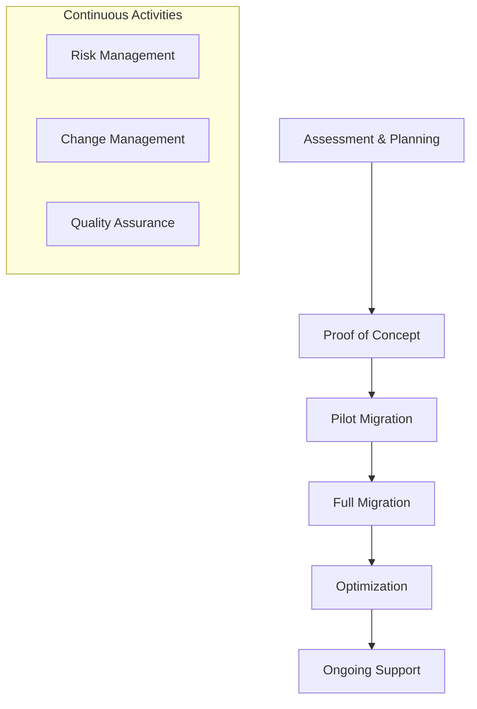

# 🏗️ Professional Services & Consulting - Comprehensive Guide
*Transform Your DevOps Expertise into High-Value Consulting Services*

---

## 📊 Market Overview & Opportunity

The DevOps consulting market is experiencing unprecedented growth, with global spending projected to reach **$25 billion by 2028**. Mid-career professionals with 5+ years of experience can command **$150-400/hour** for specialized consulting services.

### Market Drivers
- **Digital Transformation**: 87% of enterprises accelerating cloud adoption
- **Skills Gap**: 3.5 million unfilled cybersecurity and DevOps positions globally
- **Cost Optimization**: Companies seeking 30-60% cloud cost reductions
- **Compliance Requirements**: SOC2, HIPAA, PCI-DSS automation needs

---

## 🎯 1. High-End Freelance Consulting

### **Service Overview**
Premium technical consulting for complex infrastructure challenges that require deep expertise and proven methodologies.

### **Target Market**
- **Series B-D Startups**: $10M-100M ARR companies scaling rapidly
- **Mid-Market Enterprises**: 500-5000 employees with legacy systems
- **Private Equity Portfolio**: Companies undergoing digital transformation

### **Service Packages & Pricing**

#### **Package 1: Technical Architecture Review**
**Duration**: 2-3 weeks  
**Price**: $15,000-35,000  
**Deliverables**:
- Current state architecture assessment
- Future state architecture design
- Migration roadmap with risk analysis
- Technology stack recommendations
- Security and compliance gap analysis

**Example Engagement**:
```
Client: Series C SaaS company (200 engineers)
Challenge: Monolithic application causing deployment bottlenecks
Solution: Microservices decomposition strategy
Result: 10x faster deployments, 40% cost reduction
Fee: $28,000 (2.5 weeks)
```

#### **Package 2: Complex Migration Services**
**Duration**: 3-6 months  
**Price**: $75,000-250,000  
**Deliverables**:
- Migration strategy and planning
- Infrastructure as Code implementation
- CI/CD pipeline modernization
- Team training and knowledge transfer
- Post-migration optimization

**Specialization Areas**:
- **Monolith to Microservices**: Breaking down legacy applications
- **On-Premise to Cloud**: AWS/Azure/GCP migrations
- **Multi-Cloud Strategy**: Vendor diversification and optimization
- **Legacy Modernization**: Mainframe to modern cloud architectures

### **Implementation Strategy**

#### **Phase 1: Discovery & Assessment (Week 1-2)**


**Tools & Methodologies**:
- **Architecture Documentation**: Lucidchart, Draw.io, Miro
- **Performance Monitoring**: New Relic, Datadog, Prometheus
- **Security Scanning**: Qualys, Nessus, AWS Inspector
- **Cost Analysis**: CloudHealth, Cloudability, native cloud tools

#### **Phase 2: Solution Design (Week 3-4)**
- **Target Architecture**: Cloud-native, microservices-based design
- **Technology Selection**: Best-of-breed tools for client's specific needs
- **Migration Strategy**: Phased approach with minimal business disruption
- **Risk Mitigation**: Rollback plans and disaster recovery procedures

#### **Phase 3: Implementation Planning (Week 5-6)**
- **Project Timeline**: Detailed Gantt chart with dependencies
- **Resource Requirements**: Team structure and skill requirements
- **Budget Planning**: Detailed cost breakdown and ROI projections
- **Success Metrics**: KPIs and measurement frameworks

---

## 🔍 2. Infrastructure & Security Audits

### **Service Overview**
Comprehensive evaluation of cloud infrastructure, security posture, and operational practices with actionable recommendations.

### **Audit Framework**

#### **Infrastructure Audit Components**
1. **Architecture Review**
   - High availability and disaster recovery
   - Scalability and performance optimization
   - Cost efficiency and resource utilization
   - Compliance with industry best practices

2. **Security Assessment**
   - Identity and access management (IAM)
   - Network security and segmentation
   - Data encryption and protection
   - Vulnerability management

3. **Operational Excellence**
   - Monitoring and alerting
   - Incident response procedures
   - Change management processes
   - Documentation and knowledge management

### **Audit Deliverables**

#### **Executive Summary Report**
- **Risk Assessment**: Critical, High, Medium, Low priority issues
- **Business Impact**: Quantified risks and potential losses
- **Investment Requirements**: Budget needed for remediation
- **Timeline**: Recommended implementation schedule

#### **Technical Deep Dive**
- **Detailed Findings**: 50-100 specific recommendations
- **Remediation Steps**: Step-by-step implementation guides
- **Code Examples**: Infrastructure as Code templates
- **Tool Recommendations**: Specific products and configurations

### **Pricing Models**

| Audit Type | Duration | Price Range | Target Client |
|------------|----------|-------------|---------------|
| **Quick Assessment** | 1 week | $8,000-15,000 | Startups, SMBs |
| **Comprehensive Audit** | 2-3 weeks | $20,000-45,000 | Mid-market |
| **Enterprise Review** | 4-6 weeks | $50,000-100,000 | Large enterprises |

### **Real-World Case Study**
```
Client: FinTech startup preparing for Series B
Challenge: Security audit required for investor due diligence
Findings: 47 security vulnerabilities, non-compliant data handling
Remediation: 90-day security improvement plan
Result: Successful funding round ($25M raised)
Consultant Fee: $32,000
Client ROI: 781x (funding secured)
```

---

## ⚙️ 3. CI/CD Pipeline Architecture

### **Service Overview**
Design and implement enterprise-grade continuous integration and deployment pipelines that enable rapid, reliable software delivery.

### **Pipeline Architecture Components**

#### **Source Code Management**
- **Git Workflow Strategy**: GitFlow, GitHub Flow, or custom branching
- **Code Quality Gates**: SonarQube, CodeClimate integration
- **Security Scanning**: SAST, DAST, dependency vulnerability checks
- **Compliance Automation**: Policy as Code with Open Policy Agent

#### **Build & Test Automation**


**Technology Stack Options**:
- **Jenkins**: Enterprise-grade with Blue Ocean UI
- **GitLab CI/CD**: Integrated DevOps platform
- **GitHub Actions**: Cloud-native with marketplace integrations
- **Azure DevOps**: Microsoft ecosystem integration
- **CircleCI**: High-performance cloud pipelines

#### **Deployment Strategies**
1. **Blue-Green Deployment**: Zero-downtime releases
2. **Canary Releases**: Gradual rollout with monitoring
3. **Feature Flags**: Runtime configuration management
4. **Rolling Updates**: Kubernetes-native deployment patterns

### **Service Packages**

#### **Starter Pipeline Package**
**Price**: $15,000-25,000  
**Timeline**: 3-4 weeks  
**Includes**:
- Basic CI/CD pipeline setup
- Automated testing integration
- Deployment to staging/production
- Team training (8 hours)

#### **Enterprise Pipeline Package**
**Price**: $45,000-75,000  
**Timeline**: 8-12 weeks  
**Includes**:
- Multi-environment pipeline architecture
- Advanced security and compliance integration
- Monitoring and observability setup
- Disaster recovery and rollback procedures
- Comprehensive team training (40 hours)

### **ROI Metrics for Clients**
- **Deployment Frequency**: From monthly to daily releases
- **Lead Time**: 90% reduction in time from code to production
- **Mean Time to Recovery**: 80% faster incident resolution
- **Change Failure Rate**: 70% reduction in production issues

---

## 💰 4. Cloud Cost Optimization (FinOps)

### **Service Overview**
Specialized consulting focused on reducing cloud spending while maintaining or improving performance and reliability.

### **FinOps Methodology**

#### **Phase 1: Cost Visibility & Analysis**
- **Spend Analysis**: Historical cost trends and patterns
- **Resource Utilization**: CPU, memory, storage efficiency
- **Waste Identification**: Unused resources and over-provisioning
- **Tagging Strategy**: Cost allocation and chargeback implementation

#### **Phase 2: Optimization Implementation**
- **Right-Sizing**: Instance and storage optimization
- **Reserved Instances**: Commitment-based discounts
- **Spot Instances**: Leveraging spare capacity
- **Auto-Scaling**: Dynamic resource adjustment

#### **Phase 3: Governance & Culture**
- **Cost Monitoring**: Real-time alerts and dashboards
- **Budget Management**: Department-level cost controls
- **FinOps Training**: Engineering team education
- **Continuous Optimization**: Ongoing improvement processes

### **Pricing Models**

#### **Performance-Based Pricing** (Recommended)
- **Assessment Fee**: $5,000-15,000 (fixed)
- **Success Fee**: 20-30% of first-year savings
- **Ongoing Management**: 10-15% of monthly savings

#### **Fixed-Fee Pricing**
- **Small Engagement**: $25,000-50,000 (3 months)
- **Medium Engagement**: $75,000-150,000 (6 months)
- **Large Engagement**: $200,000-500,000 (12 months)

### **Case Study: E-commerce Platform**
```
Client: E-commerce platform ($2M/month AWS spend)
Challenge: Rapid growth causing cost explosion
Optimization Results:
- Right-sizing: $240k/year savings
- Reserved Instances: $360k/year savings
- Spot Instances: $180k/year savings
- Storage optimization: $120k/year savings
Total Annual Savings: $900k (45% reduction)
Consultant Fee: $180k (20% of savings)
Client Net Benefit: $720k/year
```

---

## 🛡️ 5. Disaster Recovery (DR) as a Service

### **Service Overview**
Comprehensive business continuity planning and implementation to ensure minimal downtime and data loss during disasters.

### **DR Strategy Framework**

#### **Business Impact Analysis**
- **Recovery Time Objective (RTO)**: Maximum acceptable downtime
- **Recovery Point Objective (RPO)**: Maximum acceptable data loss
- **Critical System Identification**: Priority-based recovery sequence
- **Cost-Benefit Analysis**: DR investment vs. business impact

#### **DR Architecture Design**


#### **Implementation Components**
1. **Data Replication**: Real-time or near-real-time synchronization
2. **Infrastructure Automation**: IaC for rapid environment recreation
3. **Network Failover**: DNS and load balancer configuration
4. **Application Recovery**: Stateless design and container orchestration

### **Service Tiers**

#### **Basic DR Package**
**Price**: $30,000-50,000  
**RTO**: 4-8 hours  
**RPO**: 1-4 hours  
**Includes**:
- DR strategy document
- Backup and replication setup
- Basic failover procedures
- Quarterly testing

#### **Premium DR Package**
**Price**: $75,000-150,000  
**RTO**: 15-60 minutes  
**RPO**: 5-15 minutes  
**Includes**:
- Automated failover systems
- Multi-region architecture
- Continuous data replication
- Monthly testing and optimization

#### **Enterprise DR Package**
**Price**: $200,000-500,000  
**RTO**: < 15 minutes  
**RPO**: < 5 minutes  
**Includes**:
- Active-active multi-region setup
- Zero-downtime failover
- Automated recovery orchestration
- 24/7 monitoring and support

---

## 🚀 6. Migration-as-a-Service

### **Service Overview**
End-to-end migration services for complex infrastructure and application modernization projects.

### **Migration Types & Strategies**

#### **Cloud Migration Patterns**
1. **Rehost (Lift & Shift)**: Minimal changes, quick migration
2. **Replatform**: Minor optimizations for cloud benefits
3. **Refactor**: Significant architecture changes for cloud-native
4. **Rebuild**: Complete application rewrite
5. **Replace**: Migration to SaaS alternatives

#### **Migration Framework**


### **Specialized Migration Services**

#### **Legacy Mainframe Modernization**
**Complexity**: Highest  
**Duration**: 12-24 months  
**Price**: $500k-2M+  
**Challenges**:
- COBOL to modern language conversion
- Data migration and validation
- Business process reengineering
- Regulatory compliance maintenance

#### **Multi-Cloud Migration**
**Complexity**: High  
**Duration**: 6-18 months  
**Price**: $200k-800k  
**Benefits**:
- Vendor lock-in avoidance
- Cost optimization opportunities
- Improved disaster recovery
- Geographic compliance requirements

#### **Kubernetes Migration**
**Complexity**: Medium-High  
**Duration**: 3-9 months  
**Price**: $100k-400k  
**Components**:
- Containerization strategy
- Orchestration platform setup
- Service mesh implementation
- Monitoring and observability

### **Migration Success Metrics**
- **Migration Velocity**: Applications migrated per sprint
- **Downtime**: Actual vs. planned maintenance windows
- **Performance**: Before/after system performance comparison
- **Cost**: Migration budget vs. actual spend
- **Quality**: Post-migration defect rates

---

## 📈 Business Development Strategy

### **Client Acquisition Channels**

#### **Inbound Marketing**
- **Content Marketing**: Technical blog posts and case studies
- **SEO Optimization**: Target keywords like "DevOps consultant" + location
- **Social Proof**: LinkedIn recommendations and testimonials
- **Speaking Engagements**: Conference presentations and webinars

#### **Outbound Sales**
- **LinkedIn Outreach**: Targeted messaging to CTOs and VPs of Engineering
- **Cold Email Campaigns**: Personalized value propositions
- **Referral Program**: Incentivize existing clients for introductions
- **Partnership Network**: Collaborate with complementary service providers

### **Proposal & Contracting**

#### **Proposal Structure**
1. **Executive Summary**: Problem statement and proposed solution
2. **Scope of Work**: Detailed deliverables and timeline
3. **Methodology**: Proven frameworks and best practices
4. **Team & Credentials**: Consultant background and case studies
5. **Investment & ROI**: Pricing and expected business benefits

#### **Contract Templates**
- **Master Services Agreement (MSA)**: Framework for ongoing relationship
- **Statement of Work (SOW)**: Project-specific terms and deliverables
- **Non-Disclosure Agreement (NDA)**: Confidentiality protection
- **Intellectual Property**: Ownership and usage rights

### **Scaling Your Practice**

#### **Team Building**
- **Senior Associates**: Experienced practitioners for complex projects
- **Junior Consultants**: Recent graduates for implementation work
- **Specialized Partners**: Security, compliance, and industry experts
- **Offshore Resources**: Cost-effective development and testing

#### **Service Productization**
- **Standardized Methodologies**: Repeatable frameworks and processes
- **Tool Development**: Custom scripts and automation platforms
- **Training Programs**: Client education and certification
- **Managed Services**: Ongoing support and optimization

---

## 🎯 Success Metrics & KPIs

### **Financial Metrics**
- **Monthly Recurring Revenue (MRR)**: Predictable income stream
- **Average Deal Size**: Project value trends
- **Client Lifetime Value (CLV)**: Long-term relationship value
- **Profit Margins**: Service profitability analysis

### **Operational Metrics**
- **Utilization Rate**: Billable hours percentage
- **Project Success Rate**: On-time, on-budget delivery
- **Client Satisfaction**: NPS scores and testimonials
- **Referral Rate**: New business from existing clients

### **Growth Metrics**
- **Pipeline Value**: Qualified opportunities in sales process
- **Conversion Rate**: Proposal to contract success rate
- **Market Share**: Position in target market segments
- **Brand Recognition**: Industry visibility and thought leadership

---

**Next Steps**: Ready to launch your consulting practice? Start with the [Getting Started Guide](./Getting-Started.md) for a detailed 90-day implementation plan.