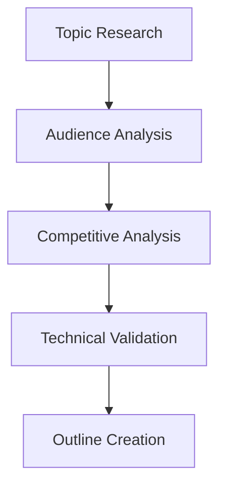
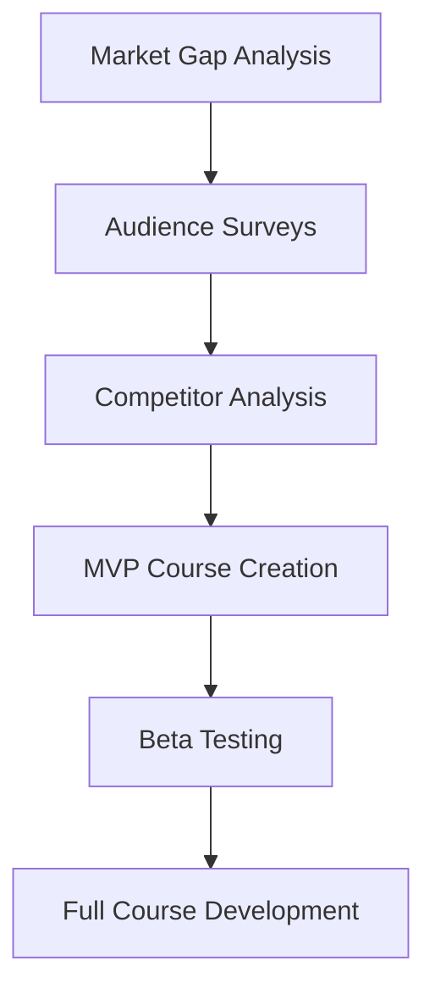
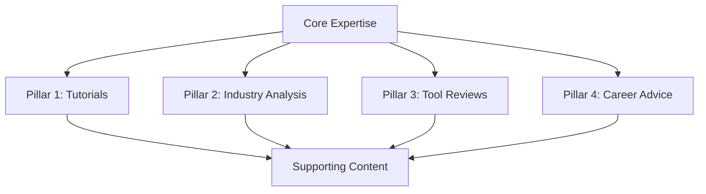
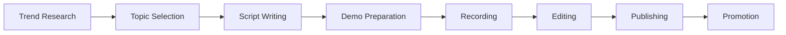
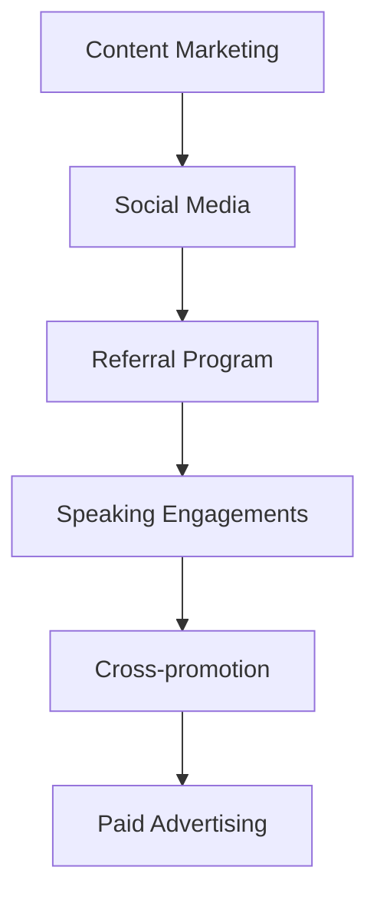

# 📝 Content Creation & Education - Comprehensive Guide
*Scale Your DevOps Knowledge Through Strategic Content Monetization*

---

## 📊 Market Overview & Revenue Potential

The technical content creation market has exploded, with top DevOps educators earning **$500k-2M+ annually**. The global e-learning market is projected to reach **$1 trillion by 2027**, with technical content commanding premium pricing.

### Market Opportunities
- **Technical Writing**: $300-2,000 per article
- **Online Courses**: $50k-500k annual revenue per course
- **YouTube Channels**: $10k-100k+ monthly ad revenue
- **Premium Newsletters**: $50k-300k annual subscription revenue
- **E-books & Guides**: $25k-200k in passive income

---

## ✍️ 1. Paid Technical Writing

### **Market Analysis**
Technical writing for DevOps content is experiencing unprecedented demand, with companies paying premium rates for high-quality, actionable content that drives developer adoption.

### **Target Publications & Rates**

| Publication | Rate Range | Content Type | Audience |
|-------------|------------|--------------|----------|
| **DigitalOcean Community** | $300-600 | Tutorials, guides | 40M+ developers |
| **HashiCorp Blog** | $500-1,200 | Product tutorials | Enterprise DevOps |
| **CircleCI Blog** | $400-800 | CI/CD best practices | 30k+ companies |
| **AWS Blog** | $800-2,000 | Architecture patterns | Global enterprise |
| **Red Hat Developer** | $600-1,500 | Open source guides | Enterprise Linux |
| **Docker Blog** | $500-1,000 | Containerization | 13M+ developers |

### **Content Categories & Pricing**

#### **Tutorial Articles** ($300-800)
- **Step-by-step guides**: Implementation tutorials with code examples
- **Best practices**: Industry-standard approaches and methodologies
- **Tool comparisons**: Objective analysis of competing solutions
- **Troubleshooting guides**: Common problems and solutions

**Example Topics**:
- "Implementing GitOps with ArgoCD: A Complete Guide"
- "Kubernetes Security Best Practices for Production"
- "Terraform vs. Pulumi: A Comprehensive Comparison"

#### **Architecture Deep Dives** ($800-1,500)
- **System design**: Large-scale architecture patterns
- **Case studies**: Real-world implementation stories
- **Performance optimization**: Scaling and efficiency improvements
- **Security architecture**: Zero-trust and defense-in-depth strategies

#### **Thought Leadership** ($1,000-2,000)
- **Industry trends**: Future of DevOps and emerging technologies
- **Strategic insights**: Business impact of technical decisions
- **Innovation stories**: Cutting-edge implementations and results

### **Writing Process & Quality Standards**

#### **Research Phase** (20% of time)

**Research Tools**:
- **Google Trends**: Topic popularity and seasonality
- **Ahrefs/SEMrush**: Keyword research and competition
- **Stack Overflow**: Developer pain points and questions
- **GitHub**: Code examples and implementation patterns

#### **Writing Phase** (60% of time)
- **Hook**: Compelling introduction with clear value proposition
- **Structure**: Logical flow with clear headings and subheadings
- **Code Examples**: Working, tested code snippets
- **Visuals**: Diagrams, screenshots, and architecture drawings
- **Conclusion**: Actionable next steps and additional resources

#### **Review Phase** (20% of time)
- **Technical Review**: Code testing and validation
- **Editorial Review**: Grammar, style, and clarity
- **SEO Optimization**: Keyword integration and meta descriptions
- **Final Polish**: Formatting and visual enhancements

### **Building Your Writing Portfolio**

#### **Phase 1: Foundation Building** (Months 1-3)
- **Personal Blog**: 10-15 high-quality articles
- **Guest Posts**: 5-8 articles on medium-tier publications
- **Social Media**: LinkedIn articles and Twitter threads
- **GitHub**: Code repositories supporting your articles

#### **Phase 2: Premium Placements** (Months 4-6)
- **Tier 1 Publications**: Target top-paying platforms
- **Series Development**: Multi-part article series
- **Video Content**: Supplement articles with video tutorials
- **Speaking Engagements**: Conference presentations based on articles

#### **Phase 3: Thought Leadership** (Months 7-12)
- **Industry Analysis**: Trend prediction and market insights
- **Original Research**: Surveys and data-driven content
- **Book Proposal**: Leverage articles into book deals
- **Consulting Leads**: Convert readers into high-value clients

### **Revenue Optimization Strategies**

#### **Rate Negotiation Framework**
1. **Research Market Rates**: Know industry standards
2. **Demonstrate Value**: Show traffic and engagement metrics
3. **Package Deals**: Offer series discounts for multiple articles
4. **Performance Bonuses**: Negotiate based on article performance
5. **Exclusive Partnerships**: Higher rates for publication exclusivity

#### **Scaling Your Writing Business**
- **Content Templates**: Standardized structures for efficiency
- **Research Assistants**: Outsource initial research and fact-checking
- **Editor Network**: Professional editing for premium quality
- **Content Calendar**: Strategic planning for maximum impact

---

## 🎓 2. Comprehensive Online Courses

### **Market Analysis**
The online course market for technical content has matured, with successful DevOps courses generating **$50k-500k annually**. Success requires deep expertise, excellent production quality, and strategic marketing.

### **Platform Analysis & Revenue Models**

| Platform | Revenue Share | Audience | Best For |
|----------|---------------|----------|----------|
| **Udemy** | 50% (organic) / 25% (paid ads) | 57M+ students | Broad market reach |
| **Pluralsight** | Royalty-based | Enterprise learners | Professional development |
| **A Cloud Guru** | Revenue share | Cloud professionals | Certification prep |
| **Linux Academy** | Licensing fees | System administrators | Hands-on labs |
| **Your Own Platform** | 95% (after payment processing) | Direct audience | Maximum control |

### **Course Development Framework**

#### **Market Research & Validation**

**Validation Methods**:
- **Pre-sales**: Gauge demand before full development
- **Beta Cohorts**: Small groups for feedback and testimonials
- **Community Polls**: LinkedIn and Reddit audience research
- **Keyword Research**: Search volume for course topics

#### **Course Structure & Content Design**

**Beginner Course Template** (8-12 hours)
1. **Introduction & Setup** (1 hour)
2. **Fundamentals** (3-4 hours)
3. **Hands-on Projects** (4-6 hours)
4. **Best Practices** (1-2 hours)
5. **Next Steps & Resources** (30 minutes)

**Advanced Course Template** (15-25 hours)
1. **Prerequisites Review** (1 hour)
2. **Advanced Concepts** (5-8 hours)
3. **Real-world Projects** (8-12 hours)
4. **Enterprise Patterns** (2-3 hours)
5. **Troubleshooting & Optimization** (1-2 hours)

#### **Production Quality Standards**

**Video Production**:
- **4K Resolution**: Future-proof content quality
- **Professional Audio**: Lavalier microphone and audio processing
- **Screen Recording**: High-resolution with clear annotations
- **Editing**: Professional cuts, transitions, and graphics

**Supplementary Materials**:
- **Code Repositories**: Complete, working examples
- **Slide Decks**: Professional presentation materials
- **Cheat Sheets**: Quick reference guides
- **Practice Challenges**: Hands-on learning reinforcement

### **Successful Course Examples & Revenue**

#### **"Kubernetes for DevOps Engineers"**
- **Platform**: Udemy + Own site
- **Students**: 25,000+
- **Revenue**: $180k annually
- **Content**: 20 hours, 15 hands-on projects
- **Success Factors**: Practical focus, regular updates, community engagement

#### **"Advanced Terraform Patterns"**
- **Platform**: Pluralsight + Corporate training
- **Students**: 8,000+
- **Revenue**: $320k annually
- **Content**: 35 hours, enterprise case studies
- **Success Factors**: Deep expertise, real-world examples, certification alignment

### **Marketing & Launch Strategy**

#### **Pre-Launch** (3 months before)
- **Content Marketing**: Blog posts and tutorials
- **Email List Building**: Lead magnets and free resources
- **Social Media**: Behind-the-scenes content creation
- **Influencer Outreach**: Industry expert endorsements

#### **Launch Week**
- **Product Hunt**: Technology product showcase
- **Social Media Blitz**: Coordinated announcement campaign
- **Email Campaign**: Segmented audience targeting
- **Webinar Series**: Free preview sessions

#### **Post-Launch**
- **Student Feedback**: Continuous improvement based on reviews
- **Content Updates**: Keep material current with technology changes
- **Community Building**: Discord/Slack groups for students
- **Upselling**: Advanced courses and consulting services

---

## 📝 3. Niche Technical Blogging

### **Blog Monetization Strategies**

#### **Advertising Revenue**
- **Google AdSense**: $2-5 per 1,000 pageviews
- **Carbon Ads**: $8-15 per 1,000 pageviews (developer-focused)
- **Direct Sponsorships**: $500-5,000 per sponsored post
- **Newsletter Sponsorships**: $1,000-10,000 per issue

#### **Affiliate Marketing**
- **Cloud Providers**: 5-15% commission on referrals
- **Tool Subscriptions**: $50-500 per enterprise signup
- **Book Recommendations**: 4-8% commission on technical books
- **Course Affiliates**: 30-50% commission on course sales

#### **Premium Content**
- **Membership Tiers**: $10-50/month for exclusive content
- **Consulting Leads**: $10k-100k+ project value
- **Speaking Opportunities**: $2k-15k per conference presentation
- **Book Deals**: $10k-100k+ advance payments

### **Content Strategy Framework**

#### **Pillar Content Strategy**

**Content Calendar Planning**:
- **Monday**: Tutorial/How-to content
- **Wednesday**: Industry news and analysis
- **Friday**: Tool reviews and comparisons
- **Monthly**: In-depth case studies
- **Quarterly**: Industry trend reports

#### **SEO Optimization Strategy**

**Keyword Research**:
- **Primary Keywords**: High-volume, medium competition
- **Long-tail Keywords**: Specific, actionable queries
- **Semantic Keywords**: Related terms and concepts
- **Local Keywords**: Geographic targeting when relevant

**Content Optimization**:
- **Title Tags**: Compelling and keyword-rich
- **Meta Descriptions**: Clear value propositions
- **Header Structure**: Logical H1-H6 hierarchy
- **Internal Linking**: Strategic cross-referencing
- **Image Optimization**: Alt text and file naming

### **Successful Blog Case Studies**

#### **"The DevOps Engineer's Handbook"**
- **Monthly Visitors**: 150k+
- **Revenue**: $25k/month
- **Monetization**: Ads, affiliates, consulting leads
- **Success Factors**: Consistent publishing, practical focus, community engagement

#### **"Cloud Cost Optimization Weekly"**
- **Monthly Visitors**: 75k+
- **Revenue**: $40k/month
- **Monetization**: Premium newsletter, consulting, sponsorships
- **Success Factors**: Niche expertise, data-driven insights, executive audience

---

## 📺 4. Educational YouTube Channel

### **YouTube Monetization Ecosystem**

#### **Revenue Streams**
- **AdSense Revenue**: $1-5 per 1,000 views
- **Channel Memberships**: $5-50/month per member
- **Super Chat/Thanks**: $1-100 per donation
- **Sponsored Content**: $1,000-20,000 per video
- **Affiliate Marketing**: $500-10,000 per month
- **Course Sales**: $5k-50k+ per launch

#### **Channel Growth Strategy**

**Content Pillars**:
1. **Tutorial Tuesdays**: Step-by-step technical guides
2. **Tool Thursday**: Product reviews and comparisons
3. **Weekend Projects**: End-to-end implementations
4. **Live Streams**: Q&A and real-time problem solving

**Optimization Tactics**:
- **Thumbnail Design**: High-contrast, readable text
- **Title Optimization**: Keyword-rich, curiosity-driven
- **Description SEO**: Detailed summaries with timestamps
- **End Screens**: Strategic calls-to-action
- **Playlists**: Organized content series

### **Production Workflow**

#### **Content Planning** (Weekly)

**Equipment & Software**:
- **Camera**: Sony A7 III or equivalent DSLR
- **Microphone**: Shure SM7B or Audio-Technica AT2020
- **Lighting**: Softbox lighting kit
- **Screen Recording**: OBS Studio or Camtasia
- **Editing**: Final Cut Pro or Adobe Premiere Pro

#### **Successful Channel Examples**

**"DevOps Toolkit"**
- **Subscribers**: 85k+
- **Monthly Views**: 500k+
- **Revenue**: $15k/month
- **Content**: Kubernetes, Docker, CI/CD tutorials
- **Success Factors**: Consistent uploads, practical demos, community engagement

**"Cloud Native News"**
- **Subscribers**: 45k+
- **Monthly Views**: 300k+
- **Revenue**: $25k/month
- **Content**: Weekly news, tool reviews, interviews
- **Success Factors**: Timely content, industry connections, premium sponsors

---

## 📚 5. Technical E-books & Guides

### **E-book Market Analysis**

#### **Pricing Strategies**
- **Short Guides** (20-50 pages): $9-29
- **Comprehensive Books** (100-300 pages): $39-99
- **Premium Packages**: $99-299 (book + video + templates)
- **Enterprise Licenses**: $500-5,000 per organization

#### **Distribution Platforms**

| Platform | Revenue Share | Audience | Best For |
|----------|---------------|----------|----------|
| **Amazon Kindle** | 35-70% | General public | Broad reach |
| **Gumroad** | 5-10% fee | Tech audience | Direct sales |
| **Leanpub** | 10% fee | Developers | In-progress books |
| **Your Website** | 97% (after payment) | Direct audience | Maximum profit |

### **E-book Development Process**

#### **Topic Validation & Research**
- **Market Gap Analysis**: Identify underserved topics
- **Audience Surveys**: Validate demand and pricing
- **Competitor Analysis**: Differentiation opportunities
- **Expert Interviews**: Industry insights and quotes

#### **Content Structure Templates**

**Technical Guide Template**:
1. **Introduction & Problem Statement**
2. **Prerequisites & Setup**
3. **Core Concepts** (3-5 chapters)
4. **Practical Implementation** (hands-on examples)
5. **Advanced Topics & Best Practices**
6. **Troubleshooting & FAQ**
7. **Resources & Next Steps**

**Case Study Template**:
1. **Executive Summary**
2. **Business Challenge**
3. **Technical Solution**
4. **Implementation Process**
5. **Results & Metrics**
6. **Lessons Learned**
7. **Replication Guide**

### **Successful E-book Examples**

#### **"The Terraform Production Checklist"**
- **Pages**: 85
- **Price**: $49
- **Sales**: 2,500+ copies
- **Revenue**: $122k
- **Success Factors**: Practical checklists, real-world examples, regular updates

#### **"Kubernetes Security Patterns"**
- **Pages**: 150
- **Price**: $79
- **Sales**: 1,200+ copies
- **Revenue**: $95k
- **Success Factors**: Niche expertise, enterprise focus, comprehensive coverage

---

## 📧 6. Premium Newsletters

### **Newsletter Monetization Models**

#### **Subscription Tiers**
- **Free Tier**: Basic content, lead generation
- **Premium Tier**: $10-50/month, exclusive insights
- **Enterprise Tier**: $100-500/month, custom research
- **Sponsorship Revenue**: $500-10,000 per issue

#### **Content Strategy Framework**

**Weekly Newsletter Structure**:
1. **Industry News** (3-5 key updates)
2. **Deep Dive** (detailed analysis of one topic)
3. **Tool Spotlight** (product review or comparison)
4. **Community Highlight** (reader submissions or questions)
5. **Resources** (links, books, courses)

**Monthly Premium Features**:
- **Exclusive Interviews**: Industry leaders and innovators
- **Market Research**: Original surveys and data analysis
- **Early Access**: New tools and platform previews
- **Private Community**: Subscriber-only Discord or Slack

### **Growth & Monetization Strategy**

#### **Subscriber Acquisition**

**Growth Tactics**:
- **Lead Magnets**: Free guides and checklists
- **Social Proof**: Testimonials and subscriber counts
- **Referral Incentives**: Rewards for successful referrals
- **Cross-promotion**: Partnerships with complementary newsletters
- **Conference Presence**: Speaking and booth presence

#### **Successful Newsletter Examples**

**"DevOps Weekly Insights"**
- **Subscribers**: 15k+ (3k premium)
- **Revenue**: $18k/month
- **Content**: Weekly trends, tool reviews, career advice
- **Success Factors**: Consistent quality, industry connections, actionable insights

**"Cloud Cost Intelligence"**
- **Subscribers**: 8k+ (2k premium)
- **Revenue**: $35k/month
- **Content**: FinOps trends, cost optimization strategies, vendor analysis
- **Success Factors**: Niche expertise, executive audience, data-driven insights

---

## 📈 Content Business Scaling Strategy

### **Phase 1: Foundation** (Months 1-6)
- **Content Creation**: Establish consistent publishing schedule
- **Audience Building**: Grow email list and social media following
- **Quality Focus**: Develop reputation for high-value content
- **Revenue Streams**: Start with 1-2 monetization methods

### **Phase 2: Diversification** (Months 7-18)
- **Multiple Platforms**: Expand to 3-4 content channels
- **Product Development**: Create courses, e-books, and premium content
- **Team Building**: Hire editors, designers, and virtual assistants
- **Revenue Optimization**: Test and optimize pricing strategies

### **Phase 3: Scale & Systematize** (Months 19-36)
- **Content Systems**: Develop repeatable processes and templates
- **Team Expansion**: Build full content production team
- **Strategic Partnerships**: Collaborate with industry leaders
- **Business Development**: Explore acquisition and investment opportunities

### **Success Metrics & KPIs**

#### **Content Metrics**
- **Traffic Growth**: Monthly unique visitors and pageviews
- **Engagement Rate**: Comments, shares, and time on page
- **Email Subscribers**: List growth and open rates
- **Social Media**: Followers and engagement across platforms

#### **Revenue Metrics**
- **Monthly Recurring Revenue (MRR)**: Predictable subscription income
- **Average Revenue Per User (ARPU)**: Customer value optimization
- **Customer Lifetime Value (CLV)**: Long-term relationship value
- **Conversion Rates**: Visitor to customer conversion optimization

---

**Ready to build your content empire?** Start with the [Content Strategy Workbook](./Content-Strategy-Workbook.md) for detailed planning templates and implementation guides.