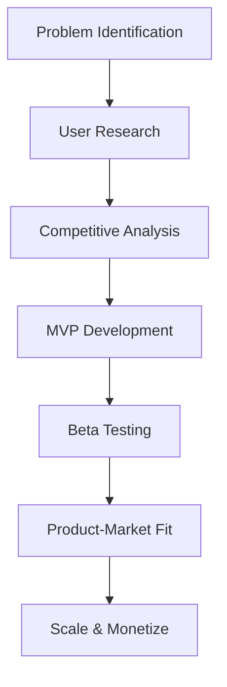
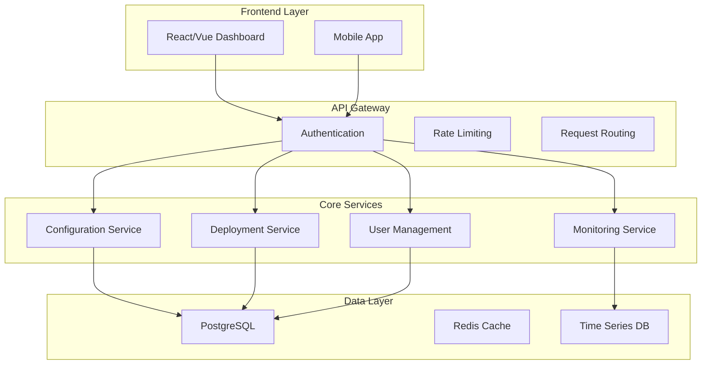
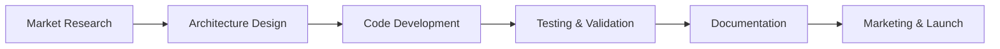
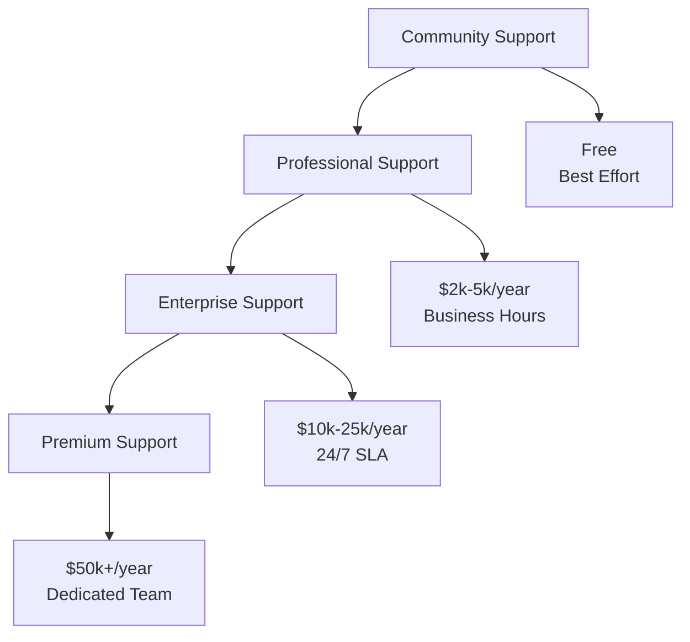
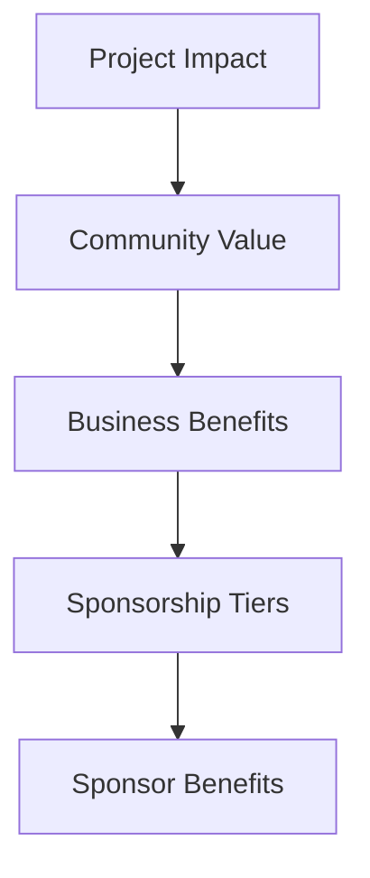
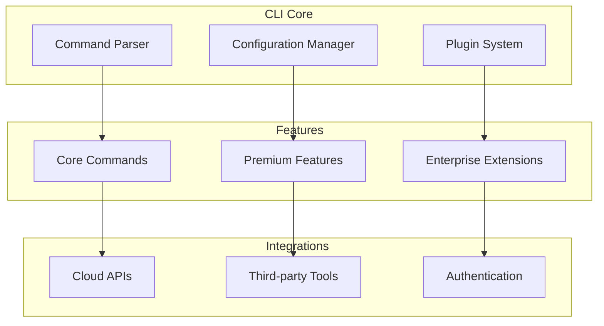
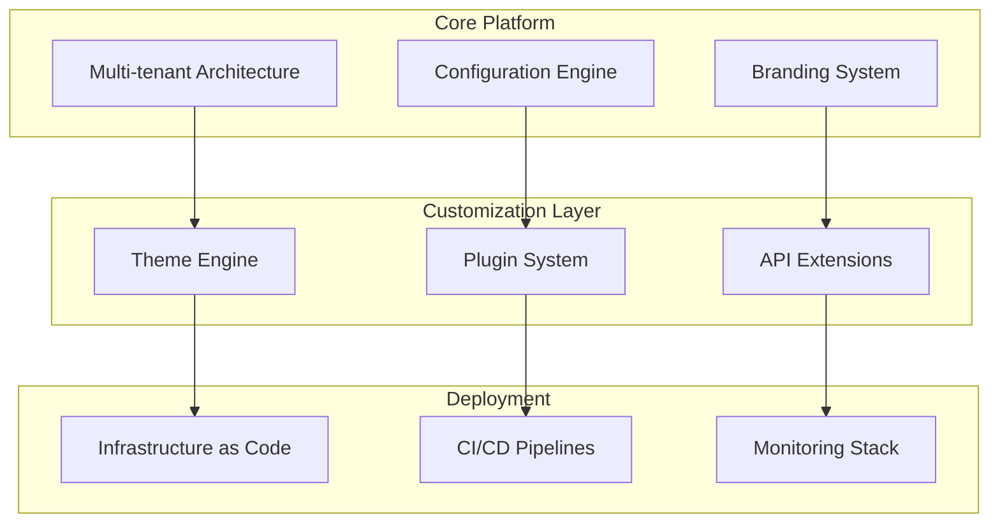

# 🛠️ Open Source & Tool Development - Comprehensive Guide
*Transform Code into Sustainable Revenue Streams Through Strategic Product Development*

---

## 📊 Market Overview & Revenue Potential

The developer tools market is experiencing explosive growth, projected to reach **$26.4 billion by 2027**. Open source projects with commercial models are generating **$1M-100M+ annually**, with successful DevOps tools commanding premium pricing.

### Market Opportunities
- **SaaS Management Tools**: $50k-500k ARR
- **Marketplace Templates**: $25k-200k annual revenue
- **Enterprise Support**: $100k-2M+ annual contracts
- **CLI Tools**: $10k-100k+ in premium features
- **White-label Solutions**: $200k-5M+ licensing revenue

---

## 🎛️ 1. SaaS Management Layers

### **Market Analysis**
Complex open-source tools often lack user-friendly interfaces, creating opportunities for simplified management layers that enterprises will pay premium prices for.

### **Target Tool Categories**

#### **Network & Security Tools**
- **WireGuard Management**: Enterprise VPN orchestration
- **Tailscale Administration**: Zero-trust network management
- **Vault UI**: HashiCorp Vault simplified interface
- **Consul Dashboard**: Service mesh visualization and control

#### **Infrastructure Management**
- **Terraform Cloud Alternative**: Self-hosted state management
- **Ansible Tower Lite**: Simplified automation orchestration
- **Kubernetes Dashboard Plus**: Enhanced cluster management
- **Prometheus Manager**: Monitoring configuration simplified

### **Product Development Framework**

#### **Market Validation Process**

**Validation Methods**:
- **Developer Surveys**: Pain point identification
- **GitHub Issue Analysis**: Common problems and requests
- **Community Forums**: Reddit, Stack Overflow, Discord discussions
- **Enterprise Interviews**: Decision-maker needs assessment

#### **Technical Architecture Patterns**

**Microservices Architecture**:

### **Successful Product Examples**

#### **"WireGuard Enterprise Manager"**
- **Problem**: Complex WireGuard configuration for large teams
- **Solution**: Web-based management with RBAC and automation
- **Revenue Model**: $50/month per 100 peers
- **Market Size**: 10k+ potential enterprise customers
- **Annual Revenue**: $300k+ (600 customers)

**Key Features**:
- **User Management**: LDAP/SAML integration
- **Network Topology**: Visual network mapping
- **Automated Deployment**: Infrastructure as Code integration
- **Monitoring**: Connection health and performance metrics
- **Compliance**: Audit logs and security reporting

#### **"Terraform State Manager Pro"**
- **Problem**: Terraform Cloud limitations and pricing
- **Solution**: Self-hosted alternative with enterprise features
- **Revenue Model**: $200/month per team (5-10 developers)
- **Market Size**: 50k+ development teams
- **Annual Revenue**: $1.2M+ (500 teams)

**Key Features**:
- **State Management**: Secure, versioned state storage
- **Policy Engine**: Custom validation and compliance rules
- **Cost Estimation**: Infrastructure cost predictions
- **Team Collaboration**: Code review and approval workflows
- **Multi-cloud Support**: AWS, Azure, GCP integration

### **Monetization Strategies**

#### **Freemium Model**
- **Free Tier**: Basic functionality for small teams
- **Pro Tier**: $50-200/month for advanced features
- **Enterprise Tier**: $500-2000/month for large organizations

#### **Usage-Based Pricing**
- **Per-Resource**: $0.10-1.00 per managed resource
- **Per-User**: $10-50 per user per month
- **Per-Transaction**: $0.01-0.10 per API call or operation

#### **Enterprise Licensing**
- **Annual Contracts**: $10k-100k+ per year
- **Multi-year Deals**: 20-30% discount for 3-year commitments
- **Custom Development**: $150-300/hour for specialized features

---

## 🏪 2. Marketplace Templates & Modules

### **Market Analysis**
Infrastructure as Code templates and modules represent a **$500M+ market** with high demand for production-ready, well-documented solutions.

### **Platform Opportunities**

| Platform | Market Size | Commission | Best For |
|----------|-------------|------------|----------|
| **Terraform Registry** | 100M+ downloads | Free (lead gen) | Open source modules |
| **AWS Marketplace** | $5B+ annual sales | 15-25% | Enterprise solutions |
| **Azure Marketplace** | $2B+ annual sales | 20-30% | Microsoft ecosystem |
| **GCP Marketplace** | $1B+ annual sales | 15-20% | Google Cloud solutions |
| **GitHub Marketplace** | 50M+ developers | 25% | Developer tools |

### **High-Value Template Categories**

#### **Infrastructure Templates**
- **Multi-tier Applications**: Complete application stacks
- **Disaster Recovery**: Cross-region backup and failover
- **Compliance Frameworks**: SOC2, HIPAA, PCI-DSS ready
- **Cost-Optimized Architectures**: Reserved instances and spot pricing

#### **Security Templates**
- **Zero-Trust Networks**: Comprehensive security implementation
- **Identity Management**: SSO and RBAC configurations
- **Encryption at Rest**: Database and storage encryption
- **Vulnerability Scanning**: Automated security assessments

#### **Monitoring & Observability**
- **Complete Observability Stack**: Prometheus, Grafana, Jaeger
- **Log Aggregation**: ELK or EFK stack deployment
- **APM Integration**: Application performance monitoring
- **Cost Monitoring**: Cloud spend tracking and alerting

### **Template Development Process**

#### **Research & Planning**

**Quality Standards**:
- **Production-Ready**: Tested in real environments
- **Well-Documented**: Comprehensive README and examples
- **Modular Design**: Reusable components and variables
- **Security-First**: Best practices and compliance built-in
- **Cost-Optimized**: Efficient resource utilization

#### **Pricing Strategy**

**Individual Templates**: $49-299
- **Basic Templates**: Simple, single-purpose solutions
- **Advanced Templates**: Complex, multi-component architectures
- **Enterprise Templates**: Compliance and governance included

**Template Bundles**: $199-999
- **Industry Packages**: Fintech, healthcare, e-commerce
- **Technology Stacks**: Complete application environments
- **Compliance Suites**: Regulatory requirement templates

**Enterprise Licenses**: $2k-20k
- **Unlimited Usage**: Organization-wide deployment rights
- **Custom Modifications**: Tailored to specific requirements
- **Priority Support**: Direct access to template creators

### **Success Case Studies**

#### **"AWS Well-Architected Templates"**
- **Product**: Complete AWS architecture templates
- **Sales**: 2,500+ licenses
- **Revenue**: $180k annually
- **Success Factors**: AWS partnership, comprehensive documentation, regular updates

#### **"Kubernetes Production Patterns"**
- **Product**: Enterprise-ready K8s configurations
- **Sales**: 800+ licenses
- **Revenue**: $240k annually
- **Success Factors**: Real-world testing, security focus, community engagement

---

## 🏢 3. Enterprise Open Source Support

### **Market Overview**
Enterprise open source support is a **$24 billion market** with companies paying premium rates for guaranteed SLAs, custom features, and expert consultation.

### **Support Service Models**

#### **Tiered Support Structure**

#### **Service Components**

**Professional Support** ($2k-5k/year):
- **Email Support**: 48-hour response time
- **Bug Fixes**: Priority issue resolution
- **Documentation**: Enhanced guides and tutorials
- **Community Access**: Private Slack or Discord channels

**Enterprise Support** ($10k-25k/year):
- **24/7 Support**: Phone and email availability
- **SLA Guarantees**: 4-hour response for critical issues
- **Custom Features**: Paid development for specific needs
- **Training**: On-site or virtual team training sessions

**Premium Support** ($50k+/year):
- **Dedicated Engineer**: Assigned support specialist
- **Custom Development**: Major feature development
- **Architecture Review**: System design consultation
- **Emergency Response**: Immediate critical issue support

### **Implementation Strategy**

#### **Building Support Infrastructure**
- **Ticketing System**: Zendesk, Freshdesk, or custom solution
- **Knowledge Base**: Comprehensive documentation and FAQs
- **Monitoring Tools**: Proactive issue detection and alerting
- **Communication Channels**: Slack, Discord, or Microsoft Teams

#### **Team Structure**
- **Support Engineers**: L1/L2 technical support specialists
- **Senior Engineers**: L3 escalation and complex problem solving
- **Product Managers**: Feature prioritization and roadmap planning
- **Customer Success**: Relationship management and upselling

### **Revenue Optimization**

#### **Customer Segmentation**
- **Startups**: Basic support with growth potential
- **Mid-Market**: Professional support with expansion opportunities
- **Enterprise**: Premium support with custom development
- **Strategic Accounts**: White-glove service and partnership

#### **Upselling Strategies**
- **Usage Analytics**: Identify expansion opportunities
- **Feature Requests**: Convert requests into paid development
- **Training Programs**: Additional revenue from education services
- **Consulting Services**: Architecture and implementation consulting

---

## 💰 4. GitHub Sponsors & OpenCollective

### **Sponsorship Market Analysis**
Developer sponsorship platforms have grown **300%+ annually**, with top maintainers earning **$50k-500k+ per year** through community and corporate sponsorship.

### **Platform Comparison**

| Platform | Fee | Best For | Payment Options |
|----------|-----|----------|-----------------|
| **GitHub Sponsors** | 0% | Individual developers | Monthly/one-time |
| **OpenCollective** | 5-10% | Projects/organizations | Transparent funding |
| **Patreon** | 5-12% | Content creators | Subscription-based |
| **Ko-fi** | 0-5% | Creative projects | Tips and donations |

### **Sponsorship Strategy Framework**

#### **Value Proposition Development**

**Impact Metrics**:
- **Download Statistics**: Monthly/annual download counts
- **Dependency Usage**: Projects depending on your code
- **Community Size**: Contributors, stars, and forks
- **Business Adoption**: Companies using your project

#### **Sponsorship Tier Structure**

**Individual Sponsors**:
- **$5/month**: Name in README and releases
- **$25/month**: Priority issue responses
- **$100/month**: Monthly video calls and feedback sessions

**Corporate Sponsors**:
- **$500/month**: Logo placement and marketing mentions
- **$2,000/month**: Dedicated support channel and SLA
- **$5,000/month**: Custom feature development and consulting

**Enterprise Sponsors**:
- **$10,000/month**: Strategic partnership and co-marketing
- **$25,000/month**: Dedicated engineering resources
- **$50,000+/month**: Joint product development and integration

### **Sponsor Acquisition Strategy**

#### **Corporate Outreach**
- **Usage Analysis**: Identify companies using your project
- **Value Quantification**: Calculate business impact and savings
- **Executive Targeting**: Reach CTOs, VPs of Engineering
- **Partnership Proposals**: Mutual benefit and co-marketing opportunities

#### **Community Building**
- **Regular Updates**: Monthly progress reports and roadmaps
- **Transparency**: Open financial reporting and fund allocation
- **Engagement**: Active participation in conferences and meetups
- **Content Creation**: Blog posts, tutorials, and case studies

---

## 🔧 5. CLI Tool Development

### **Market Opportunity**
Developer productivity tools represent a **$5 billion market** with successful CLI tools generating **$10k-100k+ annually** through freemium and enterprise models.

### **Successful CLI Tool Categories**

#### **Infrastructure Management**
- **Multi-cloud CLIs**: Unified interface for AWS, Azure, GCP
- **Kubernetes Tools**: Simplified cluster management and debugging
- **Terraform Helpers**: State management and plan analysis
- **Docker Utilities**: Container optimization and security scanning

#### **Development Workflow**
- **Git Enhancements**: Advanced branching and merge strategies
- **Code Quality**: Automated linting and security scanning
- **Deployment Tools**: Simplified CI/CD pipeline management
- **Monitoring CLIs**: Log analysis and performance debugging

### **Development Framework**

#### **Technical Architecture**

#### **Monetization Models**

**Freemium Approach**:
- **Free Tier**: Basic functionality for individual developers
- **Pro Tier**: $10-50/month for advanced features and integrations
- **Team Tier**: $100-500/month for collaboration and management features

**Enterprise Licensing**:
- **Site License**: $5k-25k/year for unlimited organizational use
- **Custom Development**: $150-300/hour for specialized features
- **Support Contracts**: $2k-10k/year for priority support and training

### **Success Case Studies**

#### **"k9s Pro" - Kubernetes Management**
- **Free Version**: Basic cluster navigation and viewing
- **Pro Version**: $29/month - Advanced filtering, custom views, team sharing
- **Enterprise**: $299/month - RBAC integration, audit logging, custom plugins
- **Revenue**: $180k annually (500 pro users, 20 enterprise customers)

#### **"tftools" - Terraform Enhancement Suite**
- **Free Version**: Basic plan analysis and validation
- **Pro Version**: $49/month - Cost estimation, security scanning, team collaboration
- **Enterprise**: $499/month - Policy enforcement, compliance reporting, SSO integration
- **Revenue**: $320k annually (400 pro users, 35 enterprise customers)

---

## 🏗️ 6. White-Label Infrastructure

### **Market Analysis**
The white-label infrastructure market is valued at **$8.2 billion** with development agencies and consultants seeking turnkey solutions to accelerate client delivery.

### **Product Categories**

#### **Application Stacks**
- **E-commerce Platforms**: Complete online store infrastructure
- **SaaS Starter Kits**: Multi-tenant application foundations
- **Mobile App Backends**: API and database infrastructure
- **Content Management**: Headless CMS with CDN integration

#### **Industry-Specific Solutions**
- **FinTech Infrastructure**: Compliance-ready financial applications
- **HealthTech Platforms**: HIPAA-compliant healthcare systems
- **EdTech Solutions**: Scalable learning management systems
- **IoT Platforms**: Device management and data processing

### **White-Label Development Framework**

#### **Architecture Principles**

#### **Key Features**
- **Multi-tenancy**: Isolated customer environments
- **Customization**: Branding, themes, and feature toggles
- **Scalability**: Auto-scaling and load balancing
- **Security**: Built-in authentication and authorization
- **Monitoring**: Comprehensive observability and alerting

### **Licensing & Pricing Models**

#### **License Types**
- **Development License**: $5k-15k - Single project usage
- **Agency License**: $25k-75k - Unlimited client projects
- **Enterprise License**: $100k-500k - White-label reseller rights
- **Source Code License**: $250k-1M+ - Full code ownership

#### **Revenue Sharing Models**
- **Percentage Model**: 10-30% of client project value
- **Subscription Model**: $500-5k/month per deployed instance
- **Success Fee**: 5-15% of client's annual revenue
- **Hybrid Model**: Base fee + percentage of growth

### **Success Examples**

#### **"SaaS Foundation Pro"**
- **Product**: Complete multi-tenant SaaS infrastructure
- **Licenses Sold**: 150+ development licenses
- **Revenue**: $2.8M annually
- **Success Factors**: Comprehensive documentation, active community, regular updates

#### **"E-commerce Infrastructure Kit"**
- **Product**: Scalable online store platform
- **Licenses Sold**: 80+ agency licenses
- **Revenue**: $1.9M annually
- **Success Factors**: Industry focus, payment integrations, mobile-first design

---

## 📈 Business Development & Scaling

### **Go-to-Market Strategy**

#### **Phase 1: Product Development** (Months 1-6)
- **MVP Development**: Core functionality and basic features
- **Beta Testing**: Limited user group for feedback and validation
- **Documentation**: Comprehensive guides and API references
- **Initial Marketing**: Blog posts, social media, and community engagement

#### **Phase 2: Market Entry** (Months 7-12)
- **Product Launch**: Public release with pricing and support
- **Customer Acquisition**: Targeted marketing and sales outreach
- **Partnership Development**: Integration partners and resellers
- **Feature Expansion**: Based on customer feedback and market demands

#### **Phase 3: Scale & Optimize** (Months 13-24)
- **Team Building**: Hire developers, support, and sales staff
- **Process Automation**: Streamline operations and customer onboarding
- **Market Expansion**: New features, integrations, and market segments
- **Strategic Partnerships**: Joint ventures and acquisition opportunities

### **Success Metrics & KPIs**

#### **Product Metrics**
- **Active Users**: Monthly and daily active user counts
- **Feature Adoption**: Usage statistics for key features
- **Performance**: Response times, uptime, and error rates
- **Customer Satisfaction**: NPS scores and support ratings

#### **Business Metrics**
- **Monthly Recurring Revenue (MRR)**: Predictable subscription income
- **Customer Acquisition Cost (CAC)**: Marketing and sales efficiency
- **Lifetime Value (LTV)**: Long-term customer profitability
- **Churn Rate**: Customer retention and satisfaction

#### **Growth Metrics**
- **Market Share**: Position in target market segments
- **Pipeline Value**: Qualified sales opportunities
- **Partner Revenue**: Income from integrations and partnerships
- **Brand Recognition**: Industry visibility and thought leadership

---

## 🎯 Implementation Roadmap

### **30-Day Quick Start**
- [ ] **Market Research**: Identify target problems and opportunities
- [ ] **Competitive Analysis**: Study existing solutions and gaps
- [ ] **MVP Planning**: Define minimum viable product features
- [ ] **Technical Architecture**: Design scalable and maintainable system

### **90-Day Development Sprint**
- [ ] **Core Development**: Build essential features and functionality
- [ ] **Beta Testing**: Recruit early users for feedback and validation
- [ ] **Documentation**: Create comprehensive user and developer guides
- [ ] **Marketing Foundation**: Website, blog, and social media presence

### **180-Day Market Launch**
- [ ] **Product Launch**: Public release with pricing and support
- [ ] **Customer Acquisition**: Execute marketing and sales strategies
- [ ] **Partnership Development**: Establish key integrations and alliances
- [ ] **Revenue Optimization**: Test and refine pricing and packaging

---

**Ready to build your next developer tool?** Start with the [Product Development Toolkit](./Product-Development-Toolkit.md) for detailed templates, frameworks, and implementation guides.