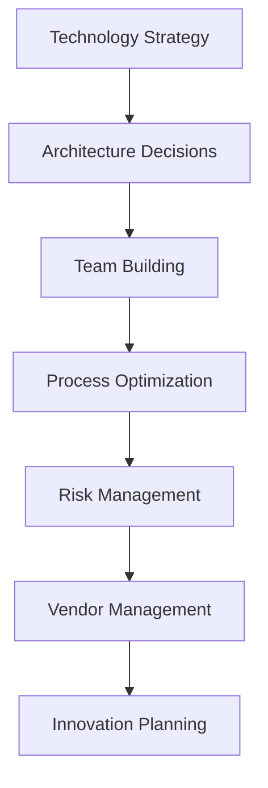
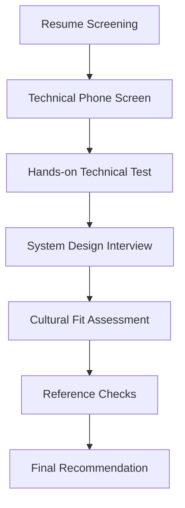
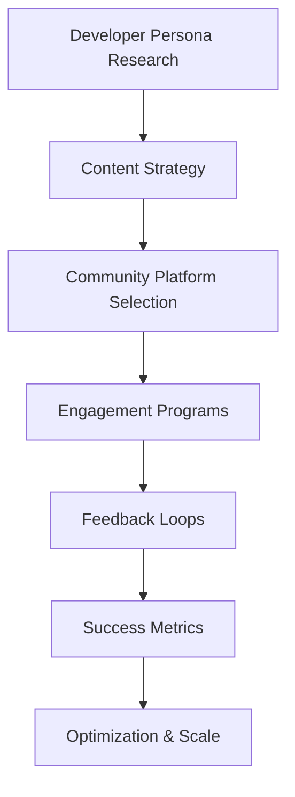
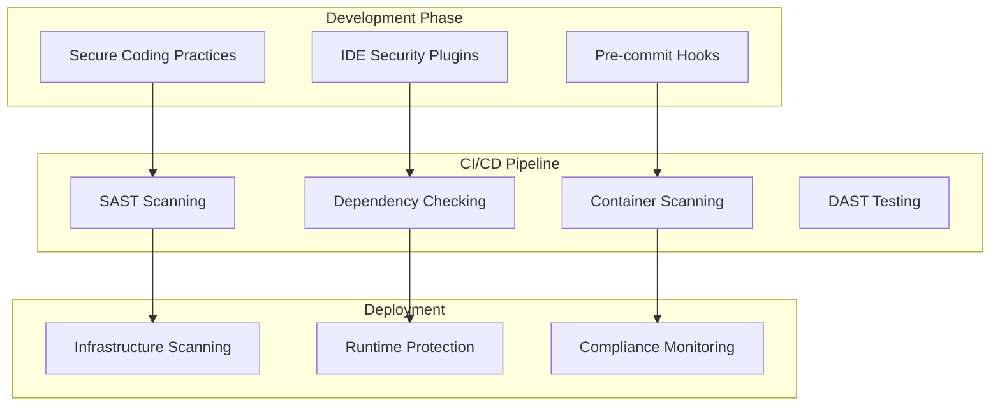
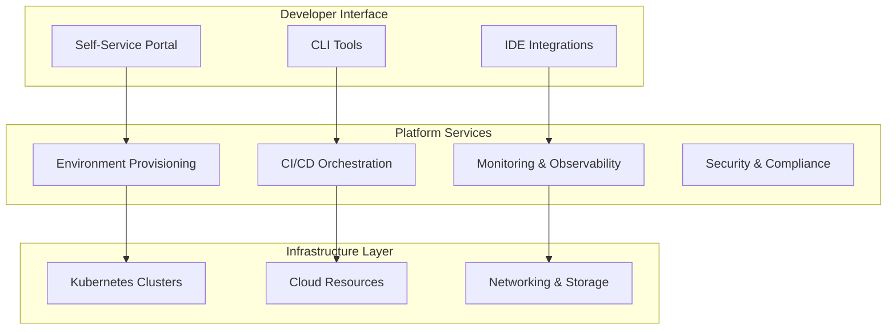
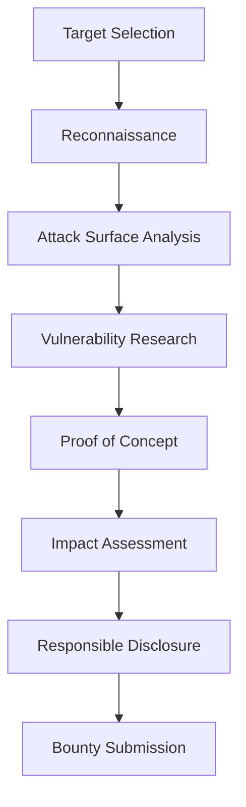

# 🎯 Niche & Strategic Roles - Comprehensive Guide
*Leverage Strategic Understanding for High-Value Specialized Positions*

---

## 📊 Market Overview & Compensation Analysis

Specialized DevOps roles command **premium compensation** due to their strategic nature and scarcity of qualified professionals. These positions often combine technical expertise with business acumen, making them highly valuable to organizations.

### Compensation Ranges by Role
- **Fractional CTO**: $200-500/hour, $15k-50k/month retainers
- **Technical Recruiting**: $150-300/hour, $50k-200k placement fees
- **DevRel Consulting**: $150-400/hour, $10k-30k/month contracts
- **DevSecOps Strategy**: $200-400/hour, $25k-75k project fees
- **Platform Engineering**: $175-350/hour, $20k-60k/month engagements
- **Vulnerability Research**: $500-5000+ per vulnerability, $100k-500k annual bounties

---

## 👔 1. Fractional CTO / DevOps Advisor

### **Role Overview**
Fractional CTOs provide strategic technical leadership to organizations that need senior guidance but aren't ready for a full-time executive hire. This role combines deep technical expertise with business strategy and leadership skills.

### **Market Demand Analysis**
- **Target Market**: Series A-C startups, mid-market companies (50-500 employees)
- **Market Size**: 50,000+ companies in growth phase globally
- **Average Engagement**: 6-18 months, 10-30 hours per week
- **Success Rate**: 85% of engagements lead to follow-on work or referrals

### **Core Responsibilities**

#### **Strategic Technology Leadership**


**Key Activities**:
- **Technology Roadmap**: 12-36 month strategic planning
- **Architecture Review**: System design and scalability assessment
- **Team Development**: Hiring, mentoring, and performance management
- **Process Implementation**: Agile, DevOps, and quality assurance practices
- **Vendor Evaluation**: Tool selection and contract negotiation
- **Risk Assessment**: Security, compliance, and operational risk management

#### **Business-Technology Alignment**
- **Product Strategy**: Technical feasibility and implementation planning
- **Budget Planning**: Technology investment and ROI analysis
- **Stakeholder Communication**: Board reporting and investor relations
- **Competitive Analysis**: Technology differentiation and market positioning
- **Scaling Preparation**: Infrastructure and team scaling for growth phases

### **Service Packages & Pricing**

#### **Strategic Advisory Package**
**Commitment**: 10-15 hours/month  
**Duration**: 6-12 months  
**Price**: $8,000-15,000/month  
**Deliverables**:
- Monthly strategic reviews and recommendations
- Quarterly technology roadmap updates
- Architecture decision support
- Team hiring and development guidance
- Board presentation support

#### **Hands-On Leadership Package**
**Commitment**: 20-30 hours/month  
**Duration**: 12-18 months  
**Price**: $15,000-30,000/month  
**Deliverables**:
- Direct team management and mentoring
- Architecture design and implementation oversight
- Process implementation and optimization
- Vendor negotiations and contract management
- Crisis management and problem resolution

#### **Transformation Package**
**Commitment**: 30-40 hours/month  
**Duration**: 6-12 months  
**Price**: $25,000-50,000/month  
**Deliverables**:
- Complete technology transformation leadership
- Team restructuring and hiring
- Process and culture change management
- System architecture redesign
- Performance and scalability improvements

### **Client Acquisition Strategy**

#### **Target Client Identification**
- **Funding Events**: Series A-C companies with recent funding
- **Growth Indicators**: Rapid hiring, product launches, market expansion
- **Technology Challenges**: Scaling issues, security concerns, technical debt
- **Leadership Gaps**: CTO departure, technical co-founder transition

#### **Positioning & Messaging**
- **Value Proposition**: "Strategic technology leadership without full-time commitment"
- **Differentiation**: "Proven track record of scaling technology teams and systems"
- **Social Proof**: Case studies, testimonials, and measurable outcomes
- **Thought Leadership**: Speaking, writing, and industry participation

### **Success Case Studies**

#### **FinTech Startup Transformation**
```
Client: Series B FinTech startup (150 employees)
Challenge: Scaling issues, security concerns, technical debt
Engagement: 18 months, 25 hours/week
Results:
- Reduced system downtime by 95%
- Improved deployment frequency from weekly to daily
- Implemented SOC2 compliance program
- Scaled engineering team from 15 to 45 developers
- Prepared technology infrastructure for Series C funding
Fee: $420,000 total engagement
Client Outcome: $50M Series C funding secured
```

#### **E-commerce Platform Modernization**
```
Client: Mid-market e-commerce company ($50M revenue)
Challenge: Legacy monolith limiting growth and innovation
Engagement: 12 months, 20 hours/week
Results:
- Migrated from monolith to microservices architecture
- Reduced page load times by 60%
- Implemented automated testing and deployment
- Established platform engineering team
- Improved system reliability to 99.9% uptime
Fee: $300,000 total engagement
Client Outcome: 40% increase in conversion rates, $20M additional revenue
```

---

## 🔍 2. Technical Recruiting & Vetting

### **Market Overview**
Technical recruiting for DevOps and SRE roles is a **$2.5 billion market** with severe talent shortages driving premium placement fees and consulting rates.

### **Service Models**

#### **Technical Interview Consulting**
**Rate**: $150-300/hour  
**Services**:
- Interview question development
- Technical assessment design
- Live interview participation
- Candidate evaluation and scoring
- Hiring process optimization

#### **Recruitment Process Outsourcing (RPO)**
**Model**: 15-25% of first-year salary  
**Services**:
- Complete recruitment lifecycle management
- Sourcing and candidate pipeline development
- Technical screening and assessment
- Interview coordination and management
- Offer negotiation and closing support

#### **Talent Advisory Services**
**Rate**: $200-400/hour  
**Services**:
- Compensation benchmarking and analysis
- Job description optimization
- Employer branding and positioning
- Talent market analysis and insights
- Retention strategy development

### **Technical Assessment Framework**

#### **DevOps Engineer Assessment**


**Assessment Components**:
1. **Infrastructure as Code**: Terraform, CloudFormation, Ansible
2. **Container Orchestration**: Docker, Kubernetes, service mesh
3. **CI/CD Pipelines**: Jenkins, GitLab, GitHub Actions
4. **Monitoring & Observability**: Prometheus, Grafana, ELK stack
5. **Cloud Platforms**: AWS, Azure, GCP expertise
6. **Security Practices**: DevSecOps, compliance, vulnerability management

#### **SRE Assessment Framework**
1. **System Design**: Large-scale distributed systems
2. **Reliability Engineering**: SLI/SLO definition and monitoring
3. **Incident Response**: On-call procedures and post-mortem analysis
4. **Automation**: Toil reduction and process automation
5. **Performance Engineering**: Capacity planning and optimization
6. **Programming Skills**: Python, Go, or other systems languages

### **Specialized Recruiting Niches**

#### **FinTech DevOps Recruiting**
**Market Premium**: 25-40% higher placement fees  
**Specialization Requirements**:
- Regulatory compliance knowledge (SOX, PCI-DSS)
- High-frequency trading system experience
- Risk management and audit trail implementation
- Real-time processing and low-latency systems

#### **Healthcare DevOps Recruiting**
**Market Premium**: 30-50% higher placement fees  
**Specialization Requirements**:
- HIPAA compliance expertise
- Medical device software experience
- Clinical data management systems
- FDA validation and documentation processes

### **Client Development Strategy**

#### **Target Markets**
- **High-Growth Startups**: Series B-D companies scaling rapidly
- **Enterprise Organizations**: Fortune 1000 companies with large tech teams
- **Consulting Firms**: Need for specialized technical talent
- **Private Equity**: Portfolio companies requiring technical leadership

#### **Partnership Opportunities**
- **Executive Search Firms**: Technical expertise for C-level searches
- **HR Consulting Companies**: Specialized technical assessment services
- **Venture Capital Firms**: Due diligence and portfolio company support
- **Industry Associations**: Speaking and thought leadership opportunities

---

## 🚀 3. Developer Relations (DevRel) Consulting

### **Market Analysis**
The DevRel market has grown **400%+ in the past 5 years**, with companies investing heavily in developer community building and product adoption strategies.

### **DevRel Strategy Framework**

#### **Community Building Strategy**


**Key Components**:
- **Developer Journey Mapping**: Awareness to advocacy progression
- **Content Strategy**: Technical tutorials, case studies, best practices
- **Community Platforms**: Discord, Slack, forums, social media
- **Event Programming**: Meetups, conferences, hackathons, webinars
- **Feedback Systems**: Product input, feature requests, bug reports
- **Advocacy Programs**: Champion programs, speaker bureaus, beta testing

### **Service Offerings**

#### **DevRel Strategy Development**
**Duration**: 6-12 weeks  
**Price**: $25,000-75,000  
**Deliverables**:
- Developer persona research and analysis
- Community strategy and roadmap
- Content calendar and editorial guidelines
- Engagement program design
- Success metrics and KPI framework
- Implementation timeline and resource requirements

#### **Community Platform Implementation**
**Duration**: 8-16 weeks  
**Price**: $40,000-100,000  
**Deliverables**:
- Platform selection and setup
- Community guidelines and moderation policies
- Onboarding and engagement workflows
- Integration with existing tools and systems
- Training for internal team members
- Launch strategy and promotion plan

#### **Content & Education Program**
**Duration**: 12-24 weeks  
**Price**: $60,000-150,000  
**Deliverables**:
- Technical content strategy and calendar
- Tutorial and documentation development
- Video content production and editing
- Interactive learning experiences
- Certification program development
- Content performance optimization

### **Specialized DevRel Areas**

#### **API-First Companies**
**Focus Areas**:
- Developer onboarding and time-to-first-success
- SDK development and maintenance
- API documentation and interactive examples
- Integration showcase and case studies
- Developer support and troubleshooting

#### **Infrastructure Tools**
**Focus Areas**:
- Technical deep-dive content and tutorials
- Integration guides and best practices
- Community-driven plugin and extension ecosystems
- Enterprise adoption and success stories
- Competitive differentiation and positioning

#### **Open Source Projects**
**Focus Areas**:
- Contributor onboarding and mentorship
- Governance and decision-making processes
- Maintainer sustainability and burnout prevention
- Corporate sponsorship and funding strategies
- Community health and diversity initiatives

### **Success Metrics & KPIs**

#### **Community Growth Metrics**
- **Active Members**: Monthly and daily active community participants
- **Engagement Rate**: Comments, shares, and interaction percentages
- **Content Consumption**: Tutorial completions, documentation views
- **Event Participation**: Meetup attendance, webinar registrations

#### **Product Adoption Metrics**
- **Developer Signups**: New account registrations and activations
- **API Usage**: Calls, integrations, and active applications
- **Time to First Success**: Onboarding completion and first integration
- **Feature Adoption**: Usage of new features and capabilities

#### **Business Impact Metrics**
- **Lead Generation**: Marketing qualified leads from developer community
- **Customer Acquisition**: Conversion from developer to paying customer
- **Revenue Attribution**: Sales influenced by DevRel activities
- **Brand Awareness**: Developer survey results and industry recognition

---

## 🛡️ 4. DevSecOps Strategy

### **Market Opportunity**
The DevSecOps market is projected to reach **$23.2 billion by 2028**, driven by increasing security threats and regulatory compliance requirements.

### **DevSecOps Implementation Framework**

#### **Security Integration Strategy**


### **Service Packages**

#### **DevSecOps Assessment & Strategy**
**Duration**: 4-8 weeks  
**Price**: $35,000-75,000  
**Deliverables**:
- Current security posture assessment
- Threat modeling and risk analysis
- DevSecOps maturity evaluation
- Security tool evaluation and recommendations
- Implementation roadmap and timeline
- Training and change management plan

#### **Security Pipeline Implementation**
**Duration**: 12-20 weeks  
**Price**: $75,000-200,000  
**Deliverables**:
- Automated security scanning integration
- Policy as code implementation
- Vulnerability management workflows
- Incident response automation
- Compliance reporting and dashboards
- Team training and documentation

#### **Compliance Automation Program**
**Duration**: 16-24 weeks  
**Price**: $100,000-300,000  
**Deliverables**:
- SOC2, HIPAA, or PCI-DSS compliance automation
- Audit trail and evidence collection
- Continuous compliance monitoring
- Risk assessment and remediation workflows
- Executive reporting and dashboards
- Auditor coordination and support

### **Industry Specializations**

#### **Financial Services DevSecOps**
**Regulatory Requirements**:
- SOX compliance and audit trails
- PCI-DSS for payment processing
- FFIEC guidelines for banking
- Real-time fraud detection and prevention

**Premium Pricing**: 40-60% above standard rates

#### **Healthcare DevSecOps**
**Regulatory Requirements**:
- HIPAA compliance and data protection
- FDA validation for medical devices
- HITECH Act security requirements
- Clinical data integrity and audit trails

**Premium Pricing**: 50-70% above standard rates

#### **Government & Defense DevSecOps**
**Security Requirements**:
- FedRAMP compliance and authorization
- NIST cybersecurity framework implementation
- Supply chain security and SBOM management
- Zero-trust architecture implementation

**Premium Pricing**: 60-80% above standard rates

---

## 🏗️ 5. Platform Engineering Consulting

### **Market Overview**
Platform Engineering is emerging as a critical discipline, with **90% of enterprises** planning to implement Internal Developer Platforms (IDPs) by 2026.

### **Platform Engineering Strategy**

#### **IDP Architecture Framework**


### **Service Offerings**

#### **Platform Strategy & Design**
**Duration**: 8-12 weeks  
**Price**: $50,000-125,000  
**Deliverables**:
- Developer experience assessment
- Platform requirements and architecture
- Technology stack evaluation and selection
- Implementation roadmap and phasing
- Success metrics and KPI framework
- Change management and adoption strategy

#### **Platform Implementation**
**Duration**: 16-32 weeks  
**Price**: $150,000-500,000  
**Deliverables**:
- Core platform infrastructure setup
- Self-service portal development
- CI/CD pipeline templates and automation
- Monitoring and observability integration
- Security and compliance controls
- Developer onboarding and training

#### **Platform Optimization & Evolution**
**Duration**: Ongoing (6-12 month contracts)  
**Price**: $25,000-75,000/month  
**Deliverables**:
- Platform performance monitoring and optimization
- New service development and integration
- Developer feedback collection and analysis
- Platform roadmap planning and execution
- Team training and capability development
- Vendor management and technology evaluation

### **Platform Engineering Metrics**

#### **Developer Productivity Metrics**
- **Deployment Frequency**: Releases per day/week
- **Lead Time**: Code commit to production deployment
- **Mean Time to Recovery**: Incident resolution time
- **Change Failure Rate**: Percentage of deployments causing issues

#### **Platform Adoption Metrics**
- **Service Utilization**: Usage of platform services and templates
- **Developer Onboarding**: Time to first successful deployment
- **Self-Service Adoption**: Percentage of manual requests eliminated
- **Developer Satisfaction**: Survey scores and feedback analysis

---

## 🔒 6. Vulnerability Research

### **Market Analysis**
The bug bounty market has grown to **$300+ million annually**, with critical vulnerabilities in infrastructure tools commanding premium payouts.

### **Research Focus Areas**

#### **Infrastructure Tools**
- **Container Runtimes**: Docker, containerd, CRI-O
- **Orchestration Platforms**: Kubernetes, OpenShift, Rancher
- **CI/CD Tools**: Jenkins, GitLab, GitHub Actions
- **Monitoring Systems**: Prometheus, Grafana, ELK stack
- **Cloud Services**: AWS, Azure, GCP native services

#### **DevOps Tool Chain**
- **Version Control**: Git, GitLab, Bitbucket
- **Artifact Repositories**: Nexus, Artifactory, Harbor
- **Infrastructure as Code**: Terraform, Ansible, Puppet
- **Secret Management**: Vault, AWS Secrets Manager, Azure Key Vault

### **Research Methodology**

#### **Vulnerability Discovery Process**


### **Revenue Streams**

#### **Bug Bounty Programs**
- **Critical Vulnerabilities**: $5,000-50,000+
- **High Severity**: $1,000-10,000
- **Medium Severity**: $500-2,500
- **Low Severity**: $100-500

#### **Private Programs**
- **Enterprise Assessments**: $25,000-100,000
- **Red Team Engagements**: $50,000-200,000
- **Security Research Retainers**: $10,000-50,000/month
- **Zero-Day Research**: $100,000-1,000,000+

#### **Consulting & Training**
- **Security Assessment Services**: $200-500/hour
- **Vulnerability Research Training**: $5,000-15,000 per workshop
- **Security Tool Development**: $150-300/hour
- **Expert Witness Services**: $300-600/hour

---

## 📈 Career Development & Scaling

### **Skill Development Roadmap**

#### **Technical Skills**
- **Deep Specialization**: Become expert in 2-3 specific areas
- **Broad Knowledge**: Maintain awareness across DevOps ecosystem
- **Emerging Technologies**: Stay current with new tools and practices
- **Security Expertise**: Develop security-first mindset and skills

#### **Business Skills**
- **Strategic Thinking**: Understand business impact of technical decisions
- **Communication**: Present complex technical concepts to business stakeholders
- **Project Management**: Lead complex initiatives and transformations
- **Financial Acumen**: Understand budgeting, ROI, and business metrics

### **Personal Brand Development**

#### **Thought Leadership**
- **Content Creation**: Blog posts, whitepapers, case studies
- **Speaking Engagements**: Conferences, meetups, webinars
- **Industry Participation**: Standards bodies, advisory boards
- **Media Presence**: Podcasts, interviews, industry publications

#### **Network Building**
- **Professional Associations**: DevOps Institute, CNCF, industry groups
- **Executive Networks**: CTO forums, leadership communities
- **Peer Relationships**: Other consultants and specialists
- **Client Relationships**: Long-term partnerships and referrals

### **Scaling Strategies**

#### **Team Building**
- **Junior Associates**: Develop and mentor emerging talent
- **Specialized Partners**: Collaborate with complementary experts
- **Offshore Resources**: Scale delivery capacity cost-effectively
- **Strategic Alliances**: Partner with larger consulting firms

#### **Service Productization**
- **Methodology Development**: Create repeatable frameworks and processes
- **Tool Development**: Build proprietary tools and platforms
- **Training Programs**: Develop certification and education offerings
- **Intellectual Property**: Create valuable assets and licensing opportunities

---

**Ready to launch your specialized consulting practice?** Start with the [Niche Role Assessment](./Niche-Role-Assessment.md) to identify your optimal specialization and market positioning.