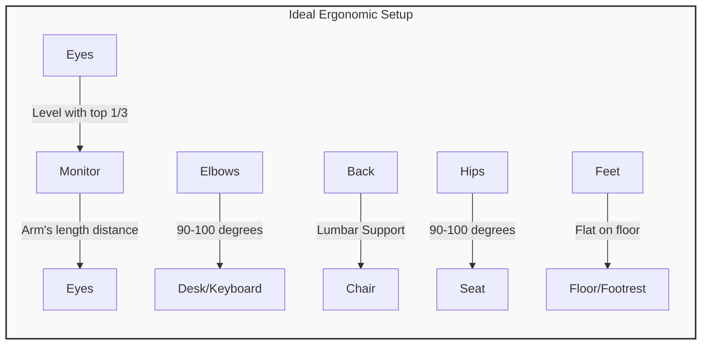

# Independent Contractor & Remote Work Guide

A comprehensive guide to thriving as an independent contractor in the DevOps field, including remote work best practices, international considerations, and work-life balance strategies.

---

## 📋 Table of Contents

1. [Understanding Independent Contractor Status](#contractor-status)
2. [Remote Work Setup](#remote-setup)
3. [International Contracting](#international)
4. [Client Relationship Management](#client-management)
5. [Work-Life Balance](#work-life)
6. [Legal & Tax Considerations](#legal-tax)
7. [Tools & Productivity](#tools)

---

## <a name="contractor-status"></a>📝 Understanding Independent Contractor Status

### Employee vs. Independent Contractor

The IRS uses specific criteria to determine your classification. Misclassification can result in severe penalties.

| Factor | Employee | Independent Contractor |
|--------|----------|------------------------|
| **Control** | Employer controls how work is done | You control how work is done |
| **Schedule** | Set hours | Flexible schedule |
| **Equipment** | Employer provides | You provide your own |
| **Training** | Employer trains you | You already have skills |
| **Multiple Clients** | Not allowed | Can work for multiple clients |
| **Location** | Employer's premises | Your choice |
| **Benefits** | Receive W-2, benefits | No benefits, receive 1099 |
| **Integration** | Core to business operations | Separate, project-based |

### IRS Classification Tests

#### Behavioral Control
- ✅ **Contractor**: You decide how, when, and where to work
- ❌ **Employee**: Company dictates methods and schedule

#### Financial Control
- ✅ **Contractor**: Invest in your own tools, market to other clients
- ❌ **Employee**: Company provides tools, exclusive arrangement

#### Type of Relationship
- ✅ **Contractor**: Written contract, project-based, no benefits
- ❌ **Employee**: Permanent role, benefits, job security

### Protecting Your Contractor Status

```markdown
## Contractor Status Checklist

✅ Use your own computer, software, and tools
✅ Set your own hours (even if coordinating with team)
✅ Work from your own location
✅ Invoice for services (don't receive regular paycheck)
✅ Have a written Independent Contractor Agreement
✅ Maintain other clients (or ability to do so)
✅ Control how you complete the work
✅ Register as an LLC or similar business entity
```

> [!WARNING]
> **Red Flags for Misclassification**:
> - Required to work specific hours daily
> - Must work on-site at client's office full-time
> - Receive company email on their domain
> - Attend mandatory all-hands meetings
> - Review process identical to employees

---

## <a name="remote-setup"></a>🏠 Remote Work Setup

### Essential Home Office Requirements

#### Hardware Setup

| Equipment | Budget | Mid-Range | Premium |
|-----------|--------|-----------|---------|
| **Monitor** | 1x 24" 1080p ($150) | 2x 27" 4K ($600) | Ultrawide 34" 5K ($1,200) |
| **Desk** | Basic desk ($100) | Standing desk ($400) | Sit-stand + accessories ($800) |
| **Chair** | Office chair ($150) | Ergonomic ($400) | Herman Miller/Steelcase ($1,200) |
| **Webcam** | Laptop built-in | Logitech C920 ($70) | Sony/Canon mirrorless ($300+) |
| **Microphone** | Headset mic | Blue Yeti ($100) | Shure SM7B + interface ($500) |
| **Lighting** | Desk lamp ($30) | Ring light ($50) | Key light + fill ($200) |
| **Total** | ~$430 | ~$1,620 | ~$4,200 |

#### Network Requirements

| Requirement | Minimum | Recommended | Ideal |
|-------------|---------|-------------|-------|
| **Download** | 25 Mbps | 100 Mbps | 500+ Mbps |
| **Upload** | 5 Mbps | 25 Mbps | 100+ Mbps |
| **Latency** | <100ms | <50ms | <20ms |
| **Backup** | Mobile hotspot | Second ISP | Fiber + Cable |

```bash
# Test your connection
speedtest-cli

# Check latency to AWS regions
ping -c 10 ec2.us-east-1.amazonaws.com
ping -c 10 ec2.eu-west-1.amazonaws.com
```

### Ergonomics Best Practices


### Home Office Deductions

**IRS Requirements for Home Office Deduction**:
- Space used **regularly** and **exclusively** for business
- Principal place of business OR where you meet clients

**Two Calculation Methods**:
| Method | Calculation | Max Deduction |
|--------|-------------|---------------|
| **Simplified** | $5 × square feet | $1,500 (300 sq ft max) |
| **Regular** | (Office sq ft ÷ Home sq ft) × Actual expenses | No limit |

**Deductible Home Expenses (Regular Method)**:
- Mortgage interest or rent
- Property taxes
- Utilities (electric, gas, water)
- Internet (business percentage)
- Home insurance
- Repairs and maintenance
- Depreciation

---

## <a name="international"></a>🌍 International Contracting

### Working for US Companies from Abroad

#### Legal Structures
| Approach | Description | Pros | Cons |
|----------|-------------|------|------|
| **Direct Contract** | Invoice as foreign entity | Simple, low cost | Client may not accept |
| **US LLC** | Form LLC in US | More clients accept | Compliance burden |
| **Employer of Record (EOR)** | Platform handles everything | Easy, compliant | 15-25% fee |

#### Employer of Record Platforms
| Platform | Coverage | Pricing | Best For |
|----------|----------|---------|----------|
| **[Deel](https://www.deel.com)** | 150+ countries | $49-599/month | Contractors |
| **[Remote](https://remote.com)** | 60+ countries | $599+/month | Full employment |
| **[Oyster](https://www.oysterhr.com)** | 180+ countries | $25-599/month | Global teams |
| **[Papaya Global](https://www.papayaglobal.com)** | 160+ countries | Custom | Enterprise |

### Tax Considerations for International Work

#### US Citizens/Residents Working Abroad
| Exclusion/Credit | Amount | Requirements |
|------------------|--------|--------------|
| **Foreign Earned Income Exclusion** | $120,000 (2023) | 330 days abroad |
| **Foreign Tax Credit** | Dollar-for-dollar | Taxes paid to foreign government |
| **Foreign Housing Exclusion** | Varies by location | Housing expenses abroad |

#### Non-US Residents Working for US Companies
```markdown
## Tax Treaty Benefits Check

1. Check if your country has tax treaty with US
2. File W-8BEN form with client
3. May reduce withholding from 30% to 0-15%
4. Report income in your home country
```

**Countries with Favorable US Tax Treaties**:
- UK: 0% withholding on services
- Canada: 0% withholding on services
- Germany: 0% withholding on services
- Australia: 0% withholding on services
- India: 15% withholding (can claim credit)

### Time Zone Management

```mermaid
gantt
    dateFormat  HH:mm
    axisFormat  %H:%M
    title Time Zone Overlap Example (UTC vs EST vs IST)

    section UTC (London)
    Work Day      :active, 09:00, 17:00

    section EST (New York)
    Work Day      :active, 14:00, 22:00
    Overlap (UTC) :crit, 14:00, 17:00

    section IST (India)
    Work Day      :active, 04:30, 12:30
    Overlap (UTC) :crit, 09:00, 12:30
```


**Strategies for Multi-Timezone Work**:

| Strategy | Description | Best For |
|----------|-------------|----------|
| **Shift Early** | Start 5-7am local | Working with Asia |
| **Shift Late** | End 10pm-midnight | Working with US West |
| **Core Hours** | 4-hour overlap window | Any timezone |
| **Async First** | Minimize meetings | Large time difference |

---

## <a name="client-management"></a>🤝 Client Relationship Management

### Finding Remote Clients

#### Premium Platforms

| Platform | Hourly Rates | Focus | Vetting |
|----------|--------------|-------|---------|
| **[Toptal](https://www.toptal.com)** | $80-200/hr | Top 3% talent | Rigorous |
| **[A.Team](https://www.a.team)** | $100-250/hr | Product teams | Invite only |
| **[Braintrust](https://www.braintrust.com)** | $100-200/hr | US only | Community-owned |
| **[Gun.io](https://www.gun.io)** | $80-180/hr | Engineering | Strong vetting |

#### General Platforms

| Platform | Hourly Rates | Focus | Competition |
|----------|--------------|-------|-------------|
| **[Upwork](https://www.upwork.com)** | $50-150/hr | All skills | High |
| **[Freelancer](https://www.freelancer.com)** | $30-100/hr | Budget clients | Very high |
| **[LinkedIn](https://www.linkedin.com)** | Market rate | Direct connect | Medium |

### Communication Best Practices

#### Async Communication

```markdown
## Async Update Template (Daily/Weekly)

### What I Completed
- [x] Deployed new monitoring stack to staging
- [x] Resolved Terraform state lock issue
- [x] Documentation for runbook updates

### In Progress
- [ ] Production deployment (blocked on approval)
- [ ] Cost optimization analysis

### Blockers
- Need access to production AWS account
- Waiting for security review sign-off

### Next Actions
- Complete production deployment (ETA: Tomorrow)
- Start Kubernetes migration planning
```

#### Video Call Etiquette

| DO | DON'T |
|----|-------|
| ✅ Camera on for important calls | ❌ Join from distracting locations |
| ✅ Mute when not speaking | ❌ Multitask visibly |
| ✅ Good lighting (face the window) | ❌ Backlight (window behind you) |
| ✅ Professional background | ❌ Messy rooms visible |
| ✅ Test tech before calls | ❌ First connection in meeting |

### Building Trust Remotely

| Practice | How |
|----------|-----|
| **Over-communicate** | Send more updates than you think necessary |
| **Be responsive** | Reply within hours, not days |
| **Deliver early** | Under-promise, over-deliver |
| **Be visible** | Camera on, participate in discussions |
| **Document everything** | Searchable history of decisions |
| **Show work** | Share WIP, not just final results |

---

## <a name="work-life"></a>⚖️ Work-Life Balance

### Setting Boundaries

#### Clear Working Hours

```markdown
## My Availability (Include in Contract/Profile)

**Working Hours**: 9:00 AM - 6:00 PM EST (Monday-Friday)
**Response Time**: 
- Slack/Email: Within 4 hours during working hours
- Urgent: Call my mobile (for emergencies only)

**Out of Hours**:
- I don't check messages after 6 PM or weekends
- Use async communication for non-urgent matters
- For true emergencies, I'm reachable by phone
```

#### Saying No Professionally

| Request | Response |
|---------|----------|
| Weekend work | "I can have this ready by Monday 10 AM. For weekend delivery, it would be a rush rate (+50%)." |
| Scope creep | "That's outside our current SOW. I'd be happy to draft a change order for this addition." |
| Last-minute call | "I have a conflict at that time. I'm available tomorrow at 2 PM or Thursday at 10 AM." |
| Lowball rate | "My rate reflects my expertise level. I'd be happy to recommend junior contractors if budget is tight." |

### Avoiding Burnout

#### Warning Signs

| Physical | Mental | Behavioral |
|----------|--------|------------|
| Chronic fatigue | Cynicism | Working longer hours |
| Insomnia | Feeling ineffective | Isolation |
| Frequent illness | Anxiety/dread | Procrastination |
| Headaches | Lack of motivation | Snapping at others |

#### Prevention Strategies

```markdown
## Daily Burnout Prevention

### Morning Routine (Before Work)
- [ ] No screens for first 30 minutes
- [ ] Challenge or movement (even 15 min)
- [ ] Healthy breakfast

### During Work
- [ ] Pomodoro technique (25 min work, 5 min break)
- [ ] Lunch away from desk
- [ ] Stand/stretch every hour
- [ ] End-of-day shutdown ritual

### Evening
- [ ] Hard stop at designated time
- [ ] No work email/Slack after hours
- [ ] Non-screen hobby or activity
- [ ] Consistent sleep schedule
```

### The Shutdown Ritual

```markdown
## End-of-Day Shutdown (10 minutes)

1. **Review** - What did I accomplish today?
2. **Plan** - What are tomorrow's top 3 priorities?
3. **Close** - All work tabs/apps closed
4. **Transition** - Physical activity or location change

Say out loud: "Work shutdown complete" 📴

This signals to your brain that work mode is over.
```

---

## <a name="legal-tax"></a>⚖️ Legal & Tax Considerations

### Contract Essentials for Remote Work

**Include These Clauses**:

```markdown
## Remote Work Contract Additions

### Work Location
Contractor shall perform services remotely from [location]. 
No on-site presence is required.

### Equipment
Contractor shall provide all equipment necessary to perform 
the services, including but not limited to computer hardware, 
software, and internet connectivity.

### Data Security
Contractor agrees to maintain reasonable security measures:
- Encrypted storage for client data
- Password-protected devices
- VPN usage when required
- Secure disposal of confidential information

### Communication
- Primary communication: [Slack/Teams/Email]
- Response time: Within [X] hours during business hours
- Video calls: [As needed / Weekly / Daily standups]
- Timezone: All deadlines referenced in [timezone]
```

### Multi-State Tax Considerations (US)

If you work in multiple states or have clients in different states:

| Situation | Tax Obligation |
|-----------|----------------|
| Work from home in State A | Pay taxes to State A |
| Client in State B | Usually no nexus for services |
| Travel to client in State B | May owe State B taxes for days worked there |
| Incorporated in State C | Pay franchise tax to State C |

**Rule of Thumb**: You typically owe income tax where you physically perform the work.

### Record Keeping Requirements

| Document | Retention Period | What to Keep |
|----------|------------------|--------------|
| **Contracts** | 7 years after completion | Signed agreements, SOWs |
| **Invoices** | 7 years | All invoices sent and paid |
| **Expenses** | 7 years | Receipts, credit card statements |
| **Tax Returns** | 7 years | Federal and state returns |
| **1099s** | 7 years | All 1099-NEC received |
| **Bank Statements** | 7 years | Business account statements |

---

## <a name="tools"></a>🛠️ Tools & Productivity

### Essential Tool Stack

| Category | Free | Paid | Enterprise |
|----------|------|------|------------|
| **Communication** | Slack free, Discord | Slack paid ($8/mo) | Teams, Slack Enterprise |
| **Video** | Google Meet, Zoom free | Zoom Pro ($15/mo) | Zoom Business, WebEx |
| **Project Management** | Trello, Notion free | Asana ($11/mo) | Jira, Monday.com |
| **Time Tracking** | Toggl free | Harvest ($12/mo) | Time Doctor |
| **Documentation** | Notion free, Obsidian | Confluence ($10/mo) | Confluence, Notion Team |
| **Invoicing** | Wave (free) | FreshBooks ($17/mo) | QuickBooks |
| **Password Manager** | Bitwarden (free) | 1Password ($3/mo) | 1Password Business |
| **VPN** | ProtonVPN free | NordVPN ($4/mo) | Tailscale Business |

### Productivity Systems

#### Time Blocking

```
┌─────────────────────────────────────────────────────────┐
│ Monday                                                   │
├───────────────┬──────────────────────────────────────────┤
│ 7-8 AM        │ 🏃 Challenge / Personal                   │
├───────────────┼──────────────────────────────────────────┤
│ 8-9 AM        │ 📧 Email triage, planning                │
├───────────────┼──────────────────────────────────────────┤
│ 9 AM - 12 PM  │ 🔨 Deep Work (no meetings)               │
├───────────────┼──────────────────────────────────────────┤
│ 12-1 PM       │ 🍽️ Lunch (away from desk)               │
├───────────────┼──────────────────────────────────────────┤
│ 1-3 PM        │ 📞 Meetings window                       │
├───────────────┼──────────────────────────────────────────┤
│ 3-5 PM        │ 🔨 Deep Work / Code review               │
├───────────────┼──────────────────────────────────────────┤
│ 5-6 PM        │ 📧 Wrap-up, planning tomorrow            │
└───────────────┴──────────────────────────────────────────┘
```

#### Weekly Review

```markdown
## Friday Weekly Review (30 minutes)

### Review
- [ ] Process inbox to zero
- [ ] Check all active projects
- [ ] Review calendar for next week
- [ ] Check financials (payments received, invoices due)

### Reflect
- What went well this week?
- What could be improved?
- Am I on track with client deliverables?

### Plan
- Top 3 priorities for next week
- Any deadlines approaching?
- Schedule blocks for deep work
```

---

## 🎯 Quick Reference Checklist

### Starting as Remote Contractor

- [ ] Register business entity (LLC recommended)
- [ ] Set up home office with ergonomic setup
- [ ] Ensure reliable internet with backup
- [ ] Get professional liability insurance
- [ ] Create contract templates including remote work clauses
- [ ] Set up invoicing and time tracking
- [ ] Establish communication boundaries
- [ ] Configure secure work environment (VPN, encrypted storage)

### Ongoing Success

- [ ] Weekly client updates (async)
- [ ] Monthly financial review
- [ ] Quarterly rate review
- [ ] Annual insurance and contract review
- [ ] Regular health and ergonomics check
- [ ] Continuous skill development

---

> [!TIP]
> **Remote Work Golden Rule**: Over-communicate and over-deliver. Since clients can't see you working, make sure they always know what's happening and are consistently impressed by results.

> [!IMPORTANT]
> **Tax Reminder**: As a contractor, no taxes are withheld from your payments. Set aside 25-35% of every payment for taxes and pay quarterly estimated taxes to avoid penalties.

**Ready to thrive as a remote contractor?** Master these fundamentals and you'll build a sustainable, location-independent DevOps career! 🌍💻
