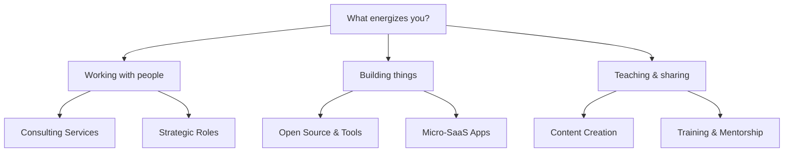

# Getting Started: Your DevOps Monetization Journey

Welcome to your comprehensive guide for turning DevOps expertise into sustainable income. This overview will help you choose the right path based on your skills, interests, and goals.

---

## 🧭 Quick Navigation

| Your Situation | Recommended Path | Time to First $ | Revenue Potential |
|----------------|------------------|-----------------|-------------------|
| **Want immediate income** | [Consulting Services](#consulting) | 2-4 weeks | $5k-30k/month |
| **Love teaching & writing** | [Content & Education](#content) | 1-3 months | $2k-20k/month |
| **Enjoy building products** | [Open Source & Tools](#tools) | 3-6 months | $1k-50k+/month |
| **Senior with business skills** | [Niche & Strategic Roles](#niche) | 1-2 months | $10k-40k/month |
| **Want scalable passive income** | [Knowledge & Apps](#knowledge-apps) | 3-12 months | $5k-100k+/month |

---

## 🎯 Decision Framework

### Step 1: Assess Your Starting Point

#### **Experience Level**
- **Junior (0-2 years)**: Focus on Content Creation (build authority)
- **Mid-Level (2-5 years)**: Consulting or Tool Development
- **Senior (5+ years)**: Strategic Roles or Training

#### **Available Time**
- **Part-time (10-20 hrs/week)**: Consulting, Mentorship, or Content
- **Full-time (40+ hrs/week)**: Any path, prioritize scalable options
- **Weekends only**: Content Creation or Tool Development

#### **Risk Tolerance**
- **Low risk**: Start with Consulting (immediate income)
- **Medium risk**: Content + Consulting hybrid
- **High risk**: Build a product (longer runway, higher upside)

### Step 2: Match Your Strengths



---

## 📚 Path Deep Dives

### <a name="consulting"></a>🏗️ 1. Professional Services & Consulting

**Best For**: Experienced engineers who want immediate income and enjoy client work

**What You'll Do**:
- Infrastructure audits and optimization
- CI/CD pipeline implementation
- Cloud cost reduction (FinOps)
- Disaster recovery planning
- Migration projects

**Getting Started**:
- **Week 1-2**: Build portfolio with case studies
- **Week 3-4**: Create profiles on Upwork/Toptal
- **Month 2**: Land first 2-3 small projects
- **Month 3+**: Increase rates, focus on larger projects

**Revenue Timeline**:
- Month 1: $0-2k (building reputation)
- Month 3: $5k-10k
- Month 6: $10k-20k
- Month 12: $15k-30k+

**[→ Read the Complete Consulting Guide](./01-Consulting-Services/Getting-Started.md)**

---

### <a name="content"></a>📝 2. Content Creation & Education

**Best For**: Engineers who love teaching and have strong communication skills

**What You'll Do**:
- Write paid technical articles ($300-800 each)
- Create online courses ($2k-50k per course)
- Build a YouTube channel (ad revenue + sponsorships)
- Launch a premium newsletter ($5-50/month)
- Publish technical e-books ($19-99 each)

**Getting Started**:
- **Month 1**: Apply to paid writing platforms, start blog
- **Month 2-3**: Publish 4-8 articles, grow email list
- **Month 4-6**: Launch YouTube or newsletter
- **Month 6-12**: Create first course or e-book

**Revenue Timeline**:
- Month 1-2: $300-1k (paid articles)
- Month 3-6: $500-2k (blog ads + articles)
- Month 6-12: $2k-5k (course sales + newsletter)
- Month 12+: $5k-20k (multiple revenue streams)

**[→ Read the Complete Content Creation Guide](./02-Content-Education/Getting-Started.md)**

---

### <a name="tools"></a>🛠️ 3. Open Source & Tool Development

**Best For**: Engineers who love coding and want to build products

**What You'll Do**:
- Create Terraform modules or Helm charts ($500-5k)
- Build CLI tools ($5k-50k/year)
- Develop SaaS management layers ($10k-500k+/year)
- Sell white-label infrastructure templates
- Offer enterprise support for open source projects

**Getting Started**:
- **Month 1**: Validate idea, create landing page
- **Month 2-3**: Build MVP, beta test
- **Month 4**: Launch on Product Hunt, marketplaces
- **Month 6+**: Iterate based on feedback, scale

**Revenue Timeline**:
- Month 1-3: $0 (building)
- Month 4-6: $500-2k (early sales)
- Month 6-12: $2k-10k (traction)
- Month 12+: $10k-50k+ (scale)

**[→ Read the Complete Tool Development Guide](./03-OpenSource-Tools/Getting-Started.md)**

---

### <a name="niche"></a>🎯 4. Niche & Strategic Roles

**Best For**: Senior engineers with business acumen and strategic thinking

**What You'll Do**:
- Fractional CTO for startups ($10k-30k/month)
- Technical recruiting and vetting ($100-300/interview)
- DevRel consulting for tool companies ($8k-25k/month)
- DevSecOps strategy for regulated industries ($10k-30k/month)
- Platform engineering consulting ($15k-40k/month)
- Technical due diligence for VCs ($2k-10k per deal)

**Getting Started**:
- **Month 1**: Build authority through content and case studies
- **Month 2**: Network with VCs, CTOs, and recruiting firms
- **Month 3**: Land first strategic engagement
- **Month 6+**: Build referral network, increase rates

**Revenue Timeline**:
- Month 1-2: $0-5k (positioning)
- Month 3-6: $10k-20k (first clients)
- Month 6-12: $20k-40k (established)
- Month 12+: $30k-50k+ (premium rates)

**[→ Read the Complete Strategic Roles Guide](./04-Niche-Roles/Getting-Started.md)**

---

### <a name="knowledge-apps"></a>💡 5. Knowledge Sharing & App Creation

**Best For**: Engineers who want to combine teaching with product development

**What You'll Do**:
- Deliver corporate training workshops ($8k-25k per workshop)
- 1-on-1 paid mentorship ($100-500/session)
- Build paid professional communities ($20-100/month per member)
- Create specialized micro-SaaS apps ($9-499/month)
- DevOps for Web3/blockchain (node management)
- Technical advisory for VCs ($2k-10k per deal)

**Getting Started**:
- **Month 1**: Choose path (training, mentorship, or app)
- **Month 2-3**: Build offering and validate with beta users
- **Month 4**: Launch and acquire first customers
- **Month 6+**: Scale through content and referrals

**Revenue Timeline**:
- Month 1-3: $0-2k (building)
- Month 3-6: $2k-10k (first revenue)
- Month 6-12: $5k-20k (growing)
- Month 12+: $10k-100k+ (scaled)

**[→ Read the Complete Knowledge Sharing & Apps Guide](./05-Knowledge-Apps/Getting-Started.md)**

---

## 🚀 Recommended Starting Strategies

### Strategy 1: Quick Cash + Long-Term Build
**Timeline**: 12 months
**Paths**: Consulting + Content Creation

```markdown
Months 1-3: Consulting
- Land 2-3 small consulting projects
- Generate $5k-10k to fund runway
- Build case studies and credibility

Months 4-6: Add Content
- Write paid articles ($1k-2k/month)
- Start blog and newsletter
- Build email list (500+ subscribers)

Months 7-12: Scale Content
- Launch online course ($10k-30k)
- Reduce consulting hours
- Focus on scalable income
```

### Strategy 2: Product-First Approach
**Timeline**: 12 months
**Paths**: Tool Development + Content Marketing

```markdown
Months 1-3: Validate & Build
- Identify market gap
- Build MVP
- Beta test with 20 users

Months 4-6: Launch & Iterate
- Product Hunt launch
- Acquire first 50 customers
- Iterate based on feedback

Months 7-12: Content Marketing
- Write SEO blog posts
- Create YouTube tutorials
- Scale to $10k+ MRR
```

### Strategy 3: Authority-Based Positioning
**Timeline**: 12 months
**Paths**: Content → Strategic Roles

```markdown
Months 1-6: Build Authority
- Publish 20+ technical articles
- Speak at 3-5 conferences
- Grow LinkedIn to 5k+ followers

Months 7-9: Transition to Advisory
- Position as thought leader
- Network with VCs and executives
- Offer free strategic sessions

Months 10-12: Premium Services
- Land fractional CTO role
- Technical due diligence work
- $20k-40k/month revenue
```

---

## 🛠️ Universal Success Factors

Regardless of which path you choose, these factors determine success:

### 1. **Niche Specialization**
❌ "DevOps Consultant"
✅ "Kubernetes Cost Optimization Specialist for Fintech"

### 2. **Proof of Results**
- Case studies with metrics
- Testimonials from real clients
- Public portfolio (GitHub, blog, courses)

### 3. **Consistent Marketing**
- LinkedIn posts (3-5x per week)
- Technical content (1-2x per month)
- Networking (2-3 events per month)

### 4. **Value-Based Pricing**
- Price based on outcomes, not hours
- Increase rates every 6 months
- Package services for higher perceived value

### 5. **Systems & Automation**
- Automated scheduling (Calendly)
- Email sequences for leads
- Standardized proposals and contracts

---

## 📊 Success Metrics by Path

### Consulting
- **Month 3**: 3 completed projects, 5-star reviews
- **Month 6**: $10k/month revenue, 2 retainer clients
- **Month 12**: $20k/month, 50% from referrals

### Content Creation
- **Month 3**: 500 email subscribers, 2 paid articles
- **Month 6**: 1,500 subscribers, $2k/month revenue
- **Month 12**: 5,000 subscribers, $5k/month revenue

### Tool Development
- **Month 3**: MVP launched, 20 beta users
- **Month 6**: 100 users, 10 paying customers
- **Month 12**: 500 users, $10k MRR

### Strategic Roles
- **Month 3**: 1 strategic engagement
- **Month 6**: 2 concurrent clients, $20k/month
- **Month 12**: 3-4 clients, $30k-40k/month

### Knowledge & Apps
- **Month 3**: First workshop or 10 mentees
- **Month 6**: $5k/month from training/community
- **Month 12**: $10k-20k/month, scalable model

---

## 🎓 Next Steps

1. **Choose Your Primary Path**: Pick one from the 5 options above
2. **Read the Detailed Guide**: Click through to your chosen path
3. **Set 90-Day Goals**: Use the action plans in each guide
4. **Join Communities**: Connect with others on the same journey
5. **Start Today**: Take the first action item from your chosen guide

---

## 📚 Additional Resources

### Communities
- **Indie Hackers**: Solo founders and product builders
- **r/devops**: DevOps community on Reddit
- **CNCF Slack**: Cloud native professionals
- **Rands Leadership**: Engineering leaders

### Tools
- **Calendly**: Scheduling
- **Stripe**: Payments
- **ConvertKit**: Email marketing
- **Notion**: Documentation and planning

### Books
- *"The Consulting Bible"* by Alan Weiss
- *"Show Your Work"* by Austin Kleon
- *"The Mom Test"* by Rob Fitzpatrick
- *"Traction"* by Gabriel Weinberg

---

> [!IMPORTANT]
> **Don't Try Everything at Once**: Pick ONE path to start. You can always add others later. Focus beats diversification in the early stages.

> [!TIP]
> **The 90-Day Rule**: Commit to one path for 90 days before switching. Most people quit too early. Give your chosen strategy time to work.

**Ready to start?** Choose your path above and dive into the detailed guide. Your DevOps monetization journey begins now! 🚀
