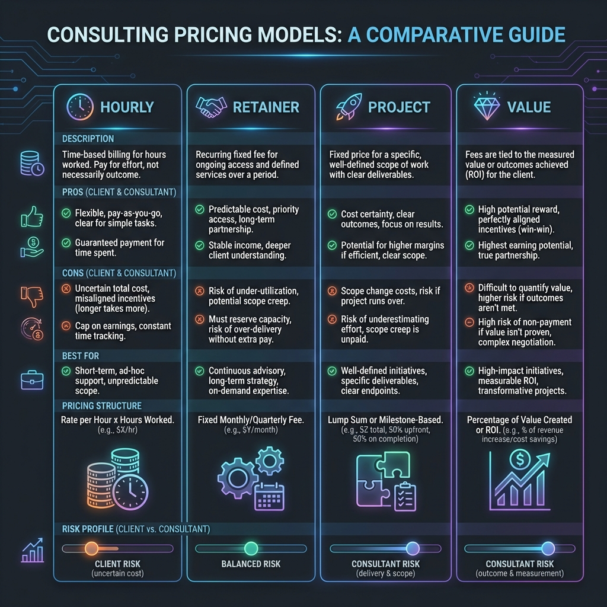

# Images Directory

This directory contains all visual assets for the Professional Development guides.

## 📁 Directory Structure

```
Images/
├── diagrams/          - Architecture and workflow diagrams
├── screenshots/       - Tool screenshots and examples
├── infographics/      - Visual summaries and charts
└── logos/            - Tool and platform logos
```

## 🎨 Image Guidelines

### File Naming Convention
- Use lowercase with hyphens: `finops-lifecycle-diagram.png`
- Be descriptive: `aws-cost-explorer-screenshot.png`
- Include version if applicable: `pricing-comparison-v2.png`

### Recommended Formats
- **Diagrams**: PNG or SVG (for scalability)
- **Screenshots**: PNG (for clarity)
- **Photos**: JPG (for file size)
- **Icons/Logos**: SVG or PNG with transparency

### Image Optimization
- Compress images before adding (use [TinyPNG](https://tinypng.com))
- Maximum width: 1200px for diagrams
- Keep file sizes under 500KB when possible

## 📊 Current Images

### FinOps Diagrams (Needed)
The following diagrams are referenced but not yet created:
- FinOps Lifecycle (3 phases: Inform, Optimize, Operate)
- Cost Optimization Strategies (6 strategies overview)
- FinOps Consulting Process (6-phase workflow)

**Temporary Solution**: Links to official FinOps Foundation diagrams provided in documentation

### Creating Diagrams

**Recommended Tools**:
- **[Excalidraw](https://excalidraw.com)**: Free, simple diagrams
- **[Lucidchart](https://www.lucidchart.com)**: Professional diagrams
- **[Draw.io](https://app.diagrams.net)**: Free, feature-rich
- **[Mermaid](https://mermaid.js.org)**: Code-based diagrams (can embed in markdown)

## 🔗 Referencing Images in Documentation

### Relative Path Format
```markdown

```

### From Different Directories
```markdown
# From 07-FinOps/README.md


# From 00-Action-Plans/01-Consulting-30-Day-Plan.md

```

## 📝 Image Inventory

### Status: No images currently in directory

**Action Items**:
1. Create FinOps lifecycle diagram
2. Create cost optimization strategies infographic
3. Create consulting process flowchart
4. Add tool screenshots as needed
5. Create pricing comparison charts

## 💡 Tips

- **Use Alt Text**: Always include descriptive alt text for accessibility
- **Keep It Simple**: Diagrams should be clear and easy to understand
- **Consistent Style**: Use similar colors and fonts across all diagrams
- **Version Control**: Keep source files (e.g., .excalidraw, .drawio) in a separate folder

---

**Need to add an image?** Place it in the appropriate subdirectory and reference it using relative paths in your markdown files.
