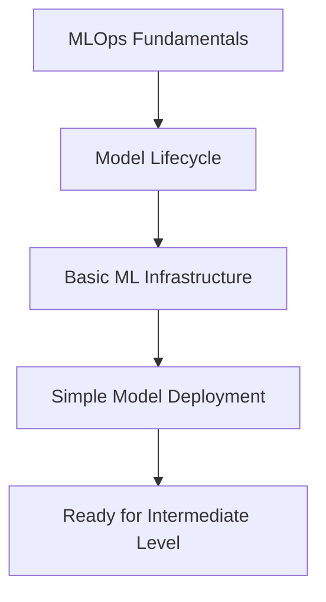

# Beginner Level: MLOps Fundamentals

Welcome to MLOps fundamentals for DevOps professionals. This level introduces core concepts, basic workflows, and essential practices for integrating machine learning into DevOps environments.

## 🎯 Learning Objectives

By completing this level, you will:
- Understand MLOps principles and terminology
- Learn the complete ML model lifecycle
- Set up basic ML infrastructure
- Deploy simple ML models to production
- Implement basic monitoring and versioning

## 📚 Course Structure

### [01 - MLOps Fundamentals](./01-MLOps-Fundamentals/)
**Core concepts and principles**
- What is MLOps and why it matters
- MLOps vs traditional DevOps
- Key stakeholders and roles
- MLOps maturity model
- Essential terminology and concepts

### [02 - Model Lifecycle](./02-Model-Lifecycle/)
**Understanding the complete ML workflow**
- Data collection and preparation
- Model development and training
- Model evaluation and validation
- Model deployment strategies
- Model maintenance and retirement

### [03 - Basic ML Infrastructure](./03-Basic-ML-Infrastructure/)
**Setting up foundational infrastructure**
- Development environment setup
- Version control for ML projects
- Basic containerization with Docker
- Simple orchestration concepts
- Storage and compute requirements

### [04 - Simple Model Deployment](./04-Simple-Model-Deployment/)
**Getting models into production**
- Model packaging and containerization
- REST API creation for model serving
- Basic deployment patterns
- Health checks and basic monitoring
- Simple rollback strategies

## 🛠️ Prerequisites

- Basic understanding of software development
- Familiarity with command line interfaces
- Basic knowledge of Python programming
- Understanding of DevOps concepts (CI/CD, containers)
- Basic statistics and data analysis concepts

## 🚀 Getting Started

1. **Environment Setup**
   ```bash
   # Install Python and pip
   python --version
   pip --version
   
   # Install essential packages
   pip install pandas numpy scikit-learn flask docker
   ```

2. **Clone Sample Repository**
   ```bash
   git clone https://github.com/example/mlops-beginner
   cd mlops-beginner
   ```

3. **Follow the Learning Path**
   - Start with 01-MLOps-Fundamentals
   - Progress through each module sequentially
   - Complete hands-on exercises in each section

## 📊 Success Criteria

### Knowledge Assessment
- [ ] Explain MLOps principles and benefits
- [ ] Describe the ML model lifecycle stages
- [ ] Set up a basic ML development environment
- [ ] Deploy a simple ML model as a REST API
- [ ] Implement basic model versioning

### Practical Skills
- [ ] Create a simple ML training pipeline
- [ ] Containerize an ML model
- [ ] Deploy model to a local environment
- [ ] Monitor basic model metrics
- [ ] Perform model updates and rollbacks

## 🔧 Tools Introduction

### Development Tools
- **Python**: Primary programming language
- **Jupyter Notebooks**: Interactive development
- **Git**: Version control for code
- **Docker**: Containerization platform

### ML Libraries
- **scikit-learn**: Traditional ML algorithms
- **pandas**: Data manipulation
- **numpy**: Numerical computing
- **matplotlib/seaborn**: Data visualization

### Basic MLOps Tools
- **Flask/FastAPI**: Model serving frameworks
- **MLflow**: Experiment tracking (basic usage)
- **Docker Compose**: Local orchestration
- **pytest**: Testing framework

## 🧪 Hands-On Projects

### Project 1: Simple Classification Model
Build and deploy a basic classification model:
- Data preprocessing pipeline
- Model training and evaluation
- REST API creation
- Docker containerization

### Project 2: Model Versioning System
Implement basic model versioning:
- Model artifact storage
- Version tracking
- Simple model registry
- Deployment automation

### Project 3: Basic Monitoring Dashboard
Create a simple monitoring system:
- Model performance metrics
- Basic alerting
- Simple visualization
- Health check endpoints

## 📈 Learning Path Progression



## 🔗 Integration with DevOps

### Version Control
- Git workflows for ML projects
- Branching strategies for experiments
- Code review processes for ML code
- Documentation standards

### Testing
- Unit tests for ML code
- Data validation tests
- Model performance tests
- Integration testing basics

### Deployment
- Containerization best practices
- Environment management
- Configuration management
- Basic CI/CD for ML

## 📝 Assessment Checklist

Before moving to Intermediate Level, ensure you can:
- [ ] Explain MLOps concepts clearly
- [ ] Set up ML development environments
- [ ] Create simple ML training pipelines
- [ ] Deploy models as REST APIs
- [ ] Implement basic monitoring
- [ ] Use version control for ML projects
- [ ] Containerize ML applications
- [ ] Understand ML model lifecycle

## 🔗 Next Steps

Upon completion:
- **[Intermediate Level](../Intermediate-Level/)** - Advanced MLOps practices
- **Specialization Tracks** - Focus on specific tools or domains
- **Hands-On Projects** - Build real-world MLOps solutions

## 📚 Additional Resources

### Beginner-Friendly Materials
- [MLOps Zoomcamp](https://github.com/DataTalksClub/mlops-zoomcamp)
- [Made With ML - MLOps](https://madewithml.com/courses/mlops/)
- [Google's Machine Learning Crash Course](https://developers.google.com/machine-learning/crash-course)

### Practice Datasets
- Iris Classification Dataset
- Boston Housing Prices
- Titanic Survival Prediction
- Wine Quality Dataset

---

*This beginner-level content provides the foundation for all advanced MLOps concepts and practices in DevOps environments.*