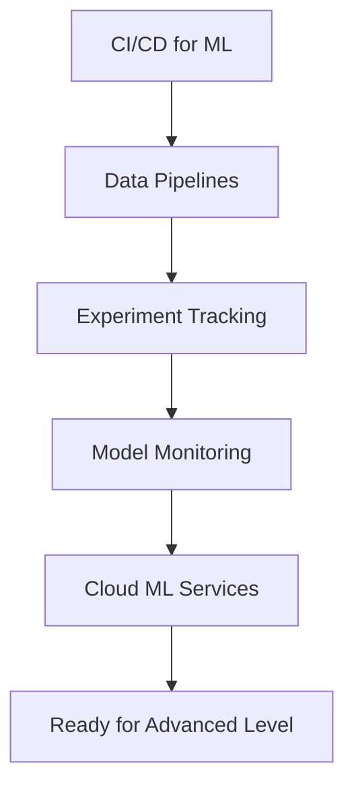

# Intermediate Level: Advanced MLOps Practices

Advanced MLOps implementations for experienced DevOps practitioners ready to build production-grade ML systems with comprehensive automation, monitoring, and governance.

## 🎯 Learning Objectives

By completing this level, you will:
- Implement comprehensive CI/CD pipelines for ML workflows
- Build and manage complex data pipelines
- Master experiment tracking and model versioning
- Deploy advanced model monitoring systems
- Integrate cloud ML services effectively

## 📚 Course Structure

### [01 - CI/CD for ML](./01-CI-CD-for-ML/)
**Advanced automation for ML workflows**
- ML-specific CI/CD pipeline design
- Automated testing strategies for ML
- Model validation and approval workflows
- Deployment automation and rollback strategies
- Integration with existing DevOps toolchains

### [02 - Data Pipelines](./02-Data-Pipelines/)
**Robust data orchestration and management**
- Data pipeline architecture patterns
- Apache Airflow for ML workflows
- Data quality validation and monitoring
- Feature engineering automation
- Real-time and batch processing integration

### [03 - Experiment Tracking](./03-Experiment-Tracking/)
**Comprehensive experiment management**
- Advanced MLflow implementations
- Weights & Biases integration
- Hyperparameter optimization workflows
- Model comparison and selection
- Experiment reproducibility strategies

### [04 - Model Monitoring](./04-Model-Monitoring/)
**Production model performance tracking**
- Model drift detection systems
- Data quality monitoring
- Performance degradation alerts
- A/B testing frameworks
- Automated retraining triggers

### [05 - Cloud ML Services](./05-Cloud-ML-Services/)
**Leveraging cloud platforms for MLOps**
- AWS SageMaker end-to-end workflows
- Azure ML platform integration
- Google Cloud Vertex AI implementation
- Multi-cloud MLOps strategies
- Cost optimization techniques

## 🛠️ Prerequisites

- Completion of [Beginner Level](../Beginner-Level/) or equivalent knowledge
- Solid understanding of containerization and orchestration
- Experience with CI/CD pipelines
- Proficiency in Python and ML libraries
- Basic cloud platform knowledge

## 🚀 Advanced Concepts

### MLOps Architecture Patterns

**Microservices for ML:**
```
┌─────────────────────────────────────────┐
│              ML Platform                │
├─────────────────────────────────────────┤
│ [Data Service] [Training Service]       │
│ [Model Service] [Monitoring Service]    │
├─────────────────────────────────────────┤
│        Infrastructure Layer             │
│ [Kubernetes] [Storage] [Networking]     │
└─────────────────────────────────────────┘
```

**Event-Driven ML Pipelines:**
- Data arrival triggers training
- Model performance triggers retraining
- Drift detection triggers alerts
- Automated model deployment on validation

### Advanced Deployment Strategies

**Multi-Model Serving:**
- A/B testing between model versions
- Canary deployments for gradual rollout
- Shadow deployments for validation
- Blue-green deployments for zero-downtime

## 📊 Success Metrics

### Technical KPIs
- **Deployment Frequency**: Models deployed per week
- **Lead Time**: Time from experiment to production
- **Mean Time to Recovery**: Time to fix production issues
- **Model Performance**: Accuracy, latency, throughput

### Business KPIs
- **Model Impact**: Business value generated
- **Cost Efficiency**: Infrastructure cost per prediction
- **Team Productivity**: Experiments per data scientist
- **Reliability**: Model uptime and availability

## 🧪 Hands-On Projects

### Project 1: End-to-End ML Pipeline
Build a complete automated ML pipeline:
- Automated data ingestion and validation
- Model training with hyperparameter optimization
- Automated testing and deployment
- Comprehensive monitoring and alerting

### Project 2: Multi-Model A/B Testing Platform
Implement advanced deployment strategies:
- Traffic splitting between model versions
- Performance comparison frameworks
- Automated rollback mechanisms
- Business metric tracking

### Project 3: Real-Time ML System
Build a real-time ML inference system:
- Stream processing for feature engineering
- Low-latency model serving
- Real-time monitoring and alerting
- Auto-scaling based on demand

## 🔧 Advanced Tools and Technologies

### Orchestration Platforms
- **Apache Airflow**: Workflow orchestration
- **Kubeflow**: Kubernetes-native ML workflows
- **Prefect**: Modern workflow management
- **Argo Workflows**: Container-native workflows

### Model Serving Frameworks
- **Seldon Core**: Kubernetes-native model serving
- **KServe**: Serverless model inference
- **BentoML**: Model serving framework
- **Ray Serve**: Scalable model serving

### Monitoring and Observability
- **Evidently**: ML model monitoring
- **Alibi Detect**: Outlier and drift detection
- **Great Expectations**: Data quality testing
- **Prometheus + Grafana**: Metrics and visualization

## 📈 Learning Path Progression



## 🔒 Security and Governance

### Model Security
- Model artifact encryption
- Access control for model registries
- Secure model serving endpoints
- Audit logging for model access

### Data Governance
- Data lineage tracking
- Privacy-preserving ML techniques
- Compliance with regulations (GDPR, HIPAA)
- Data access controls and monitoring

### Infrastructure Security
- Container security scanning
- Network security policies
- Secrets management
- Infrastructure compliance

## 📊 Assessment Criteria

### Practical Skills Assessment
**Pipeline Development:**
- [ ] Design and implement ML-specific CI/CD pipelines
- [ ] Build robust data processing workflows
- [ ] Implement comprehensive testing strategies
- [ ] Deploy models with advanced strategies

**Monitoring and Maintenance:**
- [ ] Set up model performance monitoring
- [ ] Implement drift detection systems
- [ ] Create automated alerting mechanisms
- [ ] Design retraining workflows

**Cloud Integration:**
- [ ] Leverage cloud ML services effectively
- [ ] Implement multi-cloud strategies
- [ ] Optimize costs and performance
- [ ] Ensure security and compliance

## 🔗 Integration Patterns

### DevOps Integration
- GitOps workflows for ML infrastructure
- Infrastructure as Code for ML platforms
- Automated security scanning for ML containers
- Compliance automation for ML workflows

### Data Engineering Integration
- Real-time feature engineering pipelines
- Data lake and warehouse integration
- Stream processing for ML features
- Data catalog and lineage management

## 📝 Best Practices

### Pipeline Design
- Modular and reusable components
- Fail-fast validation strategies
- Comprehensive error handling
- Resource optimization techniques

### Model Management
- Semantic versioning for models
- Model approval workflows
- Automated model testing
- Performance benchmarking

### Operational Excellence
- Comprehensive monitoring and alerting
- Automated incident response
- Regular performance reviews
- Continuous improvement processes

## ✅ Knowledge Check

Before proceeding to Advanced Level, ensure you can:
- [ ] Design and implement ML-specific CI/CD pipelines
- [ ] Build and manage complex data workflows
- [ ] Implement comprehensive experiment tracking
- [ ] Deploy advanced model monitoring systems
- [ ] Integrate cloud ML services effectively
- [ ] Handle security and governance requirements
- [ ] Optimize performance and costs

## 🔗 Next Steps

Upon completion:
- **[Advanced Level](../Advanced-Level/)** - Enterprise MLOps patterns
- **Specialization**: Focus on specific cloud platforms or tools
- **Certification**: Pursue cloud ML certifications
- **Community**: Contribute to open-source MLOps projects

## 📚 Additional Resources

### Advanced Learning Materials
- [MLOps Specialization (Coursera)](https://www.coursera.org/specializations/machine-learning-engineering-for-production-mlops)
- [Full Stack Deep Learning](https://fullstackdeeplearning.com/)
- [MLOps Community Resources](https://mlops.community/learn/)

### Industry Case Studies
- Netflix ML Platform
- Uber Michelangelo
- Airbnb ML Infrastructure
- Spotify ML Platform

---

*This intermediate-level content bridges fundamental concepts with advanced enterprise MLOps implementations.*