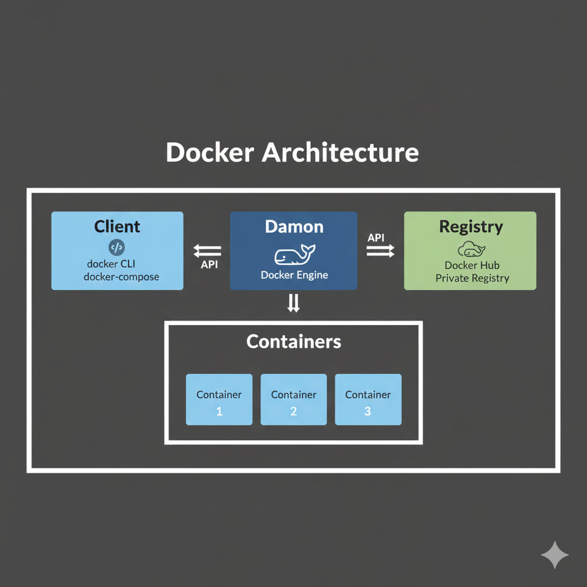
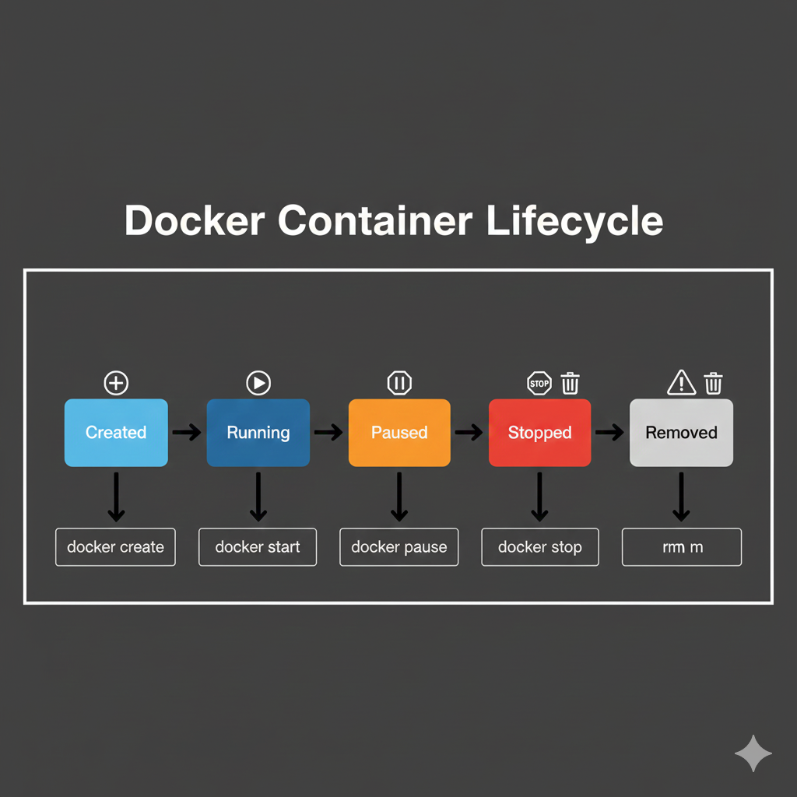

# Docker Fundamentals

Essential Docker concepts and basic operations for containerization.

## What is Docker?

Docker is a containerization platform that packages applications and their dependencies into lightweight, portable containers.

### Key Benefits
- **Consistency**: Same environment across development, testing, and production
- **Portability**: Run anywhere Docker is installed
- **Efficiency**: Lightweight compared to virtual machines
- **Scalability**: Easy horizontal scaling
- **Isolation**: Process and resource isolation
- **Speed**: Fast startup and deployment

## Core Concepts

### Containers vs Virtual Machines

| Aspect | Containers | Virtual Machines |
|--------|------------|------------------|
| **OS** | Share host OS kernel | Full OS per VM |
| **Size** | MBs | GBs |
| **Startup** | Seconds | Minutes |
| **Resource Usage** | Low overhead | High overhead |
| **Isolation** | Process-level | Hardware-level |

### Docker Architecture



### Docker Components

#### 1. Docker Engine
- **Docker Daemon**: Background service managing containers
- **Docker CLI**: Command-line interface
- **REST API**: Interface for programmatic access

#### 2. Docker Images
- **Read-only templates** for creating containers
- **Layered filesystem** for efficiency
- **Immutable** - changes create new layers

#### 3. Docker Containers
- **Running instances** of Docker images
- **Writable layer** on top of image layers
- **Isolated processes** with their own filesystem

#### 4. Docker Registry
- **Storage and distribution** of Docker images
- **Docker Hub**: Public registry
- **Private registries**: For internal use

---

## Basic Docker Workflow

### 1. Build Phase
```bash
# Create Dockerfile
cat > Dockerfile << EOF
FROM node:alpine
WORKDIR /app
COPY package*.json ./
RUN npm install
COPY . .
EXPOSE 3000
CMD ["npm", "start"]
EOF

# Build image
docker build -t myapp:v1.0 .
```

### 2. Ship Phase
```bash
# Tag image for registry
docker tag myapp:v1.0 username/myapp:v1.0

# Push to registry
docker push username/myapp:v1.0
```

### 3. Run Phase
```bash
# Pull and run image
docker run -d -p 3000:3000 username/myapp:v1.0
```

## Essential Docker Commands

### Image Management
```bash
# List images
docker images
docker image ls

# Pull image from registry
docker pull nginx:alpine

# Build image from Dockerfile
docker build -t myapp .
docker build -t myapp:v1.0 .

# Remove image
docker rmi nginx:alpine
docker image rm myapp:v1.0

# Image history
docker history nginx:alpine

# Image details
docker inspect nginx:alpine
```

### Container Management
```bash
# Run container
docker run nginx:alpine
docker run -d nginx:alpine                    # Detached mode
docker run -it ubuntu bash                    # Interactive mode
docker run -p 8080:80 nginx:alpine           # Port mapping
docker run --name webserver nginx:alpine      # Named container

# List containers
docker ps                                      # Running containers
docker ps -a                                  # All containers

# Container operations
docker start <container_id>                   # Start stopped container
docker stop <container_id>                    # Stop running container
docker restart <container_id>                 # Restart container
docker pause <container_id>                   # Pause container
docker unpause <container_id>                 # Unpause container

# Remove containers
docker rm <container_id>                      # Remove stopped container
docker rm -f <container_id>                   # Force remove running container
docker container prune                        # Remove all stopped containers
```

### Container Interaction
```bash
# Execute commands in running container
docker exec -it <container_id> bash
docker exec <container_id> ls /app

# View container logs
docker logs <container_id>
docker logs -f <container_id>                 # Follow logs
docker logs --tail 100 <container_id>         # Last 100 lines

# Copy files between host and container
docker cp file.txt <container_id>:/app/
docker cp <container_id>:/app/file.txt ./

# Container statistics
docker stats                                  # All containers
docker stats <container_id>                   # Specific container
```

---

## Dockerfile Basics

### Dockerfile Instructions
```dockerfile
# Base image
FROM node:16-alpine

# Set working directory
WORKDIR /app

# Copy files
COPY package*.json ./
COPY . .

# Run commands during build
RUN npm install
RUN npm run build

# Set environment variables
ENV NODE_ENV=production
ENV PORT=3000

# Expose ports
EXPOSE 3000

# Set user
USER node

# Define volumes
VOLUME ["/app/data"]

# Entry point and command
ENTRYPOINT ["docker-entrypoint.sh"]
CMD ["npm", "start"]
```

### Multi-Stage Builds
```dockerfile
# Build stage
FROM node:16-alpine AS builder
WORKDIR /app
COPY package*.json ./
RUN npm ci --only=production

# Production stage
FROM node:16-alpine AS production
WORKDIR /app
COPY --from=builder /app/node_modules ./node_modules
COPY . .
EXPOSE 3000
CMD ["npm", "start"]
```

## Container Lifecycle

### States


### Lifecycle Commands
```bash
# Create container without starting
docker create --name mycontainer nginx:alpine

# Start created container
docker start mycontainer

# Run (create + start)
docker run --name mycontainer nginx:alpine

# Pause/unpause
docker pause mycontainer
docker unpause mycontainer

# Stop gracefully
docker stop mycontainer

# Kill forcefully
docker kill mycontainer

# Remove container
docker rm mycontainer

# Remove all stopped containers
docker container prune
```

## Data Management

### Volumes
```bash
# Create volume
docker volume create myvolume

# List volumes
docker volume ls

# Use volume in container
docker run -v myvolume:/data alpine

# Remove volume
docker volume rm myvolume
```

### Bind Mounts
```bash
# Mount host directory
docker run -v /host/path:/container/path alpine

# Mount current directory
docker run -v $(pwd):/app alpine

# Read-only mount
docker run -v /host/path:/container/path:ro alpine
```

## Networking Basics

### Network Types
- **Bridge**: Default network for containers
- **Host**: Use host network stack
- **None**: No networking
- **Custom**: User-defined networks

### Network Commands
```bash
# List networks
docker network ls

# Create network
docker network create mynetwork

# Run container in network
docker run --network mynetwork alpine

# Connect container to network
docker network connect mynetwork mycontainer

# Disconnect from network
docker network disconnect mynetwork mycontainer
```

## Environment Variables

### Setting Environment Variables
```bash
# Single variable
docker run -e NODE_ENV=production myapp

# Multiple variables
docker run -e NODE_ENV=production -e PORT=3000 myapp

# From file
docker run --env-file .env myapp
```

### Environment File (.env)
```bash
# .env file
NODE_ENV=production
PORT=3000
DATABASE_URL=mongodb://localhost:27017/mydb
```

## Health Checks

### Dockerfile Health Check
```dockerfile
FROM nginx:alpine

# Add health check
HEALTHCHECK --interval=30s --timeout=3s --start-period=5s --retries=3 \
  CMD curl -f http://localhost/ || exit 1
```

### Runtime Health Check
```bash
# Run with health check
docker run -d --name webserver \
  --health-cmd="curl -f http://localhost/ || exit 1" \
  --health-interval=30s \
  --health-timeout=3s \
  --health-retries=3 \
  nginx:alpine

# Check health status
docker inspect --format='{{.State.Health.Status}}' webserver
```

## Resource Management

### CPU and Memory Limits
```bash
# Limit CPU and memory
docker run -d \
  --cpus="1.5" \
  --memory="512m" \
  --memory-swap="1g" \
  nginx:alpine

# CPU shares (relative weight)
docker run -d --cpu-shares=512 nginx:alpine
```

### Monitoring Resources
```bash
# Real-time stats
docker stats

# Container resource usage
docker stats --no-stream --format "table {{.Container}}\t{{.CPUPerc}}\t{{.MemUsage}}"
```

## Best Practices

### Image Best Practices
1. **Use official base images**
2. **Use specific tags, not 'latest'**
3. **Minimize layers**
4. **Use multi-stage builds**
5. **Don't run as root**
6. **Use .dockerignore**

### Container Best Practices
1. **One process per container**
2. **Use health checks**
3. **Handle signals properly**
4. **Use read-only filesystems**
5. **Set resource limits**
6. **Use secrets management**

### Example: Production-Ready Dockerfile
```dockerfile
FROM node:16-alpine AS builder

# Create app directory
WORKDIR /usr/src/app

# Copy package files
COPY package*.json ./

# Install dependencies
RUN npm ci --only=production && npm cache clean --force

# Production stage
FROM node:16-alpine AS production

# Create non-root user
RUN addgroup -g 1001 -S nodejs && \
    adduser -S nextjs -u 1001

# Set working directory
WORKDIR /usr/src/app

# Copy dependencies
COPY --from=builder --chown=nextjs:nodejs /usr/src/app/node_modules ./node_modules

# Copy application code
COPY --chown=nextjs:nodejs . .

# Switch to non-root user
USER nextjs

# Expose port
EXPOSE 3000

# Health check
HEALTHCHECK --interval=30s --timeout=3s --start-period=5s --retries=3 \
  CMD curl -f http://localhost:3000/health || exit 1

# Start application
CMD ["npm", "start"]
```

This covers the fundamental concepts and basic operations needed to get started with Docker containerization.