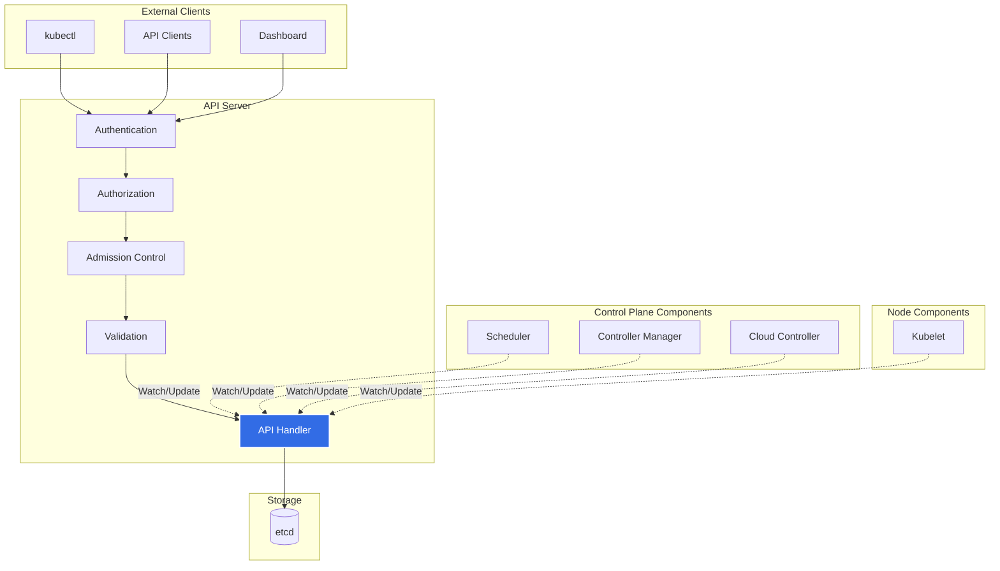
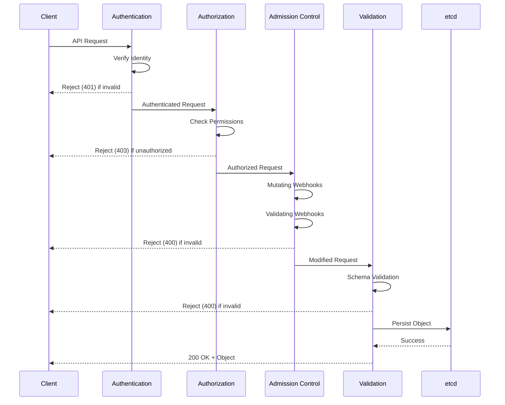
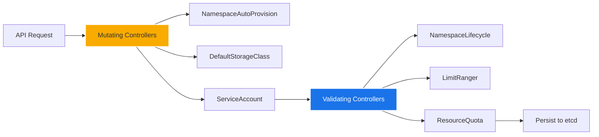
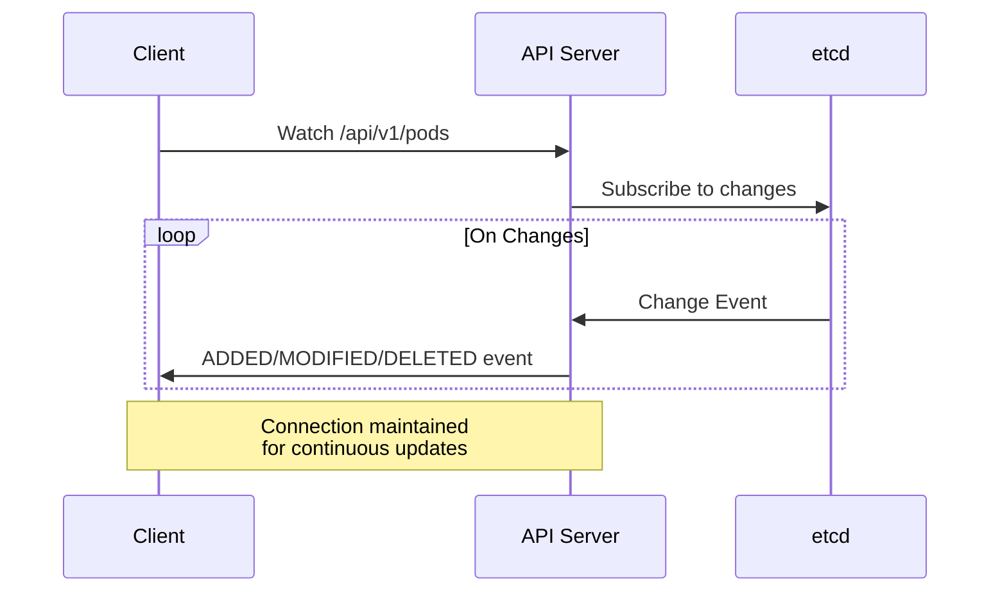
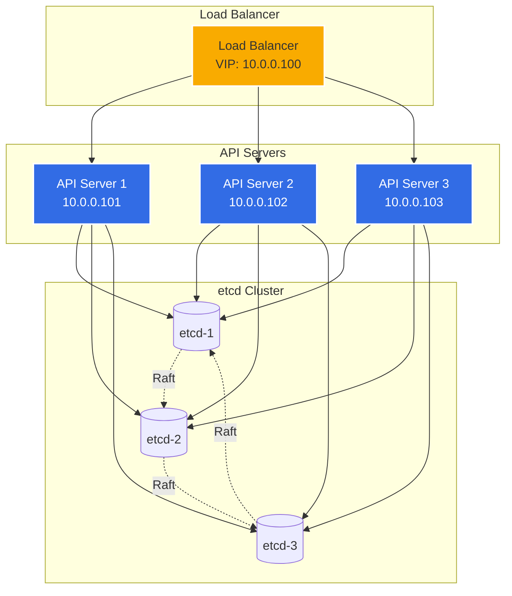
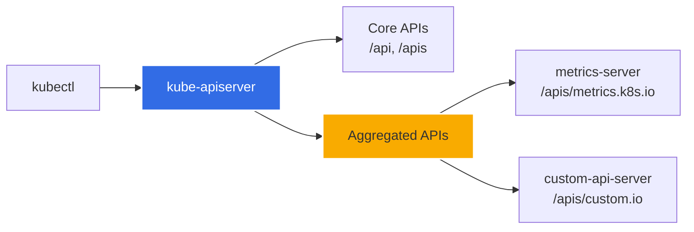

# Kube API Server

## Overview

The **Kubernetes API Server** (`kube-apiserver`) is the central management entity and the primary interface to the Kubernetes control plane. It exposes the Kubernetes API and serves as the front-end for the Kubernetes control plane, handling all REST operations and providing the interface through which all other components interact.

The API server is the only component that directly interacts with etcd, the distributed key-value store that holds the cluster's persistent state. All other components communicate with the API server to read or modify cluster state.

## Purpose and Benefits

### Key Purposes

1. **API Gateway**: Serves as the central hub for all cluster operations
2. **Authentication & Authorization**: Validates and authorizes all API requests
3. **Data Validation**: Validates and mutates object data before persisting to etcd
4. **State Management**: Acts as the single source of truth for cluster state
5. **Watch Mechanism**: Provides real-time updates to clients about resource changes

### Benefits

- **Centralized Control**: Single entry point for cluster management
- **Security**: Enforces authentication, authorization, and admission control
- **Scalability**: Horizontally scalable for high availability
- **Extensibility**: Supports custom resources and API extensions
- **Consistency**: Ensures data consistency through validation and serialization

## Architecture



## Core Components and Request Flow

### Request Processing Pipeline

Every API request goes through multiple stages:



### 1. Authentication

**Purpose**: Verifies the identity of the requester

**Supported Authentication Methods**:
- **Client Certificates**: X.509 client certificates
- **Bearer Tokens**: Static tokens, bootstrap tokens, service account tokens
- **Basic Authentication**: Username/password (deprecated)
- **OpenID Connect (OIDC)**: Integration with identity providers
- **Authentication Webhooks**: External authentication services
- **Anonymous Requests**: Can be enabled for specific scenarios

**Process**:
1. API server receives request
2. Checks authentication plugins in order
3. First successful authentication is used
4. Extracts user information (username, UID, groups)
5. Passes to authorization layer

### 2. Authorization

**Purpose**: Determines if the authenticated user can perform the requested action

**Authorization Modes**:

| Mode | Description | Use Case |
|------|-------------|----------|
| **RBAC** | Role-Based Access Control | Production clusters (recommended) |
| **ABAC** | Attribute-Based Access Control | Legacy systems |
| **Node** | Special authorization for kubelets | Node-specific access |
| **Webhook** | External authorization service | Custom authorization logic |
| **AlwaysAllow** | Allows all requests | Testing only |
| **AlwaysDeny** | Denies all requests | Testing only |

**RBAC Example**:
```yaml
apiVersion: rbac.authorization.k8s.io/v1
kind: Role
metadata:
  namespace: default
  name: pod-reader
rules:
- apiGroups: [""]
  resources: ["pods"]
  verbs: ["get", "watch", "list"]
---
apiVersion: rbac.authorization.k8s.io/v1
kind: RoleBinding
metadata:
  name: read-pods
  namespace: default
subjects:
- kind: User
  name: jane
  apiGroup: rbac.authorization.k8s.io
roleRef:
  kind: Role
  name: pod-reader
  apiGroup: rbac.authorization.k8s.io
```

### 3. Admission Control

**Purpose**: Validates and/or mutates requests before persistence

**Admission Controller Types**:
- **Mutating Admission**: Modifies the object (runs first)
- **Validating Admission**: Validates the object (runs second)

**Common Admission Controllers**:



**Important Admission Controllers**:

1. **NamespaceLifecycle**: Prevents actions in terminating namespaces
2. **LimitRanger**: Enforces resource limits within namespaces
3. **ServiceAccount**: Automatically adds ServiceAccount to pods
4. **DefaultStorageClass**: Adds default storage class to PVCs
5. **ResourceQuota**: Enforces resource quotas
6. **PodSecurityPolicy**: Enforces pod security policies (deprecated in 1.25)
7. **MutatingAdmissionWebhook**: Calls external webhooks for mutation
8. **ValidatingAdmissionWebhook**: Calls external webhooks for validation

**Dynamic Admission Control**:
```yaml
apiVersion: admissionregistration.k8s.io/v1
kind: ValidatingWebhookConfiguration
metadata:
  name: pod-policy.example.com
webhooks:
- name: pod-policy.example.com
  clientConfig:
    service:
      name: webhook-service
      namespace: webhook-namespace
      path: "/validate"
    caBundle: <base64-encoded-ca-cert>
  rules:
  - operations: ["CREATE", "UPDATE"]
    apiGroups: [""]
    apiVersions: ["v1"]
    resources: ["pods"]
  admissionReviewVersions: ["v1"]
  sideEffects: None
```

### 4. Validation and Storage

**Schema Validation**:
- Validates object structure against API schema
- Checks required fields
- Validates field types and formats
- Ensures API version compatibility

**Serialization**:
- Converts object to storage format
- Encodes to protocol buffer or JSON
- Writes to etcd with versioning

## API Groups and Versions

Kubernetes API is organized into groups:

```mermaid
graph TB
    subgraph "Core Group (legacy)"
        pods[/api/v1/pods]
        services[/api/v1/services]
        configmaps[/api/v1/configmaps]
    end
    
    subgraph "Named Groups"
        apps[/apis/apps/v1/deployments]
        batch[/apis/batch/v1/jobs]
        rbac[/apis/rbac.authorization.k8s.io/v1/roles]
        net[/apis/networking.k8s.io/v1/networkpolicies]
    end
    
    subgraph "Custom Resources"
        crd[/apis/custom.example.com/v1/myresources]
    end
    
    style pods fill:#34a853,stroke:#fff,stroke-width:2px,color:#fff
    style apps fill:#4285f4,stroke:#fff,stroke-width:2px,color:#fff
    style crd fill:#ea4335,stroke:#fff,stroke-width:2px,color:#fff
```

### API Versioning

| Stage | Description | Stability |
|-------|-------------|-----------|
| **Alpha** | `v1alpha1` | Unstable, may change or be removed |
| **Beta** | `v1beta1` | Tested, but may still change |
| **Stable** | `v1` | Production-ready, backward compatible |

## Watch Mechanism

The API server provides a **watch** mechanism for real-time updates:



**Watch Features**:
- **Resource Versions**: Track changes using resource versions
- **Bookmarks**: Periodic heartbeat to detect connection issues
- **Watch Caching**: API server caches watch connections
- **Efficient Updates**: Only sends changes, not full state

**Example Watch**:
```bash
# Watch pods in real-time
kubectl get pods --watch

# Watch with output format
kubectl get pods --watch -o json
```

## High Availability

### Multi-Master Setup



### Configuration for HA

```yaml
apiVersion: v1
kind: Pod
metadata:
  name: kube-apiserver
  namespace: kube-system
spec:
  containers:
  - name: kube-apiserver
    image: k8s.gcr.io/kube-apiserver:v1.28.0
    command:
    - kube-apiserver
    - --advertise-address=10.0.0.101
    - --etcd-servers=https://10.0.0.11:2379,https://10.0.0.12:2379,https://10.0.0.13:2379
    - --etcd-cafile=/etc/kubernetes/pki/etcd/ca.crt
    - --etcd-certfile=/etc/kubernetes/pki/apiserver-etcd-client.crt
    - --etcd-keyfile=/etc/kubernetes/pki/apiserver-etcd-client.key
    - --enable-admission-plugins=NodeRestriction,PodSecurityPolicy
    - --authorization-mode=Node,RBAC
    - --service-cluster-ip-range=10.96.0.0/12
    - --service-account-key-file=/etc/kubernetes/pki/sa.pub
    - --tls-cert-file=/etc/kubernetes/pki/apiserver.crt
    - --tls-private-key-file=/etc/kubernetes/pki/apiserver.key
```

## Configuration Options

### Essential Flags

| Flag | Description | Default |
|------|-------------|---------|
| `--advertise-address` | IP address to advertise to cluster members | Node IP |
| `--etcd-servers` | List of etcd servers | `http://127.0.0.1:2379` |
| `--enable-admission-plugins` | Ordered list of admission plugins | Several defaults |
| `--authorization-mode` | Authorization modes to use | `AlwaysAllow` |
| `--service-cluster-ip-range` | CIDR range for service ClusterIPs | Required |
| `--secure-port` | HTTPS port for serving | `6443` |
| `--insecure-port` | HTTP port (deprecated) | `0` (disabled) |
| `--tls-cert-file` | TLS certificate file | Required |
| `--tls-private-key-file` | TLS private key file | Required |

### Security Flags

```bash
kube-apiserver \
  --client-ca-file=/etc/kubernetes/pki/ca.crt \
  --tls-cert-file=/etc/kubernetes/pki/apiserver.crt \
  --tls-private-key-file=/etc/kubernetes/pki/apiserver.key \
  --service-account-key-file=/etc/kubernetes/pki/sa.pub \
  --service-account-signing-key-file=/etc/kubernetes/pki/sa.key \
  --service-account-issuer=https://kubernetes.default.svc.cluster.local \
  --authorization-mode=Node,RBAC \
  --enable-bootstrap-token-auth=true
```

## API Extensions

### Custom Resource Definitions (CRDs)

CRDs extend the Kubernetes API with custom resources:

```yaml
apiVersion: apiextensions.k8s.io/v1
kind: CustomResourceDefinition
metadata:
  name: crontabs.stable.example.com
spec:
  group: stable.example.com
  versions:
  - name: v1
    served: true
    storage: true
    schema:
      openAPIV3Schema:
        type: object
        properties:
          spec:
            type: object
            properties:
              cronSpec:
                type: string
              image:
                type: string
              replicas:
                type: integer
  scope: Namespaced
  names:
    plural: crontabs
    singular: crontab
    kind: CronTab
    shortNames:
    - ct
```

### Aggregation Layer

The API server supports API aggregation for extending with additional APIs:



**APIService Example**:
```yaml
apiVersion: apiregistration.k8s.io/v1
kind: APIService
metadata:
  name: v1beta1.metrics.k8s.io
spec:
  service:
    name: metrics-server
    namespace: kube-system
  group: metrics.k8s.io
  version: v1beta1
  insecureSkipTLSVerify: true
  groupPriorityMinimum: 100
  versionPriority: 100
```

## Performance and Optimization

### Caching

The API server implements multiple caching layers:

1. **Watch Cache**: In-memory cache for watch requests
2. **List Cache**: Caches list responses
3. **Object Cache**: Caches individual object responses

### Rate Limiting

**API Priority and Fairness (APF)**:

```yaml
apiVersion: flowcontrol.apiserver.k8s.io/v1beta3
kind: FlowSchema
metadata:
  name: my-flow-schema
spec:
  priorityLevelConfiguration:
    name: my-priority-level
  matchingPrecedence: 1000
  distinguisherMethod:
    type: ByUser
  rules:
  - subjects:
    - kind: User
      user:
        name: my-user
    resourceRules:
    - verbs: ["*"]
      apiGroups: ["*"]
      resources: ["*"]
```

### Monitoring Metrics

Key metrics to monitor:

- `apiserver_request_duration_seconds`: Request latency
- `apiserver_request_total`: Total API requests
- `etcd_request_duration_seconds`: etcd request latency
- `apiserver_current_inflight_requests`: In-flight requests
- `apiserver_watch_events_total`: Watch events sent

## Security Best Practices

### 1. TLS Configuration

```bash
# Generate certificates for API server
openssl req -new -newkey rsa:2048 -nodes \
  -keyout apiserver.key -out apiserver.csr \
  -subj "/CN=kube-apiserver/O=Kubernetes"

# Configure TLS on API server
kube-apiserver \
  --tls-cert-file=/etc/kubernetes/pki/apiserver.crt \
  --tls-private-key-file=/etc/kubernetes/pki/apiserver.key \
  --client-ca-file=/etc/kubernetes/pki/ca.crt
```

### 2. RBAC Configuration

```yaml
# Principle of least privilege
apiVersion: rbac.authorization.k8s.io/v1
kind: ClusterRole
metadata:
  name: read-only
rules:
- apiGroups: [""]
  resources: ["pods", "services", "configmaps"]
  verbs: ["get", "list", "watch"]
```

### 3. Audit Logging

```yaml
apiVersion: audit.k8s.io/v1
kind: Policy
rules:
- level: Metadata
  resources:
  - group: ""
    resources: ["secrets", "configmaps"]
- level: Request
  verbs: ["create", "update", "patch", "delete"]
  resources:
  - group: ""
  - group: "apps"
```

**Enable Audit Logging**:
```bash
kube-apiserver \
  --audit-policy-file=/etc/kubernetes/audit-policy.yaml \
  --audit-log-path=/var/log/kubernetes/audit.log \
  --audit-log-maxage=30 \
  --audit-log-maxbackup=10 \
  --audit-log-maxsize=100
```

### 4. Network Policies

Restrict network access to API server:

```yaml
apiVersion: networking.k8s.io/v1
kind: NetworkPolicy
metadata:
  name: api-server-access
  namespace: kube-system
spec:
  podSelector:
    matchLabels:
      component: kube-apiserver
  policyTypes:
  - Ingress
  ingress:
  - from:
    - namespaceSelector: {}
    ports:
    - protocol: TCP
      port: 6443
```

## Troubleshooting

### Common Issues

#### 1. API Server Not Responding

**Symptoms**: 
- `kubectl` commands timeout
- "Unable to connect to the server" errors

**Diagnosis**:
```bash
# Check API server process
ps aux | grep kube-apiserver

# Check API server logs
journalctl -u kube-apiserver -f

# Check API server pod (if running as static pod)
kubectl logs -n kube-system kube-apiserver-<node-name>

# Test API connectivity
curl -k https://localhost:6443/healthz
```

**Common Causes**:
- etcd connectivity issues
- Certificate problems
- Insufficient resources
- Network issues

#### 2. Authentication Failures

**Symptoms**: 401 Unauthorized errors

**Diagnosis**:
```bash
# Check certificate validity
openssl x509 -in /etc/kubernetes/pki/apiserver.crt -text -noout

# Verify kubeconfig
kubectl config view

# Check API server authentication flags
ps aux | grep kube-apiserver | grep -E "client-ca|token-auth"
```

#### 3. Authorization Failures

**Symptoms**: 403 Forbidden errors

**Diagnosis**:
```bash
# Check user permissions
kubectl auth can-i create pods --as=user@example.com

# View RBAC bindings
kubectl get rolebindings,clusterrolebindings -A

# Check what a user can do
kubectl auth can-i --list --as=user@example.com
```

#### 4. High Latency

**Symptoms**: Slow API responses

**Diagnosis**:
```bash
# Check API server metrics
kubectl get --raw /metrics | grep apiserver_request_duration

# Check etcd performance
etcdctl endpoint status --cluster

# Monitor in-flight requests
kubectl get --raw /metrics | grep apiserver_current_inflight_requests
```

**Solutions**:
- Scale API server horizontally
- Optimize etcd performance
- Implement request rate limiting
- Increase API server resources

### Health Checks

```bash
# Liveness probe
curl -k https://localhost:6443/livez?verbose

# Readiness probe
curl -k https://localhost:6443/readyz?verbose

# Health check
curl -k https://localhost:6443/healthz
```

## Monitoring and Observability

### Prometheus Metrics

```yaml
apiVersion: v1
kind: Service
metadata:
  name: kube-apiserver-metrics
  namespace: kube-system
  labels:
    component: kube-apiserver
spec:
  ports:
  - name: metrics
    port: 6443
    protocol: TCP
  selector:
    component: kube-apiserver
```

### Key Metrics to Monitor

```bash
# Request rate
apiserver_request_total

# Request latency (p95, p99)
apiserver_request_duration_seconds

# etcd latency
etcd_request_duration_seconds

# Watch events
apiserver_watch_events_total

# Admission webhook latency
apiserver_admission_webhook_admission_duration_seconds

# Cache statistics
apiserver_cache_list_total
apiserver_cache_list_fetched_objects_total
```

### Logging

**Log Levels**:
- `--v=0`: Generally useful for production
- `--v=2`: Useful steady state information
- `--v=4`: Debug level verbosity
- `--v=6`: Display requested resources
- `--v=8`: HTTP request contents
- `--v=10`: Full request/response bodies

```bash
# Enable verbose logging
kube-apiserver --v=4
```

## Summary

The Kubernetes API Server is the cornerstone of the Kubernetes control plane:

- ✅ **Central Hub**: All cluster communication flows through the API server
- ✅ **Security Gateway**: Enforces authentication, authorization, and admission control
- ✅ **State Manager**: Only component that directly accesses etcd
- ✅ **Extensible**: Supports CRDs and API aggregation
- ✅ **Highly Available**: Can be scaled horizontally for reliability
- ✅ **Performance**: Implements caching and rate limiting for efficiency

> [!IMPORTANT]
> The API server is critical for cluster operation. All other components depend on it, making its availability and security paramount. Always run multiple API server instances in production environments.

> [!TIP]
> Use `kubectl proxy` to access the API server locally without authentication for debugging: `kubectl proxy --port=8080`. Then access `http://localhost:8080/api/`

## References

- [Kubernetes Documentation - API Server](https://kubernetes.io/docs/reference/command-line-tools-reference/kube-apiserver/)
- [Kubernetes API Concepts](https://kubernetes.io/docs/reference/using-api/api-concepts/)
- [Admission Controllers Reference](https://kubernetes.io/docs/reference/access-authn-authz/admission-controllers/)
- [API Priority and Fairness](https://kubernetes.io/docs/concepts/cluster-administration/flow-control/)
- [Auditing](https://kubernetes.io/docs/tasks/debug/debug-cluster/audit/)
