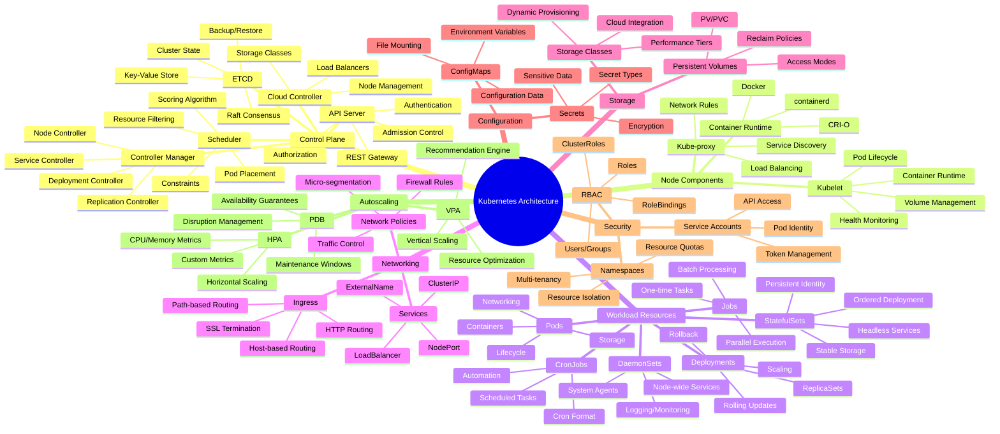

# Kubernetes Architecture - Mermaid Mind Map

```mermaid
mindmap
  root((Kubernetes Architecture))
    Control Plane
      API Server
        REST Gateway
        Authentication
        Authorization
        Admission Control
      ETCD
        Cluster State
        Key-Value Store
        Raft Consensus
        Backup/Restore
      Scheduler
        Pod Placement
        Resource Filtering
        Scoring Algorithm
        Constraints
      Controller Manager
        Node Controller
        Replication Controller
        Deployment Controller
        Service Controller
      Cloud Controller
        Load Balancers
        Storage Classes
        Node Management
    
    Node Components
      Kubelet
        Pod Lifecycle
        Container Runtime
        Volume Management
        Health Monitoring
      Kube-proxy
        Service Discovery
        Load Balancing
        Network Rules
      Container Runtime
        containerd
        CRI-O
        Docker
    
    Workload Resources
      Pods
        Containers
        Networking
        Storage
        Lifecycle
      Deployments
        Rolling Updates
        Scaling
        Rollback
        ReplicaSets
      StatefulSets
        Ordered Deployment
        Persistent Identity
        Stable Storage
        Headless Services
      DaemonSets
        Node-wide Services
        System Agents
        Logging/Monitoring
      Jobs
        Batch Processing
        One-time Tasks
        Parallel Execution
      CronJobs
        Scheduled Tasks
        Cron Format
        Automation
    
    Networking
      Services
        ClusterIP
        NodePort
        LoadBalancer
        ExternalName
      Ingress
        HTTP Routing
        SSL Termination
        Path-based Routing
        Host-based Routing
      Network Policies
        Micro-segmentation
        Firewall Rules
        Traffic Control
    
    Storage
      Persistent Volumes
        PV/PVC
        Access Modes
        Reclaim Policies
      Storage Classes
        Dynamic Provisioning
        Cloud Integration
        Performance Tiers
    
    Configuration
      ConfigMaps
        Configuration Data
        Environment Variables
        File Mounting
      Secrets
        Sensitive Data
        Encryption
        Secret Types
    
    Security
      RBAC
        Roles
        RoleBindings
        ClusterRoles
        Users/Groups
      Service Accounts
        Pod Identity
        API Access
        Token Management
      Namespaces
        Resource Isolation
        Multi-tenancy
        Resource Quotas
    
    Autoscaling
      HPA
        Horizontal Scaling
        CPU/Memory Metrics
        Custom Metrics
      VPA
        Vertical Scaling
        Resource Optimization
        Recommendation Engine
      PDB
        Availability Guarantees
        Disruption Management
        Maintenance Windows
```