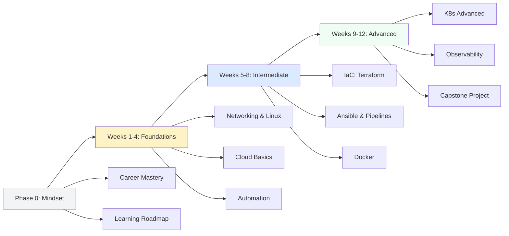

# 🚀 DevOps Master Learning Path

> **"From Zero to Production-Ready in 12 Weeks"**

This structured learning path is generated from the actual content in this repository. Every link points to real files, every lab is actionable, and every assessment is ready to test your knowledge.

---

## 📊 Learning Path Overview



---

## 🚀 Phase 0: Career Mastery & Mindset (Pre-work)

**Primary Objective:** Align your technical goals with industry expectations and build a high-conversion professional presence. Use Phase 0 in parallel with technical phases to ensure your resume and portfolio grow as you learn.

### 🗺️ Phase 0 Curriculum Map
| Module | Title | Primary Outcome |
|:--- |:--- |:--- |
| **01** | [DevOps Persona](./00-career-mastery/01-devops-persona/) | Master the CALMS mindset beyond tools |
| **02** | [Tool Landscape](./00-career-mastery/02-the-tool-landscape/) | Map the ecosystem & avoid tutorial hell |
| **03** | [Soft Skills](./00-career-mastery/03-soft-skills/) | Handle incidents & docs like a senior |
| **04** | [Ops Simulations](./00-career-mastery/04-day-in-the-life-operations/) | Practice "Morning Triage" & Rollbacks |
| **05** | [Strategic Roadmap](./00-career-mastery/05-strategic-roadmap/) | Plan progression Junior → Staff |
| **06** | [Portfolio Guide](./00-career-mastery/06-portfolio-guide/) | Build 3-5 "Deployable" GitHub projects |
| **07** | [Resume Engineering](./00-career-mastery/07-resume-engineering/) | Pass the ATS with 70+ match scores |
| **08** | [AI Prompt Arsenal](./00-career-mastery/08-prompt-engineer/) | Use AI to accelerate the job search |
| **09** | [Interview Mastery](./00-career-mastery/09-interview-mastery/) | Pass technical & behavioral drills |
| **10** | [Salary Negotiation](./00-career-mastery/10-salary-negotiation/) | Benchmarking & offer strategy |
| **11** | [Mock Scripts](./00-career-mastery/11-mock-interview-scripts/) | 30-min timed simulation practice |
| **12** | [Hiring Logic](./00-career-mastery/12-hiring-logic/) | Understand the interviewer's POV |
| **13** | [Daily Checklist](./00-career-mastery/13-daily-checklist/) | Operational muscle memory |

### 🤖 AI Prompts Quick Reference
Available in [08-prompt-engineer/](./00-career-mastery/08-prompt-engineer/):
- **Skills Gap Analyzer**: Get a personalized 90-day learning roadmap.
- **Recruiter Prompt**: Get resume match scores vs. Job Descriptions.
- **ATS Stress Test**: Fix formatting blockers before applying.
- **Final Round Interview**: STAR-method prep for leadership rounds.

### 📊 Career Success Metrics
| Metric | Junior Target | Senior Target |
|:--- |:--- |:--- |
| **Resume Response** | 10-15% | 25-30% |
| **LinkedIn Views** | 100+/mo | 300+/mo |
| **GitHub Activity** | 3+ days/week | 5+ days/week |
| **Offer Gain** | Market Entry | +10-20% via Negotiation |

---

## 🎯 Phase 1: Foundations (Weeks 1-4)

### Week 1: Networking & Linux Fundamentals

**Primary Objective:** Understand OSI model, IP addressing, and master essential Linux commands

**Reading List:**

- [Networking Fundamentals](./01-beginner/01-phase-1/01-networking/01-network-fundamentals/readme.md)
- [OSI Model Deep Dive](./01-beginner/01-phase-1/01-networking/02-network-models/readme.md)
- [IP Addressing](./01-beginner/01-phase-1/01-networking/03-ip-addressing/readme.md)
- [Linux Introduction](./01-beginner/01-phase-1/02-linux/01-introduction/readme.md)
- [Linux Commands](./01-beginner/01-phase-1/02-linux/03-commands/readme.md)

**Hands-on Labs:**

- [IP Addressing Challenges](./01-beginner/01-phase-1/01-networking/03-ip-addressing/challenges.md)
- [Network Troubleshooting](./01-beginner/01-phase-1/01-networking/06-basic-troubleshooting/readme.md)
- Linux command practice in terminal

**Assessment:**

- [OSI Model Quiz](./01-beginner/01-phase-1/01-networking/02-network-models/osi-model/quiz.md)
- [Linux Introduction Quiz](./01-beginner/01-phase-1/02-linux/01-introduction/quiz.md)
- [Linux Commands Interview Questions](./01-beginner/01-phase-1/02-linux/03-commands/interview-questions.md)

**By Sunday, you should be able to:**

- Explain all 7 layers of the OSI model
- Calculate subnet masks and CIDR notation
- Navigate Linux filesystem confidently
- Use 50+ essential Linux commands

---

### Week 2: Linux Deep-Dive & Data Formats

**Primary Objective:** Master Linux permissions, SSH, and understand DevOps data formats

**Reading List:**

- [Linux Filesystem](./01-beginner/01-phase-1/02-linux/02-filesystem/readme.md)
- [Linux Permissions](./01-beginner/01-phase-1/02-linux/04-permissions/readme.md)
- [SSH Fundamentals](./01-beginner/01-phase-1/02-linux/ssh/readme.md)
- [YAML for DevOps](./01-beginner/01-phase-1/04-data-formats/yaml/readme.md)
- [JSON Basics](./01-beginner/01-phase-1/04-data-formats/json/readme.md)

**Hands-on Labs:**

- [YAML DRY Challenge](./01-beginner/01-phase-1/04-data-formats/yaml/challenges/dry-challenge.md)
- [jq JSON Challenge](./01-beginner/01-phase-1/04-data-formats/json/challenges/jq-challenge.md)
- [XML Extraction Challenge](./01-beginner/01-phase-1/04-data-formats/xml/challenges/extraction-challenge.md)
- SSH key generation and configuration

**Assessment:**

- [Linux Filesystem Quiz](./01-beginner/01-phase-1/02-linux/02-filesystem/quiz.md)
- [Linux Permissions Quiz](./01-beginner/01-phase-1/02-linux/04-permissions/quiz.md)
- [SSH Interview Questions](./01-beginner/01-phase-1/02-linux/ssh/interview-questions.md)

**By Sunday, you should be able to:**

- Set file permissions using chmod/chown
- Configure SSH keys for passwordless authentication
- Write and parse YAML/JSON for configuration files
- Understand Linux file ownership and groups

---

### Week 3: Cloud Foundations & Version Control

**Primary Objective:** Understand cloud computing basics and master Git workflows

**Reading List:**

- [Cloud Foundations](./01-beginner/01-phase-1/07-cloud-foundations/readme.md)
- [AWS Basics](./01-beginner/01-phase-1/07-cloud-foundations/05-aws-basics/readme.md)
- [Git & GitHub](./01-beginner/01-phase-1/08-repository-management/01-git-github/readme.md)
- [Repository Management](./01-beginner/01-phase-1/08-repository-management/readme.md)

**Hands-on Labs:**

- [Git/GitHub Challenges](./01-beginner/01-phase-1/08-repository-management/01-git-github/challenges.md)
- [GitLab Challenges](./01-beginner/01-phase-1/08-repository-management/02-gitlab/challenges.md)
- Create AWS Free Tier account
- Deploy first EC2 instance

**Assessment:**

- [Repository Management Quiz](./01-beginner/01-phase-1/08-repository-management/interview-questions-and-quiz.md)
- Git workflow scenarios

**By Sunday, you should be able to:**

- Explain IaaS, PaaS, SaaS models
- Create and manage Git repositories
- Perform branching, merging, and pull requests
- Launch and connect to AWS EC2 instances

---

### Week 4: Automation Foundations

**Primary Objective:** Learn Python basics and shell scripting for DevOps automation

**Reading List:**

- [Python Fundamentals](./01-beginner/02-phase-2/01-automation/02-python-basics/part-01-python-foundations/01-fundamentals/readme.md)
- [Python Control Flow](./01-beginner/02-phase-2/01-automation/02-python-basics/part-01-python-foundations/02-control-flow/readme.md)
- [Python Data Structures](./01-beginner/02-phase-2/01-automation/02-python-basics/part-01-python-foundations/04-data-structures/readme.md)
- [File I/O for DevOps](./01-beginner/02-phase-2/01-automation/02-python-basics/part-01-python-foundations/06-file-io-devops/readme.md)

**Hands-on Labs:**

- [Python Fundamentals Challenges](./01-beginner/02-phase-2/01-automation/02-python-basics/part-01-python-foundations/01-fundamentals/challenges.md)
- [Control Flow Challenges](./01-beginner/02-phase-2/01-automation/02-python-basics/part-01-python-foundations/02-control-flow/challenges.md)
- [Data Structures Challenges](./01-beginner/02-phase-2/01-automation/02-python-basics/part-01-python-foundations/04-data-structures/challenges.md)
- [File I/O Challenges](./01-beginner/02-phase-2/01-automation/02-python-basics/part-01-python-foundations/06-file-io-devops/challenges.md)

**Assessment:**

- [Python Challenges](./01-beginner/02-phase-2/01-automation/02-python-basics/challenges.md)
- Build a log parser script

**By Sunday, you should be able to:**

- Write Python scripts for automation tasks
- Parse JSON/YAML files with Python
- Handle errors and exceptions
- Create reusable functions and modules

---

## 🔧 Phase 2: Intermediate (Weeks 5-8)

### Week 5: Infrastructure as Code - Terraform

**Primary Objective:** Master Terraform for infrastructure provisioning

**Reading List:**

- [IaC Introduction](./02-intermediate/02-phase-2/01-infrastructure-automation/02-config-management/01-introduction/readme.md)
- [Terraform Fundamentals](./02-intermediate/02-phase-2/01-infrastructure-automation/02-config-management/02-iac-foundations-and-terraform/01-fundamentals/readme.md)
- [Provisioning Keywords](./02-intermediate/02-phase-2/01-infrastructure-automation/02-config-management/00-reference-and-metadata/provisioning-iac-keywords.md)
- [IaC Architecture Patterns](./02-intermediate/02-phase-2/01-infrastructure-automation/02-config-management/00-reference-and-metadata/iac-architecture-patterns-ref.md)

**Hands-on Labs:**

- Deploy VPC with Terraform
- Create EC2 instances with modules
- Implement remote state with S3
- [Terraform Quiz](./02-intermediate/02-phase-2/01-infrastructure-automation/02-config-management/07-assessments/terraform-quiz.md)

**Assessment:**

- [Terraform Assessment](./02-intermediate/02-phase-2/01-infrastructure-automation/02-config-management/07-assessments/terraform-quiz.md)
- Build multi-tier infrastructure

**By Sunday, you should be able to:**

- Write Terraform HCL code
- Manage state files remotely
- Create reusable Terraform modules
- Understand declarative vs imperative IaC

---

### Week 6: Configuration Management - Ansible

**Primary Objective:** Master Ansible for server configuration and automation

**Reading List:**

- [Configuration Management Philosophy](./02-intermediate/02-phase-2/01-infrastructure-automation/02-config-management/readme.md)
- [Ansible Fundamentals](./02-intermediate/02-phase-2/01-infrastructure-automation/02-config-management/03-server-configuration-and-ansible/01-ansible/readme.md)
- [Config Management Keywords](./02-intermediate/02-phase-2/01-infrastructure-automation/02-config-management/00-reference-and-metadata/config-management-keywords.md)
- [Secrets Management](./02-intermediate/02-phase-2/01-infrastructure-automation/02-config-management/00-reference-and-metadata/secrets-management-ref.md)

**Hands-on Labs:**

- Write first Ansible playbook
- Create reusable roles
- Implement Ansible Vault
- Configure web server fleet
- [Ansible Quiz](./02-intermediate/02-phase-2/01-infrastructure-automation/02-config-management/07-assessments/ansible-quiz.md)

**Assessment:**

- [Ansible Assessment](./02-intermediate/02-phase-2/01-infrastructure-automation/02-config-management/07-assessments/ansible-quiz.md)
- [Interview Questions](./02-intermediate/02-phase-2/01-infrastructure-automation/02-config-management/07-assessments/interview-questions.md)

**By Sunday, you should be able to:**

- Write idempotent Ansible playbooks
- Use Jinja2 templates
- Manage secrets with Ansible Vault
- Implement dynamic inventory

---

### Week 7: CI/CD Pipelines

**Primary Objective:** Build automated CI/CD pipelines

**Reading List:**

- [CI/CD Foundations](./02-intermediate/02-phase-2/02-delivery-and-governance/01-ci-cd-pipelines/readme.md)
- [Pipeline Patterns](./02-intermediate/02-phase-2/02-delivery-and-governance/01-ci-cd-pipelines/01-part-1-the-blueprint/readme.md)
- [Testing & Validation](./02-intermediate/02-phase-2/01-infrastructure-automation/02-config-management/00-reference-and-metadata/testing-validation-ref.md)

**Hands-on Labs:**

- Create GitHub Actions workflow
- Build Jenkins pipeline
- Implement automated testing
- Deploy with GitLab CI

**Assessment:**

- Build end-to-end CI/CD pipeline
- Implement blue-green deployment

**By Sunday, you should be able to:**

- Design CI/CD workflows
- Implement automated testing
- Configure deployment strategies
- Integrate security scanning

---

### Week 8: Containerization with Docker

**Primary Objective:** Master Docker containerization

**Reading List:**

- [Container Fundamentals](./01-beginner/03-phase-3/02-container-orchestration/readme.md)
- [Docker Basics](./01-beginner/03-phase-3/02-container-orchestration/part-01-foundations/01-docker-fundamentals/readme.md)
- [Dockerfile Best Practices](./01-beginner/03-phase-3/02-container-orchestration/part-01-foundations/02-dockerfile-mastery/readme.md)

**Hands-on Labs:**

- Build custom Docker images
- Create multi-stage builds
- Implement Docker Compose
- Container networking and volumes

**Assessment:**

- Containerize a multi-tier application
- Optimize Docker images

**By Sunday, you should be able to:**

- Write efficient Dockerfiles
- Use Docker Compose for local development
- Understand container networking
- Implement volume management

---

## 🎓 Phase 3: Advanced (Weeks 9-12)

### Week 9: Kubernetes Fundamentals

**Primary Objective:** Deploy and manage applications on Kubernetes

**Reading List:**

- [Kubernetes Architecture](./01-beginner/03-phase-3/02-container-orchestration/part-02-kubernetes-core/01-architecture/readme.md)
- [Pods and Workloads](./01-beginner/03-phase-3/02-container-orchestration/part-02-kubernetes-core/02-pods-and-workloads/readme.md)
- [Services and Networking](./01-beginner/03-phase-3/02-container-orchestration/part-02-kubernetes-core/03-services-and-networking/readme.md)

**Hands-on Labs:**

- Deploy first Kubernetes application
- Create services and ingress
- Implement ConfigMaps and Secrets
- Practice with kubectl

**Assessment:**

- Deploy multi-tier app on K8s
- Troubleshoot pod failures

**By Sunday, you should be able to:**

- Understand Kubernetes architecture
- Deploy applications with manifests
- Configure services and ingress
- Manage configuration and secrets

---

### Week 10: Kubernetes Advanced & Helm

**Primary Objective:** Master advanced Kubernetes patterns and Helm

**Reading List:**

- [Storage and StatefulSets](./01-beginner/03-phase-3/02-container-orchestration/part-02-kubernetes-core/04-storage-and-persistence/readme.md)
- [Helm Fundamentals](./02-intermediate/02-phase-2/01-infrastructure-automation/02-config-management/06-kubernetes-config-and-templating/01-helm/readme.md)
- [Helm Templating](./02-intermediate/02-phase-2/01-infrastructure-automation/02-config-management/06-kubernetes-config-and-templating/01-helm/02-chart-templating/readme.md)

**Hands-on Labs:**

- Create Helm charts
- Deploy with Helm
- Implement StatefulSets
- Configure persistent volumes
- [Helm Quiz](./02-intermediate/02-phase-2/01-infrastructure-automation/02-config-management/07-assessments/helm-quiz.md)

**Assessment:**

- [Helm Assessment](./02-intermediate/02-phase-2/01-infrastructure-automation/02-config-management/07-assessments/helm-quiz.md)
- Package application as Helm chart

**By Sunday, you should be able to:**

- Create and maintain Helm charts
- Use Helm for application deployment
- Manage StatefulSets and persistent storage
- Implement advanced Kubernetes patterns

---

### Week 11: Observability & Monitoring

**Primary Objective:** Implement comprehensive monitoring and observability

**Reading List:**

- [Observability Fundamentals](./01-beginner/02-phase-2/07-observability-fundamentals/readme.md)
- [Monitoring Patterns](./02-intermediate/03-phase-3/02-observability-foundations/readme.md)
- Prometheus and Grafana setup

**Hands-on Labs:**

- Deploy Prometheus stack
- Create Grafana dashboards
- Implement log aggregation
- Set up alerting

**Assessment:**

- Build complete observability stack
- Create SLI/SLO dashboards

**By Sunday, you should be able to:**

- Deploy Prometheus and Grafana
- Create custom metrics and dashboards
- Implement log aggregation
- Configure alerting rules

---

### Week 12: Production Readiness & Capstone

**Primary Objective:** Deploy production-ready infrastructure

**Reading List:**

- [Production Checklist](./04-projects-showcase/00-governance-checklists/readme.md)
- [Security Hardening](./04-projects-showcase/00-governance-checklists/security-hardening-checklist.md)
- [CI/CD Pipeline Checklist](./04-projects-showcase/00-governance-checklists/ci-cd-pipeline-checklist.md)

**Hands-on Labs:**

- [Cloud Native Web App](./04-projects-showcase/01-cloud-native-web-app/readme.md)
- [IaC Infrastructure Provisioning](./04-projects-showcase/02-iac-infrastructure-provisioning/readme.md)
- [CI/CD Pipeline Automation](./04-projects-showcase/03-ci-cd-pipeline-automation/readme.md)
- [Kubernetes Orchestration](./04-projects-showcase/04-kubernetes-orchestration/readme.md)

### 🏁 Capstone: The "Golden Project"
**Project Title**: [Enterprise Spring PetClinic Orchestration](./04-projects-showcase/readme.md)

Deploy a complete production-ready application with:
- **Infrastructure**: Provisioned with Terraform (VPC, EKS/EC2, RDS).
- **Configuration**: Managed with Ansible (Node hardening, App config).
- **CI/CD**: Fully automated GitHub Actions or Jenkins Pipeline.
- **Orchestration**: Highly available Kubernetes deployment.
- **Observability**: Prometheus & Grafana monitoring with SLI/SLO alerts.
- **Security**: OPA Gatekeeper policies and secret management via Vault.

**By Sunday, you should be able to:**
- Deploy production-grade infrastructure from scratch.
- Explain every architectural trade-off in your stack.
- Demonstrate a "Day 2 Operations" mindset (Scaling, Monitoring, Security).

---

## 📝 Assessments & Certification Prep

This repository includes a centralized **Assessment Hub** to validate your progress at every tier.

👉 **[Launch the DevOps Quiz Hub](./06-quizzes/README.md)**

- **01 Beginner**: Linux, Networking, and Git basics.
- **02 Intermediate**: AWS infrastructure, Terraform, and Docker.
- **03 Advanced**: SRE practices, CI/CD, and K8s orchestration.
- **🦅 Staff Level**: Advanced architectural trade-offs and disaster recovery.

---

## 📚 Reference Materials

### Quick Access Guides

- [IaC Audit Report](./IAC-AUDIT-REPORT.md)
- [Terraform Module Template](TERRAFORM-MODULE-README-TEMPLATE.md)
- [State Corruption Recovery](TERRAFORM-STATE-CORRUPTION-RECOVERY-GUIDE.md)
- [CI/CD Pipeline Examples](./CICD-PIPELINE-EXAMPLE.md)
- [Executive Summary](./EXECUTIVE-SUMMARY.md)

### Cheat Sheets

- [AWS Cheatsheets](./08-resources/00-cheatsheets/aws/)
- [Command Reference](./08-resources/00-cheatsheets/cheatsheet.md)

### Additional Resources

- [Books and Guides](./08-resources/02-books-guides/)
- [Scripts and Code](./08-resources/01-scripts-code/)

---

## 🎯 Learning Strategies

### Daily Routine (2-3 hours)

1. **Read** (30 min): Study assigned materials
2. **Practice** (60 min): Complete hands-on labs
3. **Build** (30 min): Work on personal projects
4. **Review** (30 min): Take quizzes and review concepts

### Weekly Milestones

- **Monday-Wednesday**: Learn new concepts
- **Thursday-Friday**: Complete labs and challenges
- **Saturday**: Take assessments
- **Sunday**: Review and prepare for next week

### Success Metrics

- ✅ Complete all reading materials
- ✅ Finish all hands-on labs
- ✅ Pass all assessments (80%+ score)
- ✅ Build portfolio projects

---

## 🏆 Certification Path

After completing this learning path, you'll be prepared for:

- AWS Certified Solutions Architect - Associate
- Certified Kubernetes Administrator (CKA)
- HashiCorp Certified: Terraform Associate
- Linux Foundation Certified System Administrator (LFCS)

---

## 🤝 Community & Support

### Getting Help

1. Review reference materials in `00-reference-and-metadata/` directories
2. Check troubleshooting guides
3. Consult interview questions for deeper understanding
4. Build projects to solidify knowledge

### Contributing
Found an issue or want to improve content? Submit a pull request!

---

## 📊 Progress Tracking

Create a copy of this checklist to track your progress:

```markdown
## Phase 0: Career Mastery
- [ ] 01. DevOps Persona & CALMS Framework
- [ ] 02. Landscape & Tool Selection Strategy
- [ ] 03. Soft Skills & Blameless Culture
- [ ] 04. Day in the Life: Operational Triage
- [ ] 13. Daily Checklist: SRE Standards
- [ ] 05. Strategic Roadmap: 90-Day Learning Plan
- [ ] 06. Portfolio: GitHub Profile Branding
- [ ] 07. Resume Engineering: ATS Optimization
- [ ] 08. AI Prompts: Career Arsenal Setup
- [ ] 09. Interview Mastery: STAR method stories
- [ ] 11. Mock Interviews: 30m Time Drills
- [ ] 12. Hiring Logic: Manager Insight
- [ ] 10. Salary Negotiation: TC Benchmarking

## Phase 1: Foundations
- [ ] Week 1: Networking & Linux
- [ ] Week 2: Linux Deep-Dive & Data Formats
- [ ] Week 3: Cloud Foundations & Version Control
- [ ] Week 4: Automation Foundations

## Phase 2: Intermediate
- [ ] Week 5: Infrastructure as Code - Terraform
- [ ] Week 6: Configuration Management - Ansible
- [ ] Week 7: CI/CD Pipelines
- [ ] Week 8: Containerization with Docker

## Phase 3: Advanced
- [ ] Week 9: Kubernetes Fundamentals
- [ ] Week 10: Kubernetes Advanced & Helm
- [ ] Week 11: Observability & Monitoring
- [ ] Week 12: Production Readiness & Capstone Project
```

---

**🚀 Ready to start? Begin with [Week 1: Networking & Linux Fundamentals](./01-beginner/01-phase-1/01-networking/readme.md)**

**Last Updated:** 2024  
**Version:** 1.0  
**Estimated Completion Time:** 12 weeks (15-20 hours/week)
