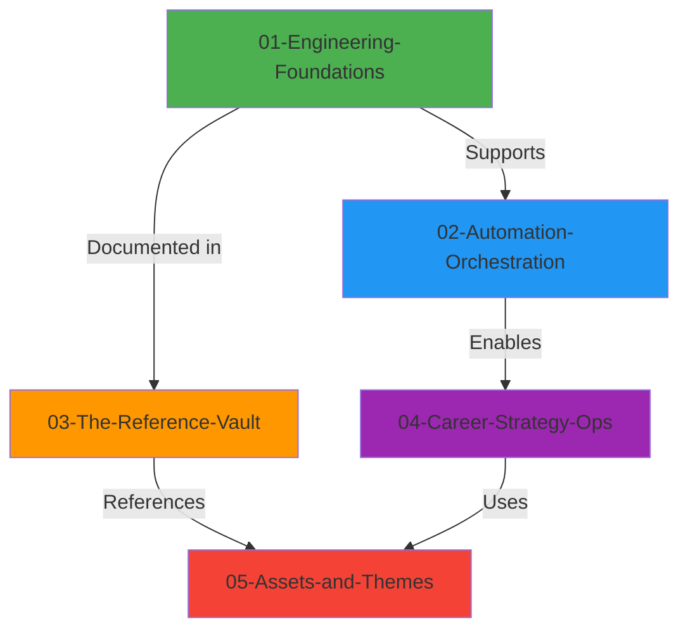

# DevOps Mastery - Master Index
**Architecture**: Domain-Driven Design (DDD)  
**Migration Date**: 2026-02-16  
**Total Pillars**: 5

---

## 🏛️ Architecture Overview

---

## 📚 Pillar Breakdown

### 🟢 Pillar 01: Engineering Foundations
**Core technical skills that underpin all DevOps work**

- **01-linux-fundamentals**: Shell, filesystem, permissions, SSH
- **02-networking-concepts**: OSI model, TCP/IP, DNS, routing
- **03-git-version-control**: Branching, workflows, GitHub Actions
- **04-automation-scripting**: Bash, Python, PowerShell fundamentals

**Learning Path**: Beginner → Intermediate  
**Estimated Time**: 8-12 weeks

---

### 🔵 Pillar 02: Automation Orchestration
**Containerization, workflow automation, and orchestration tools**

- **01-containers**: Docker fundamentals, images, networking, volumes
- **02-mcp**: Model Context Protocol orchestration patterns
- **03-n8n**: Workflow automation and integration

**Learning Path**: Intermediate → Advanced  
**Estimated Time**: 6-8 weeks

---

### 🟠 Pillar 03: The Reference Vault
**Atomic command library for terminal searchability**

- **powershell-commands**: 100+ PowerShell cmdlets (1 file per command)
- **linux-commands**: Essential CLI reference
- **[domain]-reference**: Curated best practices by domain

**Usage**: `grep -r "Get-Disk" 03-The-Reference-Vault/`  
**Total Commands**: 200+

---

### 🟣 Pillar 04: Career Strategy Ops
**Soft skills, operational procedures, and career development**

- **01-career-mastery**: Resume, portfolio, interview prep
- **02-finops-strategy**: Cost optimization, budget management
- **03-operational-procedures**: Rollback, triage, post-mortems

**Learning Path**: Continuous  
**Estimated Time**: Ongoing

---

### 🔴 Pillar 05: Assets and Themes
**Media, plugins, and configuration files**

- **images/**: Centralized image library (organized by domain)
- **mermaid-themes/**: Diagram styling
- **obsidian-config/**: Note-taking setup
- **assets/**: SVG diagrams, icons, banners

**Total Assets**: 500+ files

---

## 🔍 Quick Navigation

### By Skill Level
- **Beginner**: Pillar 01 (Foundations)
- **Intermediate**: Pillar 02 (Automation)
- **Advanced**: Pillar 03 (Reference) + Pillar 04 (Strategy)

### By Use Case
- **Learning**: Pillar 01 → Pillar 02
- **Reference**: Pillar 03
- **Career**: Pillar 04
- **Design**: Pillar 05

---

## 📖 Migration Notes

- **Atomic Preservation**: All individual command files preserved
- **No Script Loss**: All .sh, .ps1, .py files migrated
- **Duplicate Handling**: Conflicting READMEs renamed with `-v2` suffix
- **Backup**: Available at `~/Devops_BACKUP_*`

---

**Last Updated**: 2026-02-16  
**Maintainer**: Lead DevOps Information Architect
