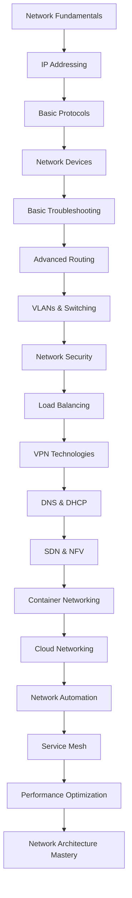

# Networking for DevOps

Comprehensive networking guide organized by skill levels for DevOps professionals. This directory contains structured learning paths from fundamental concepts to advanced cloud-native networking technologies.

## 📚 Learning Path Structure

### 🟢 [Beginner Level](./Beginner-Level/)
Fundamental networking concepts essential for DevOps beginners
- Network fundamentals and OSI model
- IP addressing and subnetting
- Basic protocols (HTTP, DNS, DHCP)
- Network devices and their roles
- Basic troubleshooting techniques

### 🟡 [Intermediate Level](./Intermediate-Level/)
Advanced networking concepts for experienced DevOps practitioners
- Advanced routing protocols
- VLANs and switching technologies
- Network security implementations
- Load balancing strategies
- VPN technologies
- DNS and DHCP management

### 🔴 [Advanced Level](./Advanced-Level/)
Cutting-edge networking technologies for senior DevOps engineers
- Software-Defined Networking (SDN) and NFV
- Container and Kubernetes networking
- Cloud networking architectures
- Network automation and IaC
- Service mesh technologies
- Performance optimization

## 📖 Legacy Documentation

### [Network Models](./Network%20Model/)
Detailed OSI and TCP/IP model documentation

### [Ports Reference](./Ports/)
Comprehensive port numbers and services reference

### [CyberSecurity](./CyberSecurity/)
Network security fundamentals and practices

---

## 🚀 Quick Start Guide

### For Beginners
1. **Start with [Network Fundamentals](./Beginner-Level/Network-Fundamentals/)** - Learn OSI model and basic concepts
2. **Master [IP Addressing](./Beginner-Level/IP-Addressing/)** - Understand subnetting and addressing
3. **Study [Basic Protocols](./Beginner-Level/Basic-Protocols/)** - HTTP, DNS, DHCP essentials
4. **Explore [Network Devices](./Beginner-Level/Network-Devices/)** - Routers, switches, firewalls
5. **Practice [Basic Troubleshooting](./Beginner-Level/Basic-Troubleshooting/)** - Essential diagnostic skills

### For Intermediate Practitioners
1. **Advanced [Routing Protocols](./Intermediate-Level/Advanced-Routing/)** - OSPF, BGP, EIGRP
2. **Implement [VLANs and Switching](./Intermediate-Level/VLANs-Switching/)** - Network segmentation
3. **Deploy [Network Security](./Intermediate-Level/Network-Security/)** - Firewalls, IDS/IPS
4. **Configure [Load Balancing](./Intermediate-Level/Load-Balancing/)** - High availability strategies
5. **Setup [VPN Technologies](./Intermediate-Level/VPN-Technologies/)** - Secure connectivity
6. **Manage [DNS and DHCP](./Intermediate-Level/DNS-DHCP/)** - Advanced service configuration

### For Advanced Engineers
1. **Master [SDN and NFV](./Advanced-Level/SDN-NFV/)** - Software-defined networking
2. **Implement [Container Networking](./Advanced-Level/Container-Networking/)** - Docker, Kubernetes, CNI
3. **Design [Cloud Networking](./Advanced-Level/Cloud-Networking/)** - Multi-cloud architectures
4. **Automate with [Network Automation](./Advanced-Level/Network-Automation/)** - IaC and GitOps
5. **Deploy [Service Mesh](./Advanced-Level/Service-Mesh/)** - Istio, Linkerd, Consul
6. **Optimize [Performance](./Advanced-Level/Performance-Optimization/)** - Advanced tuning

## 📊 Learning Progress Tracker



## 🛠️ Essential Tools by Level

### Beginner Tools
- **Network Diagnostics**: ping, traceroute, nslookup, dig
- **Packet Analysis**: Wireshark, tcpdump
- **Configuration**: ip, ifconfig, netstat, ss
- **Simulation**: Packet Tracer, GNS3

### Intermediate Tools
- **Load Balancers**: HAProxy, Nginx, F5
- **Monitoring**: Nagios, Zabbix, PRTG
- **Security**: pfSense, Fortinet, Palo Alto
- **Automation**: Ansible, Puppet, Chef

### Advanced Tools
- **Container Networking**: Calico, Flannel, Cilium, Weave
- **Service Mesh**: Istio, Linkerd, Consul Connect
- **Cloud Networking**: AWS VPC, Azure VNet, GCP VPC
- **Infrastructure as Code**: Terraform, Pulumi, CloudFormation
- **Observability**: Prometheus, Grafana, Jaeger, Zipkin

## 🎯 Career Progression Paths

### Network Engineer → DevOps Engineer
```
Traditional Networking → Infrastructure as Code → Cloud Networking → DevOps
├── Master CLI and GUI tools
├── Learn automation scripting
├── Understand cloud platforms
└── Implement CI/CD for infrastructure
```

### DevOps Engineer → Network Architect
```
DevOps Practices → Advanced Networking → Architecture Design → Leadership
├── Deep dive into network protocols
├── Design scalable architectures
├── Implement security best practices
└── Lead technical teams
```

### Software Developer → Platform Engineer
```
Application Development → Container Technologies → Platform Engineering
├── Learn containerization (Docker, Kubernetes)
├── Understand service mesh technologies
├── Implement developer platforms
└── Focus on developer experience
```

## 📚 Recommended Certifications

### Beginner Level
- CompTIA Network+
- Cisco CCNA
- AWS Certified Cloud Practitioner

### Intermediate Level
- Cisco CCNP Enterprise
- AWS Certified Solutions Architect
- Microsoft Azure Network Engineer
- Google Cloud Professional Network Engineer

### Advanced Level
- Cisco CCIE Enterprise Infrastructure
- AWS Certified Advanced Networking - Specialty
- Certified Kubernetes Administrator (CKA)
- Certified Kubernetes Security Specialist (CKS)
- Istio Certified Associate (ICA)

## 🔧 Hands-On Lab Environment

### Recommended Setup
```bash
# Virtual Lab Environment
├── Hypervisor: VMware Workstation/VirtualBox
├── Network Simulation: GNS3/EVE-NG
├── Container Platform: Docker Desktop
├── Kubernetes: minikube/kind/k3s
├── Cloud Labs: AWS Free Tier/Azure Free Account
└── Monitoring: Prometheus + Grafana stack
```

### Sample Lab Topology
```
Internet
    │
[Edge Router] ── [Firewall] ── [DMZ Switch]
    │                              │
[Core Switch]                 [Web Servers]
    │
├── [VLAN 10: Users] ── [Workstations]
├── [VLAN 20: Servers] ── [App Servers]
├── [VLAN 30: Management] ── [Monitoring]
└── [VLAN 40: Storage] ── [NAS/SAN]
```

## Quick Reference Guide

## Network Fundamentals

### OSI Model
```bash
# Layer 7: Application Layer
- HTTP/HTTPS, FTP, SMTP, DNS
- Application protocols
- User interface

# Layer 6: Presentation Layer
- Encryption/Decryption
- Data compression
- Character encoding

# Layer 5: Session Layer
- Session management
- Authentication
- Connection establishment

# Layer 4: Transport Layer
- TCP/UDP protocols
- Port numbers
- Reliability and flow control

# Layer 3: Network Layer
- IP addressing
- Routing protocols
- Packet forwarding

# Layer 2: Data Link Layer
- MAC addresses
- Switching
- Frame formatting

# Layer 1: Physical Layer
- Cables, wireless signals
- Electrical specifications
- Physical topology
```

### TCP/IP Protocol Suite
```bash
# Internet Protocol (IP)
IPv4: 32-bit addressing (192.168.1.1)
IPv6: 128-bit addressing (2001:db8::1)

# Transmission Control Protocol (TCP)
- Connection-oriented
- Reliable delivery
- Flow control
- Error detection and correction

# User Datagram Protocol (UDP)
- Connectionless
- Fast transmission
- No reliability guarantees
- Real-time applications

# Internet Control Message Protocol (ICMP)
- Network diagnostics
- Error reporting
- Ping and traceroute
```

## Network Security

### Firewalls
```bash
# iptables (Linux)
# Allow SSH access
iptables -A INPUT -p tcp --dport 22 -j ACCEPT

# Allow HTTP and HTTPS
iptables -A INPUT -p tcp --dport 80 -j ACCEPT
iptables -A INPUT -p tcp --dport 443 -j ACCEPT

# Block all other incoming traffic
iptables -A INPUT -j DROP

# Save rules
iptables-save > /etc/iptables/rules.v4

# UFW (Uncomplicated Firewall)
ufw enable
ufw allow ssh
ufw allow http
ufw allow https
ufw deny incoming
ufw allow outgoing
```

### VPN (Virtual Private Network)
```bash
# OpenVPN Server Configuration
port 1194
proto udp
dev tun
ca ca.crt
cert server.crt
key server.key
dh dh.pem
server 10.8.0.0 255.255.255.0
ifconfig-pool-persist ipp.txt
push "redirect-gateway def1 bypass-dhcp"
push "dhcp-option DNS 8.8.8.8"
push "dhcp-option DNS 8.8.4.4"
keepalive 10 120
cipher AES-256-CBC
user nobody
group nogroup
persist-key
persist-tun
status openvpn-status.log
verb 3

# WireGuard Configuration
[Interface]
PrivateKey = <server-private-key>
Address = 10.0.0.1/24
ListenPort = 51820

[Peer]
PublicKey = <client-public-key>
AllowedIPs = 10.0.0.2/32
```

### SSL/TLS
```bash
# Generate SSL Certificate
openssl req -x509 -nodes -days 365 -newkey rsa:2048 \
    -keyout private.key -out certificate.crt

# Let's Encrypt with Certbot
certbot --nginx -d example.com -d www.example.com

# SSL Configuration (Nginx)
server {
    listen 443 ssl http2;
    server_name example.com;
    
    ssl_certificate /path/to/certificate.crt;
    ssl_certificate_key /path/to/private.key;
    ssl_protocols TLSv1.2 TLSv1.3;
    ssl_ciphers ECDHE-RSA-AES256-GCM-SHA512:DHE-RSA-AES256-GCM-SHA512;
    ssl_prefer_server_ciphers off;
    
    location / {
        proxy_pass http://backend;
        proxy_set_header Host $host;
        proxy_set_header X-Real-IP $remote_addr;
    }
}
```

## Load Balancing

### Layer 4 Load Balancing
```bash
# HAProxy Configuration
global
    daemon
    maxconn 4096

defaults
    mode tcp
    timeout connect 5000ms
    timeout client 50000ms
    timeout server 50000ms

frontend web_frontend
    bind *:80
    default_backend web_servers

backend web_servers
    balance roundrobin
    server web1 192.168.1.10:80 check
    server web2 192.168.1.11:80 check
    server web3 192.168.1.12:80 check
```

### Layer 7 Load Balancing
```bash
# Nginx Load Balancer
upstream backend {
    least_conn;
    server 192.168.1.10:8080 weight=3;
    server 192.168.1.11:8080 weight=2;
    server 192.168.1.12:8080 weight=1;
}

server {
    listen 80;
    server_name example.com;
    
    location / {
        proxy_pass http://backend;
        proxy_set_header Host $host;
        proxy_set_header X-Real-IP $remote_addr;
        proxy_set_header X-Forwarded-For $proxy_add_x_forwarded_for;
    }
    
    location /api/ {
        proxy_pass http://api_backend;
    }
    
    location /static/ {
        root /var/www/static;
    }
}
```

## DNS (Domain Name System)

### DNS Configuration
```bash
# BIND9 Zone File
$TTL    604800
@       IN      SOA     ns1.example.com. admin.example.com. (
                              2023010101         ; Serial
                         604800         ; Refresh
                          86400         ; Retry
                        2419200         ; Expire
                         604800 )       ; Negative Cache TTL

; Name servers
        IN      NS      ns1.example.com.
        IN      NS      ns2.example.com.

; A records
@       IN      A       192.168.1.10
www     IN      A       192.168.1.10
mail    IN      A       192.168.1.20
ftp     IN      A       192.168.1.30

; CNAME records
blog    IN      CNAME   www.example.com.
shop    IN      CNAME   www.example.com.

; MX records
@       IN      MX      10      mail.example.com.

; TXT records
@       IN      TXT     "v=spf1 mx ~all"
```

### DNS Tools
```bash
# DNS Lookup Tools
dig example.com
nslookup example.com
host example.com

# DNS Performance Testing
dig @8.8.8.8 example.com +stats
dig @1.1.1.1 example.com +stats

# DNS Cache Flush
# Linux
sudo systemctl flush-dns
# macOS
sudo dscacheutil -flushcache
# Windows
ipconfig /flushdns
```

## Network Monitoring

### Monitoring Tools
```bash
# Network Traffic Analysis
# tcpdump
tcpdump -i eth0 -n -c 100 port 80

# Wireshark (GUI)
wireshark

# iftop - Interface bandwidth usage
iftop -i eth0

# nethogs - Process network usage
nethogs eth0

# ss - Socket statistics
ss -tuln
ss -p | grep :80
```

### SNMP Monitoring
```bash
# SNMP Configuration
# /etc/snmp/snmpd.conf
rocommunity public 127.0.0.1
syslocation "Data Center 1"
syscontact "admin@example.com"

# SNMP Queries
snmpwalk -v2c -c public localhost 1.3.6.1.2.1.1
snmpget -v2c -c public localhost 1.3.6.1.2.1.1.1.0

# Prometheus SNMP Exporter
snmp_exporter:
  image: prom/snmp-exporter
  ports:
    - "9116:9116"
  volumes:
    - ./snmp.yml:/etc/snmp_exporter/snmp.yml
```

## Container Networking

### Docker Networking
```bash
# Docker Network Types
# Bridge (default)
docker network create --driver bridge my-bridge

# Host networking
docker run --network host nginx

# Overlay networking (Swarm)
docker network create --driver overlay --attachable my-overlay

# Custom bridge with subnet
docker network create --driver bridge \
    --subnet=172.20.0.0/16 \
    --ip-range=172.20.240.0/20 \
    custom-bridge

# Container communication
docker run -d --name web --network my-bridge nginx
docker run -d --name db --network my-bridge postgres
```

### Kubernetes Networking
```yaml
# Network Policy Example
apiVersion: networking.k8s.io/v1
kind: NetworkPolicy
metadata:
  name: web-netpol
spec:
  podSelector:
    matchLabels:
      app: web
  policyTypes:
  - Ingress
  - Egress
  ingress:
  - from:
    - podSelector:
        matchLabels:
          app: frontend
    ports:
    - protocol: TCP
      port: 8080
  egress:
  - to:
    - podSelector:
        matchLabels:
          app: database
    ports:
    - protocol: TCP
      port: 5432
```

### Service Mesh
```yaml
# Istio Service Mesh
# Virtual Service
apiVersion: networking.istio.io/v1alpha3
kind: VirtualService
metadata:
  name: reviews
spec:
  http:
  - match:
    - headers:
        end-user:
          exact: jason
    route:
    - destination:
        host: reviews
        subset: v2
  - route:
    - destination:
        host: reviews
        subset: v1

# Destination Rule
apiVersion: networking.istio.io/v1alpha3
kind: DestinationRule
metadata:
  name: reviews
spec:
  host: reviews
  subsets:
  - name: v1
    labels:
      version: v1
  - name: v2
    labels:
      version: v2
```

## Cloud Networking

### AWS Networking
```bash
# VPC Creation
aws ec2 create-vpc --cidr-block 10.0.0.0/16

# Subnet Creation
aws ec2 create-subnet \
    --vpc-id vpc-12345678 \
    --cidr-block 10.0.1.0/24 \
    --availability-zone us-west-2a

# Security Group
aws ec2 create-security-group \
    --group-name web-sg \
    --description "Web server security group" \
    --vpc-id vpc-12345678

# Route Table
aws ec2 create-route-table --vpc-id vpc-12345678
```

### Azure Networking
```bash
# Virtual Network
az network vnet create \
    --resource-group myResourceGroup \
    --name myVNet \
    --address-prefix 10.0.0.0/16 \
    --subnet-name mySubnet \
    --subnet-prefix 10.0.1.0/24

# Network Security Group
az network nsg create \
    --resource-group myResourceGroup \
    --name myNetworkSecurityGroup

# Load Balancer
az network lb create \
    --resource-group myResourceGroup \
    --name myLoadBalancer \
    --public-ip-address myPublicIP \
    --frontend-ip-name myFrontEnd \
    --backend-pool-name myBackEndPool
```

## Network Troubleshooting

### Common Tools
```bash
# Connectivity Testing
ping google.com
traceroute google.com
mtr google.com

# Port Testing
telnet example.com 80
nc -zv example.com 80-443

# Network Configuration
ip addr show
ip route show
netstat -tuln
ss -tuln

# Bandwidth Testing
iperf3 -s  # Server
iperf3 -c server_ip  # Client

# DNS Testing
dig +trace example.com
nslookup example.com 8.8.8.8
```

### Performance Optimization
```bash
# TCP Tuning
# /etc/sysctl.conf
net.core.rmem_max = 16777216
net.core.wmem_max = 16777216
net.ipv4.tcp_rmem = 4096 65536 16777216
net.ipv4.tcp_wmem = 4096 65536 16777216
net.ipv4.tcp_congestion_control = bbr

# Apply changes
sysctl -p

# Network Interface Optimization
ethtool -K eth0 gro on
ethtool -K eth0 gso on
ethtool -G eth0 rx 4096 tx 4096
```

This comprehensive networking guide provides DevOps professionals with essential knowledge for managing network infrastructure, security, and troubleshooting in modern environments.