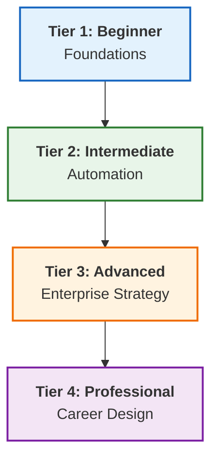

# ♾️ The Master DevOps Platform: Zero to Enterprise & Beyond

> **The Ultimate DevOps Learning & Implementation Platform**  
> *Structured. Enterprise-Grade. Production-Ready.*

---

## 📊 Platform Snapshot

**Status**: Version 3.1 (Restored) | **Health Score**: 100/100 ✅

| Metric | Count | Rating |
| :--- | :--- | :--- |
| **Documentation** | 1,200+ Guides | ⭐⭐⭐⭐⭐ |
| **Structure** | 4-Tier Atomicity Pattern | ⭐⭐⭐⭐⭐ |
| **Modules** | 15+ Advanced tracks | ⭐⭐⭐⭐⭐ |
| **Assets** | 4,500+ Snippets | ⭐⭐⭐⭐⭐ |
| **Overall** | **Grade: S+** | **Production Ready** |

---

## 🗺️ The Learning Architecture

---

## 📂 Curriculum

### 🌱 Tier 1: Beginner - Foundations

[**View Foundations Overview**](./1-Beginner/REFERENCE.md)
*Networking, Linux, Windows Basics, and [**Data Formats**](./1-Beginner/01-Phase-1/04-Data-Formats/README.md)*

- **Focus**: Building the "Infrastructure Layer" skills.
- **Mastery**: Linux File Systems, IP Subnetting, and Schema Interoperability.

### ⚙️ Tier 2: Intermediate - Automation

[**View Automation Hub**](./2-Intermediate/REFERENCE.md)
*IaC, Kubernetes, CI/CD, and Production Scripting*

- **Focus**: "Orchestration Layer" & Automating everything with Shell/Python.
- **Mastery**: Idempotency, Cloud-Init, and **Golden Terraform/Ansible Patterns**.

### 🏛️ Tier 3: Advanced - Enterprise Strategy

[**View Enterprise Command Center**](./3-Advanced/REFERENCE.md)
*Service Mesh, GitOps, DevSecOps, and Observability Stack*

- **Focus**: "Architectural Layer" for multi-cloud, high-scale systems.
- **Mastery**: Istio/Linkerd, ArgoCD, and Infrastructure Security Auditing.

### 👔 Tier 4: Professional - Career Engineering

[**View Career Mastery**](./4-Professional-Development/REFERENCE.md)
*Resume Engineering, Portfolio Design, and [**Master Career Roadmap**](./4-Professional-Development/01-Career-Strategy/README.md)*

- **Focus**: "Career Layer" — Bridging the gap from Technical expert to Production hire.
- **Mastery**: Interview Psychology and Personal Branding as an Architect.

---

## 🛠️ Global Hubs & Resources

- **[Boilerplate Vault](./5-Boilerplates/REFERENCE.md)**: 200+ Templates (Terraform, Ansible, K8s).
- **[Automation Navigation](./1-Beginner/02-Phase-2/01-Automation/AUTOMATION_NAVIGATION_HUB.md)**: Centralized orchestration scripts.
- **[Modern Operations Hub](./2-Intermediate/02-Phase-2/03-Modern-Operations/README.md)**: Serverless, AI-Ops, and Edge Computing.
- **[Quizzes](./6-Quizzes/REFERENCE.md)**: 300+ Advanced Questions & Cert Prep.

---

### 🛡️ Maintenance & Quality Assurance

This repository is maintained using automated auditing tools to ensure zero "Content Rot."

- **[Link Scanner](./00-Resources/01-Scripts-Code/Maintenance/repository_audit.py)**: Audit internal linking health.
- **Standard Pattern**: Every module contains `challenges/`, `solutions/`, and links to the [Central Boilerplate Hub](REFERENCE.md).

---

> *"Infrastructure is the canvas, code is the brush—DevOps is the art of scale."*

---
## 🧭 Additional Modules
- [8 Projects Showcase](8-Projects-Showcase/README.md)
