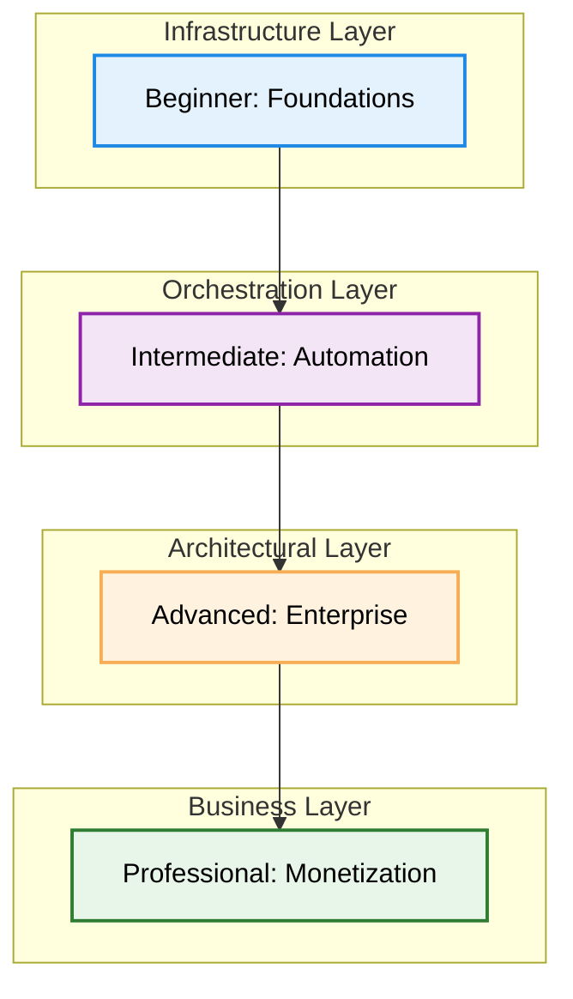

# ♾️ The Master DevOps Platform: Zero to Enterprise & Beyond

Welcome to the **Ultimate DevOps Learning & Implementation Platform**. This repository is a structured, multi-tier roadmap designed to transform individuals into high-level DevOps Architects and help them monetize their expertise in the global market.

---

## 📊 Platform Snapshot
*Analysis as of Jan 2026*

| Metric | Count |
| :--- | :--- |
| **Total Documentation Files** | 1,116+ Markdown Guides |
| **Learning Tiers** | 4 (Beginner to Professional) |
| **Specialized Modules** | 60+ Deep-Dive Folders |
| **Interactive Assets** | 100+ Quizzes & Real-Life Scenarios |
| **Code Examples** | 4,000+ Snippets & Scripts |

---

## 🗺️ The Learning Architecture

Our curriculum is divided into four distinct tiers, each building upon the previous one to ensure a "Deep-Dive" understanding of Infrastructure as Code, Automation, and Cloud Engineering.

---

## 📂 Platform Tiers

### 🌱 [1. Beginner: DevOps Foundations](./1-Beginner/README.md)
*The essential building blocks of IT.*
- **Networking**: OSI Model, VPCs, and Subnetting.
- **Linux**: Master the CLI, SSH, and SysAdmin tasks.
- **Containers**: Docker basics and Nginx plumbing.
- **Tools**: Git, GitHub, Maven, and Data Formats (YAML/JSON).

### ⚙️ [2. Intermediate: Automation & Orchestration](./2-Intermediate/README.md)
*Moving from manual hacks to scalable systems.*
- **Configuration Management**: Centralized hub for Terraform, Ansible, Chef, Helm, and Cloud-Init.
- **CI/CD**: Advanced Jenkins, GitLab pipelines, and GitLab Runners.
- **K8s**: Kubernetes fundamentals, Pods, Services, and orchestration.
- **Observability**: Monitoring, logging, and performance optimization.

### 🏛️ [3. Advanced: Enterprise Excellence](./3-Advanced/README.md)
*Building mission-critical, high-availability platforms.*
- **GitOps**: Declarative reconciliation with ArgoCD.
- **Observability**: Prometheus, ELK, and OpenTelemetry.
- **DevSecOps**: Automated security, compliance, and DevSecOps pipelines.
- **Architecture**: Service Mesh, Microservices, and Multi-Cloud strategies.

### 💼 [4. Professional Development: Monetization](./4-Professional-Development/README.md)
*Turn your knowledge into a high-revenue business.*
- **Consulting**: Building a premium DevOps consulting practice (MSA, SOW, LLC).
- **Productization**: Micro-SaaS, Courses, and selling Digital Assets.
- **FinOps**: Specialized cost optimization to save companies millions.
- **Niche Roles**: Fractional CTO, Platform Engineering, and technical evangelism.

---

## 🛠️ Global Resources & Tools

- **[Configuration Tools](./2-Intermediate/03-Configuration-Tools/README.md)**: Centralized hub for all configuration management tools (Terraform, Ansible, Chef, Helm, Cloud-Init).
- **[00-Resources](./00-Resources/README.md)**: A goldmine of technical books, interview guides, multi-language scripts, and project showcases.
- **[Quizzes](./Quizzes/README.md)**: Test your knowledge at every level with our tiered quiz collection and the final **Master Quiz**.
- **[Recommended Videos](./Recommended_Videos.md)**: A curated list of top-tier video lessons to reinforce your visual learning.

---

## 🎯 Our Mission
Our goal is to provide a **production-ready** knowledge base. This is not just a tutorial; it is a repository of battle-tested patterns, real-life scenarios, and professional strategies used by SREs and DevOps leads in Silicon Valley and beyond.

---

## 🚀 Getting Started
1. **Choose your Level**: If you're new, start with **[Networking](./1-Beginner/01-Networking/README.md)**.
2. **Take the Quizzes**: Don't just read—verify your knowledge using the **[Quiz Suite](./Quizzes/README.md)**.
3. **Build the Projects**: Check the **[Project Showcase](./00-Resources/05-Projects-Showcase/)** for hand-on implementation.

---
**"Infrastructure is the canvas, code is the brush—DevOps is the art of scale."**
