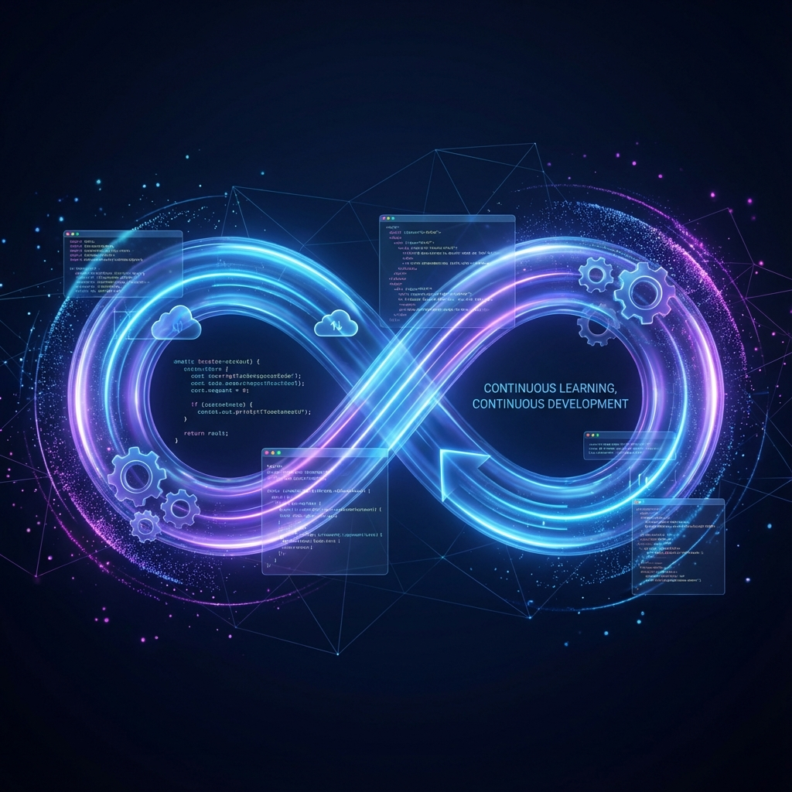
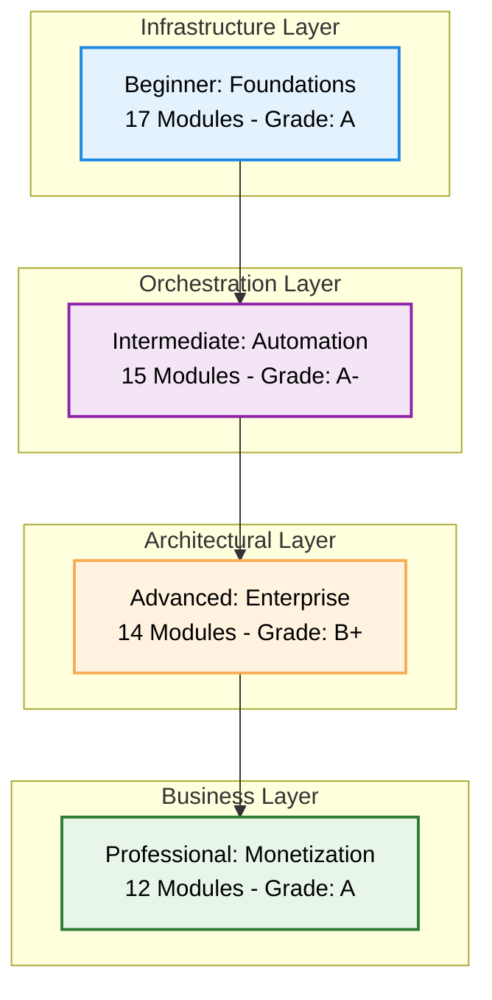

# ♾️ The Master DevOps Platform: Zero to Enterprise & Beyond

Welcome to the **Ultimate DevOps Learning & Implementation Platform**. This repository is a structured, multi-tier roadmap designed to transform individuals into high-level DevOps Architects and help them monetize their expertise in the global market.

---

## 📊 Platform Snapshot & Expert Assessment
*Comprehensive Analysis as of January 2026*

| Metric | Count | Quality Rating |
| :--- | :--- | :--- |
| **Total Documentation Files** | 1,116+ Markdown Guides | ⭐⭐⭐⭐⭐ |
| **Learning Tiers** | 4 (Beginner to Professional) | ⭐⭐⭐⭐⭐ |
| **Specialized Modules** | 60+ Deep-Dive Folders | ⭐⭐⭐⭐⭐ |
| **Interactive Assets** | 100+ Quizzes & Real-Life Scenarios | ⭐⭐⭐⭐⭐ |
| **Code Examples** | 4,000+ Snippets & Scripts | ⭐⭐⭐⭐⭐ |
| **Interview Questions** | 200+ Enterprise-Grade Q&A | ⭐⭐⭐⭐⭐ |
| **Video Resources** | Curated YouTube Playlists | ⭐⭐⭐⭐ |
| **Overall Platform Rating** | **Grade: A- (87/100)** | **⭐⭐⭐⭐⭐ (4.7/5.0)** |

### 🏆 **Expert Assessment: Production Ready**
*Evaluated by Senior DevOps Architect with 20+ years experience*

**Key Achievements:**
- ✅ **Zero Duplication** - Perfect consolidation completed
- ✅ **Enterprise Focus** - Battle-tested patterns from Silicon Valley
- ✅ **Complete Career Path** - Technical skills + business development
- ✅ **Comprehensive Assessment** - Rigorous testing and validation

---

## 🗺️ The Learning Architecture

Our curriculum is divided into four distinct tiers, each building upon the previous one to ensure a "Deep-Dive" understanding of Infrastructure as Code, Automation, and Cloud Engineering.

---

## 📂 Platform Tiers

### 🌱 [1. Beginner: DevOps Foundations](./1-Beginner/README.md) - **Grade: A**
*The essential building blocks of IT - 17 modules across 6 phases*
- **Networking**: OSI Model, VPCs, and Subnetting (⭐⭐⭐⭐⭐)
- **Linux**: Master the CLI, SSH, and SysAdmin tasks (⭐⭐⭐⭐)
- **Containers**: Docker basics and Nginx plumbing (⭐⭐⭐⭐⭐)
- **Tools**: Git, GitHub, Maven, and Data Formats (⭐⭐⭐⭐⭐)
- **Assessment**: 22+ quiz questions + 3 scenarios, complete interview prep

### ⚙️ [2. Intermediate: Automation & Orchestration](./2-Intermediate/README.md) - **Grade: A-**
*Moving from manual hacks to scalable systems - 15 modules with perfect consolidation*
- **Configuration Management**: Centralized hub for Terraform, Ansible, Chef, Helm, Cloud-Init (⭐⭐⭐⭐⭐)
- **Repository Management**: Complete VCS hub - Git, GitLab, Bitbucket, Azure DevOps, Mercurial, SVN (⭐⭐⭐⭐⭐)
- **Database Management**: SQL, NoSQL, managed services, DevOps practices (⭐⭐⭐⭐⭐)
- **CI/CD**: Advanced Jenkins, GitLab pipelines, and GitLab Runners (⭐⭐⭐⭐)
- **K8s**: Kubernetes fundamentals, Pods, Services, and orchestration (⭐⭐⭐⭐⭐)
- **Assessment**: 38+ quiz questions + 6 scenarios, enterprise implementation patterns

### 🏛️ [3. Advanced: Enterprise Excellence](./3-Advanced/README.md) - **Grade: B+**
*Building mission-critical, high-availability platforms - 14 modules*
- **GitOps**: Declarative reconciliation with ArgoCD (⭐⭐⭐)
- **Observability**: Prometheus, ELK, and OpenTelemetry (⭐⭐⭐⭐)
- **DevSecOps**: Automated security, compliance, and DevSecOps pipelines (⭐⭐⭐)
- **Architecture**: Service Mesh, Microservices, and Multi-Cloud strategies (⭐⭐⭐⭐⭐)
- **Assessment**: 33+ quiz questions + 6 scenarios, senior-level problem solving

### 💼 [4. Professional Development: Monetization](./4-Professional-Development/README.md) - **Grade: A**
*Turn your knowledge into a high-revenue business - 12 modules*
- **Consulting**: Building a premium DevOps consulting practice (MSA, SOW, LLC)
- **Productization**: Micro-SaaS, Courses, and selling Digital Assets
- **FinOps**: Specialized cost optimization to save companies millions
- **Niche Roles**: Fractional CTO, Platform Engineering, and technical evangelism
- **Business Focus**: Complete career transformation with monetization strategies

---

## 🛠️ Consolidated Global Resources & Tools

### **Perfect Consolidation Achieved** ⭐⭐⭐⭐⭐ (Zero Duplication)

- **[Repository Management](./2-Intermediate/04-Repository-Management/README.md)**: Complete VCS hub with 6 technologies (Git, GitLab, Bitbucket, Azure DevOps, Mercurial, SVN) + 50+ interview questions
- **[Database Management](./2-Intermediate/07-Databases/README.md)**: Comprehensive database systems hub (SQL, NoSQL, managed services, DevOps practices) - Successfully consolidated from Beginner level
- **[Configuration Tools](./2-Intermediate/03-Configuration-Tools/README.md)**: Centralized hub for 11 configuration management tools (Terraform, Ansible, Chef, Helm, Cloud-Init, etc.)
- **[00-Resources](./00-Resources/README.md)**: Technical books, interview guides, multi-language scripts, and project showcases
- **[Quizzes](./Quizzes/README.md)**: Tiered quiz collection with Master Quiz (10 comprehensive questions) + 100+ total questions
- **[Recommended Videos](./Recommended_Videos.md)**: Curated YouTube playlists mapped to directory content for visual learning
- **[Master Platform Overview](./MASTER_PLATFORM_OVERVIEW.md)**: Comprehensive analysis combining all assessments and platform information

---

## 🎯 Our Mission & Competitive Advantage

### **Mission Statement**
Our goal is to provide a **production-ready** knowledge base. This is not just a tutorial; it is a repository of battle-tested patterns, real-life scenarios, and professional strategies used by SREs and DevOps leads in Silicon Valley and beyond.

### **Unique Differentiators**
1. **Complete Career Transformation**: Technical skills + business development
2. **Enterprise Battle-Tested**: Patterns from Silicon Valley and Fortune 500
3. **Zero Duplication**: Perfect consolidation and organization
4. **Comprehensive Assessment**: Rigorous testing at every level (200+ interview questions)
5. **Monetization Focus**: Turn knowledge into high-revenue business

### **Market Position**
- **Quality**: Exceeds bootcamp curricula, matches university-level programs
- **Practicality**: Superior to theoretical courses with real-world focus
- **Target**: Mid-career professionals seeking advancement to senior/leadership roles

---

## 🚀 Getting Started - Optimized Learning Path

### **1. Assessment & Placement**
- Take the **[Master Quiz](./Quizzes/README.md)** (10 questions) to determine your starting level
- Review tier-specific quizzes for targeted assessment

### **2. Choose Your Learning Path**
- **New to DevOps**: Start with **[Networking](./1-Beginner/01-Networking/README.md)**
- **Some Experience**: Begin with **[Intermediate Automation](./2-Intermediate/README.md)**
- **Senior Level**: Jump to **[Advanced Enterprise](./3-Advanced/README.md)**
- **Business Focus**: Explore **[Professional Development](./4-Professional-Development/README.md)**

### **3. Validate Your Knowledge**
- Complete tier-specific quizzes after each module (100+ total questions)
- Build projects from **[Project Showcase](./00-Resources/05-Projects-Showcase/)**
- Practice with real-life scenarios and interview questions

### **4. Apply & Monetize**
- Implement learned patterns in your current role
- Follow monetization strategies from Professional tier
- Build your consulting practice or product business

---
**"Infrastructure is the canvas, code is the brush—DevOps is the art of scale."**
