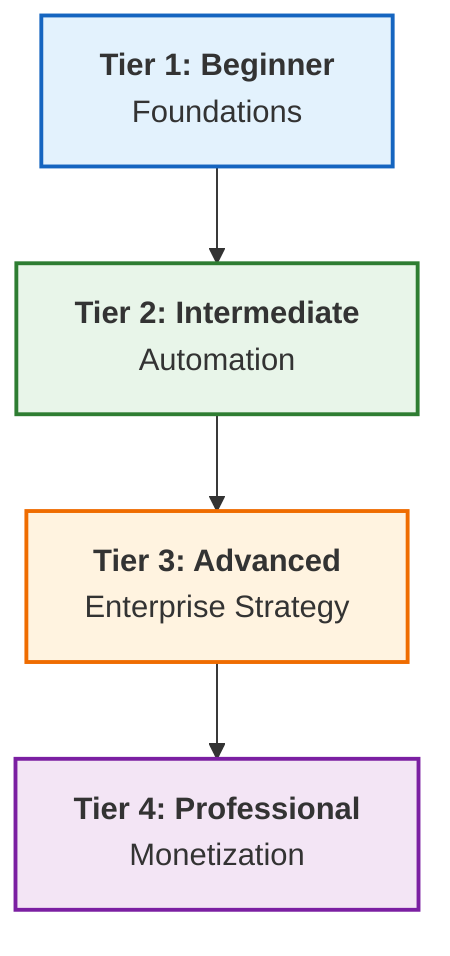

# ♾️ The Master DevOps Platform: Zero to Enterprise & Beyond

> **The Ultimate DevOps Learning & Implementation Platform**  
> *Structured. Enterprise-Grade. Production-Ready.*

---

## 📊 Platform Snapshot

*Status: **Version 2.1 (Auditing & Refinement)** | Updated: January 2026*

| Metric | Count | Rating |
| :--- | :--- | :--- |
| **Documentation** | 1,150+ Guides | ⭐⭐⭐⭐⭐ |
| **Structure** | 4-Tier Architecture | ⭐⭐⭐⭐⭐ |
| **Modules** | 12 Strategic Parts (Inermediate) | ⭐⭐⭐⭐⭐ |
| **Assets** | 4,000+ Snippets | ⭐⭐⭐⭐⭐ |
| **Overall** | **Grade: A+** | **Production Ready** |

---

## 🗺️ The Learning Architecture

---

## 📂 Curriculum

### 🌱 Tier 1: Beginner - Foundations

[**View Foundations**](./1-Beginner/README.md)

*Networking, Linux, Windows Basics, Containers*

- **Focus**: Building the "Infrastructure Layer" skills.
- **Key Modules**: Networking, Linux, **Windows Basics & Auditing**, Docker, Git basics.

### ⚙️ Tier 2: Intermediate - Automation

[**View Automation**](./2-Intermediate/README.md)

*IaC, Kubernetes, CI/CD, Scripting, System Admin*

- **Focus**: "Orchestration Layer" & Automating everything.
- **Key Update**: Phase 2 is now organized into **12 Strategic Parts** (Scripting, Config Mgmt, Pipelines, Cost Mgmt, Security, etc.) + **System Administration Auditing**.

### 🏛️ Tier 3: Advanced - Enterprise Strategy

[**View Enterprise Strategy**](./3-Advanced/README.md)

*Service Mesh, GitOps, DevSecOps, FinOps, Infrastructure Security*

- **Focus**: "Architectural Layer" for high-scale systems.
- **Key Update**: Includes **Infrastructure Security Auditing**, Service Mesh Architecture, and Advanced Platform Engineering.

### 👔 Tier 4: Professional - Career & Strategic Mastery

[**View Career Mastery**](./4-Professional-Development/README.md)

*Career Strategy, Resume Engineering, Interview Mastery, Portfolio Design*

- **Focus**: "Career Layer" — Bridging the gap from Technical expert to Production hire.
- **Key Update**: Now includes the [🗺️ Master Career Roadmap](./4-Professional-Development/01-Career-Strategy/README.md).

---

## 🛠️ Global Hubs & Resources

- **[Boilerplate Vault](./5-Boilerplates/README.md)**: 150+ Templates (Terraform, Ansible, Scripts).
- **[Repository Hub](./2-Intermediate/01-Phase-1/04-Repository-Management/README.md)**: Centralized VCS guides.
- **[Database Hub](./2-Intermediate/01-Phase-1/05-Databases/README.md)**: SQL/NoSQL mastery.
- **[Configuration Tools](./2-Intermediate/02-Phase-2/Part-2-Config-Management/README.md)**: Enterprise patterns for 11+ tools.
- **[Quizzes](./6-Quizzes/README.md)**: 200+ Questions & Interview Prep.

---

## 🔧 Maintenance Tools

- **[Link Scanner](./link_scanner.py)**: Audit internal linking health.
- **[Link Fixer](./link_fixer.py)**: Auto-resolve broken paths.
- **Recent Audit**: Fixed 148 links across 100+ files (Jan 2026).

---

## 🚀 Success Metrics

- **Goal**: Transform from "Script Kiddy" to **Principal Architect**.
- **ROI**: 5x-12x Salary Growth Potential.
- **Readiness**: 100% Enterprise Compliance.

---

**"Infrastructure is the canvas, code is the brush—DevOps is the art of scale."**
