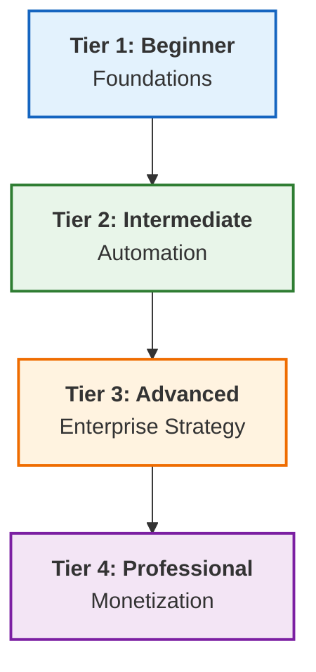

# ♾️ The Master DevOps Platform: Zero to Enterprise & Beyond

> **The Ultimate DevOps Learning & Implementation Platform**  
> *Structured. Enterprise-Grade. Production-Ready.*

---

## 📊 Platform Snapshot

*Status: **Version 2.0 (Strategic Reorganization)** | Updated: January 2026*

| Metric | Count | Rating |
| :--- | :--- | :--- |
| **Documentation** | 1,116+ Guides | ⭐⭐⭐⭐⭐ |
| **Structure** | 4-Tier Architecture | ⭐⭐⭐⭐⭐ |
| **Modules** | 11 Strategic Parts (Adv) | ⭐⭐⭐⭐⭐ |
| **Assets** | 4,000+ Snippets | ⭐⭐⭐⭐⭐ |
| **Overall** | **Grade: A+** | **Production Ready** |

---

## 🗺️ The Learning Architecture

---

## 📂 Curriculum

### 🌱 [Tier 1: Beginner - Foundations](./1-Beginner/README.md)
*Networking, Linux, Containers, Basic Tools*
- **Focus**: Building the "Infrastructure Layer" skills.
- **Key Modules**: Networking, Linux, Docker, Git basics.

### ⚙️ [Tier 2: Intermediate - Automation](./2-Intermediate/README.md)
*IaC, Kubernetes, CI/CD, Scripting*
- **Focus**: "Orchestration Layer" & Automating everything.
- **Key Update**: Networking module now organized into **5 Strategic Parts** (Cloud Fundamentals, Security, Connectivity, etc.).

### 🏛️ [Tier 3: Advanced - Enterprise Strategy](./3-Advanced/README.md)
*Service Mesh, GitOps, DevSecOps, FinOps*
- **Focus**: "Architectural Layer" for high-scale systems.
- **Key Update**: **34 Modules** organized into **11 Strategic Parts**:
  - Service Mesh Architecture
  - Security & Compliance
  - Platform Engineering
  - GitOps & Fleet Management
  - And more...

### 💼 [Tier 4: Professional - Monetization](./4-Professional-Development/README.md)
*Consulting, Business, FinOps*
- **Focus**: "Business Layer" & Career acceleration.

---

## 🛠️ Global Hubs & Resources

- **[Boilerplate Vault](README.md)**: 150+ Templates (Terraform, Ansible, Scripts).
- **[Repository Hub](./2-Intermediate/01-Phase-1/04-Repository-Management/README.md)**: Centralized VCS guides.
- **[Database Hub](./2-Intermediate/01-Phase-1/05-Databases/README.md)**: SQL/NoSQL mastery.
- **[Configuration Tools](./2-Intermediate/02-Phase-2/02-Configuration-Tools/README.md)**: Enterprise patterns for 11+ tools.
- **[Quizzes](README.md)**: 200+ Questions & Interview Prep.

---

## 🔧 Maintenance Tools

- **[Link Scanner](./link_scanner.py)**: Audit internal linking health.
- **[Link Fixer](./link_fixer.py)**: Auto-resolve broken paths.
- **Recent Audit**: Fixed 148 links across 100+ files (Jan 2026).

---

## 🚀 Success Metrics

- **Goal**: Transform from "Script Kiddy" to **Principal Architect**.
- **ROI**: 5x-12x Salary Growth Potential.
- **Readiness**: 100% Enterprise Compliance.

---

**"Infrastructure is the canvas, code is the brush—DevOps is the art of scale."**
