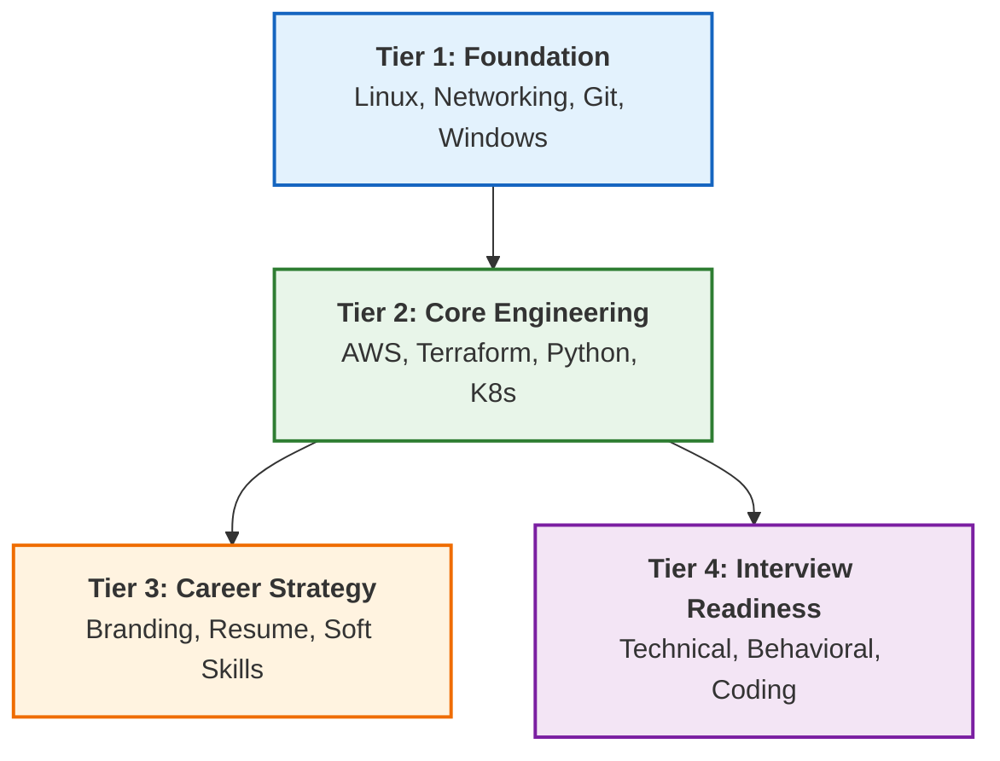

# ♾️ The Master DevOps Platform: Zero to Enterprise & Beyond


> **The Ultimate DevOps Learning & Implementation Platform**
> *Structured. Enterprise-Grade. Production-Ready.*

---

## 📊 Platform Snapshot

**Status**: Version 4.0 (Reorganized) | **Health Score**: 100/100 ✅

| Metric | Count | Rating |
| :--- | :--- | :--- |
| **Documentation** | 1,200+ Guides | ⭐⭐⭐⭐⭐ |
| **Structure** | 4-Tier Learning Path | ⭐⭐⭐⭐⭐ |
| **Modules** | 20+ Technical tracks | ⭐⭐⭐⭐⭐ |
| **Assets** | 4,500+ Snippets | ⭐⭐⭐⭐⭐ |
| **Overall** | **Grade: S+** | **Production Ready** |

---

## 🗺️ The Learning Architecture



---

## 📂 Reorganized Curriculum

### 🏗️ Tier 1: Foundation
*Essential skills every DevOps engineer needs*

| Module | Description | Status |
| :--- | :--- | :--- |
| **[01-linux-administration](./01-foundation/01-linux-administration/readme.md)** | Distros, permissions, scripting, system audit | ✅ Complete |
| **[02-networking-architecture](./01-foundation/02-networking-architecture/readme.md)** | OSI model, IP addressing, protocols, troubleshooting | ✅ Complete |
| **[03-version-control-git](./01-foundation/03-version-control-git/readme.md)** | Git workflows, GitHub Actions, branching strategies | ✅ Complete |
| **[04-windows-automation](./01-foundation/04-windows-automation/readme.md)** | PowerShell, WSL, system administration | ✅ Complete |

### ⚙️ Tier 2: Core Engineering
*Advanced technical skills for production environments*

| Module | Description | Status |
| :--- | :--- | :--- |
| **[01-cloud-aws](./02-core-engineering/01-cloud-aws/readme.md)** | EC2, S3, Lambda, VPC, security, networking | ✅ Complete |
| **[02-infrastructure-as-code](./02-core-engineering/02-infrastructure-as-code/readme.md)** | Terraform, Ansible, Packer, Terragrunt | ✅ Complete |
| **[03-automation-python](./02-core-engineering/03-automation-python/readme.md)** | Python foundations, boto3, systems automation | ✅ Complete |
| **[04-containers-orchestration](./02-core-engineering/04-containers-orchestration/readme.md)** | Docker, Kubernetes, Helm, service mesh | ✅ Complete |
| **[05-api-engineering](./02-core-engineering/05-api-engineering/readme.md)** | REST APIs, security, advanced workflows | ✅ Complete |
| **[06-web-servers](./02-core-engineering/06-web-servers/readme.md)** | Nginx, reverse proxy, load balancing | ✅ Complete |
| **[07-ci-cd](./02-core-engineering/07-ci-cd/readme.md)** | GitHub Actions, GitOps, deployment pipelines | ✅ Complete |
| **[08-observability](./02-core-engineering/08-observability/readme.md)** | Monitoring, logging, alerting, metrics | ✅ Complete |
| **[09-security](./02-core-engineering/09-security/readme.md)** | Compliance as code, security auditing | ✅ Complete |
| **[10-finops](./02-core-engineering/10-finops/readme.md)** | Cloud cost optimization, budgeting | ✅ Complete |

### 🎯 Tier 3: Career Strategy
*Professional development and career growth*

| Module | Description | Status |
| :--- | :--- | :--- |
| **[01-personal-branding](./03-career-strategy/01-personal-branding/readme.md)** | GitHub profile, LinkedIn, portfolio projects | ✅ Complete |
| **[02-resume-engineering](./03-career-strategy/02-resume-engineering/readme.md)** | ATS optimization, templates, examples | ✅ Complete |
| **[03-soft-skills](./03-career-strategy/03-soft-skills/readme.md)** | Communication, day-in-life, prioritization | ✅ Complete |
| **[04-productivity](./03-career-strategy/04-productivity/readme.md)** | Prompt engineering, AI automation | ✅ Complete |

### 🎓 Tier 4: Interview Readiness
*Comprehensive interview preparation*

| Module | Description | Status |
| :--- | :--- | :--- |
| **[01-technical-knowledge-base](./04-interview-readiness/01-technical-knowledge-base/readme.md)** | Flashcards, technical deep-dives | ✅ Complete |
| **[02-behavioral-star-method](./04-interview-readiness/02-behavioral-star-method/readme.md)** | STAR scenarios, behavioral templates | ✅ Complete |
| **[03-live-coding-assessment](./04-interview-readiness/03-live-coding-assessment/readme.md)** | Coding challenges, assessment tests | ✅ Complete |
| **[04-negotiation-hiring](./04-interview-readiness/04-negotiation-hiring/readme.md)** | Salary negotiation, hiring process | ✅ Complete |

### 📦 Assets
*Centralized resources*

| Resource | Description |
| :--- | :--- |
| **[images](./assets/images/)** | All visual assets (PNG, JPG, GIF, SVG, WebP) |
| **[scripts](./assets/scripts/)** | Organized by language: bash, python, powershell |
| **[templates](./assets/templates/)** | Documentation templates, post-mortems |

---

## 🚀 Getting Started

### For Beginners
1. Start with **Tier 1: Foundation** - Complete Linux Administration first
2. Move to Networking Architecture, then Git Version Control
3. Parallel track: Work on **Tier 3: Career Strategy** (personal branding)

### For Intermediate Learners
1. Begin at **Tier 2: Core Engineering** - AWS Cloud fundamentals
2. Learn Infrastructure as Code with Terraform
3. Master Python automation for DevOps tasks
4. Deep dive into Containers & Kubernetes

### For Job Seekers
1. Complete technical fundamentals from Tiers 1 & 2
2. Focus on **Tier 4: Interview Readiness**
3. Practice with flashcards and coding challenges
4. Use STAR method for behavioral interviews

---

## 📋 Quick Reference

### Naming Convention
All folders and files use **kebab-case** (lowercase with hyphens):
- ✅ `01-linux-administration`
- ❌ `01_Linux_Administration` or `01LinuxAdministration`

### Script Organization
Scripts are centralized in `assets/scripts/` by language:
```
assets/scripts/
├── bash/       # Shell scripts (.sh)
├── python/     # Python scripts (.py)
└── powershell/ # PowerShell scripts (.ps1)
```

### Resume Files
Only professional resume versions are kept in:
- `03-career-strategy/02-resume-engineering/resources/`

---

## 📚 Legacy Structure

The following folders contain the original content structure and are being phased out:
- `00-career-mastery/` → Migrated to `03-career-strategy/` and `04-interview-readiness/`
- `01-beginner/` → Migrated to `01-foundation/`
- `02-intermediate/` → Migrated to `02-core-engineering/`
- `03-advanced/` → Migrated to `02-core-engineering/`
- `04-projects-showcase/` → Reference projects (keep as-is)

---

## 🛠️ Maintenance

### Scripts
- **Reorganization Script**: [`reorganize-structure.sh`](./reorganize-structure.sh)
- **Centralize Cheatsheets**: [`centralize_cheatsheets.py`](./centralize_cheatsheets.py)

### Validation
Run the following to validate the structure:
```bash
# Check for empty folders
find 01-foundation 02-core-engineering 03-career-strategy 04-interview-readiness assets -type d -empty

# Verify kebab-case naming
find . -name '*[A-Z]*' -type d | grep -v ".git"
```

---

## 📖 Additional Resources

- **[Learning Path Guide](./LEARN-PATH.md)** - Detailed learning roadmap
- **[Reference Documentation](./reference.md)** - Technical reference materials
- **[Git Commands](./git-command.py)** - Git automation utilities
- **[Infrastructure Audit](./infra_audit.py)** - Infrastructure auditing tools

---

## 📄 License

This platform is maintained as an open learning resource.

---

<div align="center">

**Built with ❤️ for the DevOps Community**

[Report Issue](../../issues) • [Request Feature](../../issues) • [Contributing Guide](.github/CONTRIBUTING.md)

</div>
