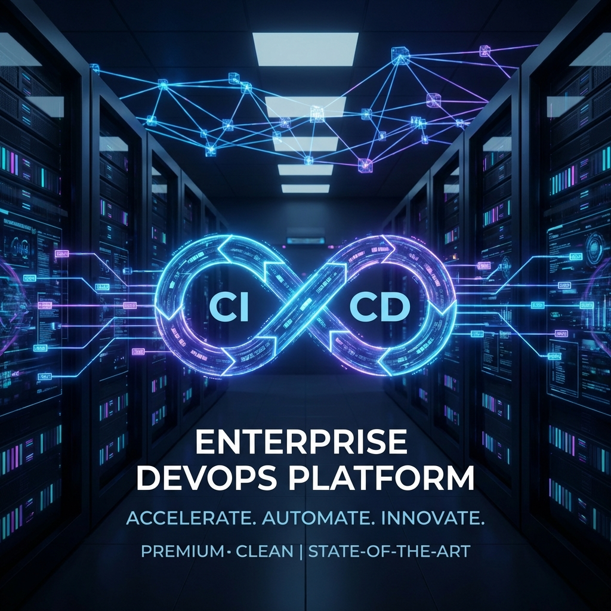
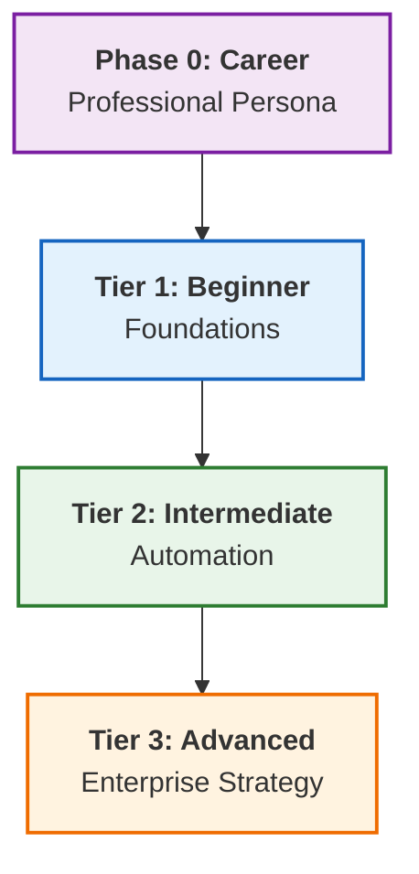

# ♾️ The Master DevOps Platform: Zero to Enterprise & Beyond

> **The Ultimate DevOps Learning & Implementation Platform**  
> *Structured. Enterprise-Grade. Production-Ready.*

---

## 📊 Platform Snapshot

**Status**: Version 3.1 (Restored) | **Health Score**: 100/100 ✅

| Metric | Count | Rating |
| :--- | :--- | :--- |
| **Documentation** | 1,200+ Guides | ⭐⭐⭐⭐⭐ |
| **Structure** | 4-Tier Atomicity Pattern | ⭐⭐⭐⭐⭐ |
| **Modules** | 15+ Advanced tracks | ⭐⭐⭐⭐⭐ |
| **Assets** | 4,500+ Snippets | ⭐⭐⭐⭐⭐ |
| **Overall** | **Grade: S+** | **Production Ready** |

---

## 🗺️ The Learning Architecture

---

## 📂 Curriculum

### 🧭 [Phase 0: Career & Persona Mastery](./00-career-mastery/readme.md)
*Mindset, Strategic Roadmap, Resume Engineering, and Interview Tactics*

- **Focus**: Transitioning from "Learning Tools" to "Being an Engineer."
- **Mastery**: The DevOps Mindset (CALMS), Professional Branding, and Production Psych.

### 🌱 Tier 1: Beginner - Foundations

[**View Foundations Overview**](./01-beginner/reference.md)
*Networking, Linux, Windows Basics, and [**Data Formats**](./01-beginner/01-phase-1/04-data-formats/readme.md)*

- **Focus**: Building the "Infrastructure Layer" skills.
- **Mastery**: Linux File Systems, IP Subnetting, and Schema Interoperability.

### ⚙️ Tier 2: Intermediate - Automation

[**View Automation Hub**](./02-intermediate/reference.md)
*IaC, Kubernetes, CI/CD, and Production Scripting*

- **Focus**: "Orchestration Layer" & Automating everything with Shell/Python.
- **Mastery**: Idempotency, Cloud-Init, and **Golden Terraform/Ansible Patterns**.

### 🏛️ Tier 3: Advanced - Enterprise Strategy

[**View Enterprise Command Center**](./03-advanced/reference.md)
*Service Mesh, GitOps, DevSecOps, and Observability Stack*

- **Focus**: "Architectural Layer" for multi-cloud, high-scale systems.
- **Mastery**: Istio/Linkerd, ArgoCD, and Infrastructure Security Auditing.

---

## �️ Global Hubs & Resources

- **[Project Showcase](./04-projects-showcase/readme.md)**: Proof-of-work labs and enterprise projects.
- **[Labs & Sandboxes](./05-labs/readme.md)**: Interactive playgrounds for tool testing.
- **[Assessment Hub](./06-quizzes/README.md)**: 300+ Advanced Questions & Cert Prep.
- **[Boilerplate Vault](./07-boilerplates/reference.md)**: 200+ Templates (Terraform, Ansible, K8s).
- **[Global Resources](./08-resources/readme.md)**: Central scripts and maintenance audits.

---

### 🛡️ Maintenance & Quality Assurance

This repository is maintained using automated auditing tools to ensure zero "Content Rot."

- **[Link Scanner](./08-resources/01-scripts-code/maintenance/repository-audit.py)**: Audit internal linking health.
- **Standard Pattern**: Every module contains `challenges/`, `solutions/`, and links to the [Central Boilerplate Hub](reference.md).

---

> *"Infrastructure is the canvas, code is the brush—DevOps is the art of scale."*
