# What is DevOps?

## Definition

DevOps is a set of practices, tools, and cultural philosophies that combines software development (Dev) and IT operations (Ops) to shorten the systems development life cycle and provide continuous delivery with high software quality.

## History and Evolution

### Origins
- **2007-2008**: Patrick Debois and Andrew Shafer discussed "Agile Infrastructure" at Agile conferences
- **2009**: Patrick Debois organized the first "DevOpsDays" conference in Ghent, Belgium
- **2010s**: Rapid adoption across the industry, driven by companies like Netflix, Amazon, and Google
- **Present**: Evolution into DevSecOps, GitOps, and Platform Engineering

### Key Influencers
- **Lean Manufacturing**: Principles from Toyota Production System
- **Agile Methodology**: Iterative development and customer collaboration
- **Systems Thinking**: Understanding interconnections and feedback loops
- **Theory of Constraints**: Identifying and eliminating bottlenecks

---

## Core Principles

### 1. Collaboration and Communication
- Breaking down silos between development and operations teams
- Shared responsibility for the entire application lifecycle
- Cross-functional teams working together

### 2. Automation
- Automated testing and deployment pipelines
- Infrastructure as Code (IaC)
- Automated monitoring and alerting

### 3. Continuous Integration and Continuous Delivery (CI/CD)
- Frequent code integration
- Automated testing at every stage
- Rapid, reliable software releases

### 4. Monitoring and Feedback
- Real-time monitoring of applications and infrastructure
- Quick feedback loops for rapid improvement
- Data-driven decision making

### 5. Continuous Learning and Improvement
- Post-incident reviews and blameless postmortems
- Experimentation and innovation culture
- Knowledge sharing across teams

### 6. Customer-Centric Approach
- Focus on delivering value to end users
- Rapid response to customer feedback
- Feature flagging and A/B testing

## Key Practices

### Version Control
- All code, configuration, and infrastructure definitions stored in version control
- Branching strategies for collaborative development
- Code review processes

### Automated Testing
- Unit tests, integration tests, and end-to-end tests
- Test-driven development (TDD)
- Automated security testing

### Infrastructure as Code (IaC)
- Managing infrastructure through code and configuration files
- Version-controlled infrastructure changes
- Consistent environments across development, testing, and production

### Containerization
- Packaging applications with their dependencies
- Consistent deployment across different environments
- Microservices architecture support

### Monitoring and Logging
- Application performance monitoring (APM)
- Centralized logging systems
- Alerting and incident response

### Configuration Management
- Consistent system configurations across environments
- Automated configuration deployment
- Configuration drift detection and remediation

### Security Integration (DevSecOps)
- Security testing in CI/CD pipelines
- Vulnerability scanning and management
- Compliance automation
- Shift-left security practices

### Microservices Architecture
- Service decomposition and independence
- API-first design
- Service mesh for communication
- Distributed system management

### Site Reliability Engineering (SRE)
- Error budgets and service level objectives (SLOs)
- Chaos engineering and fault injection
- Capacity planning and performance optimization
- Incident response and on-call practices

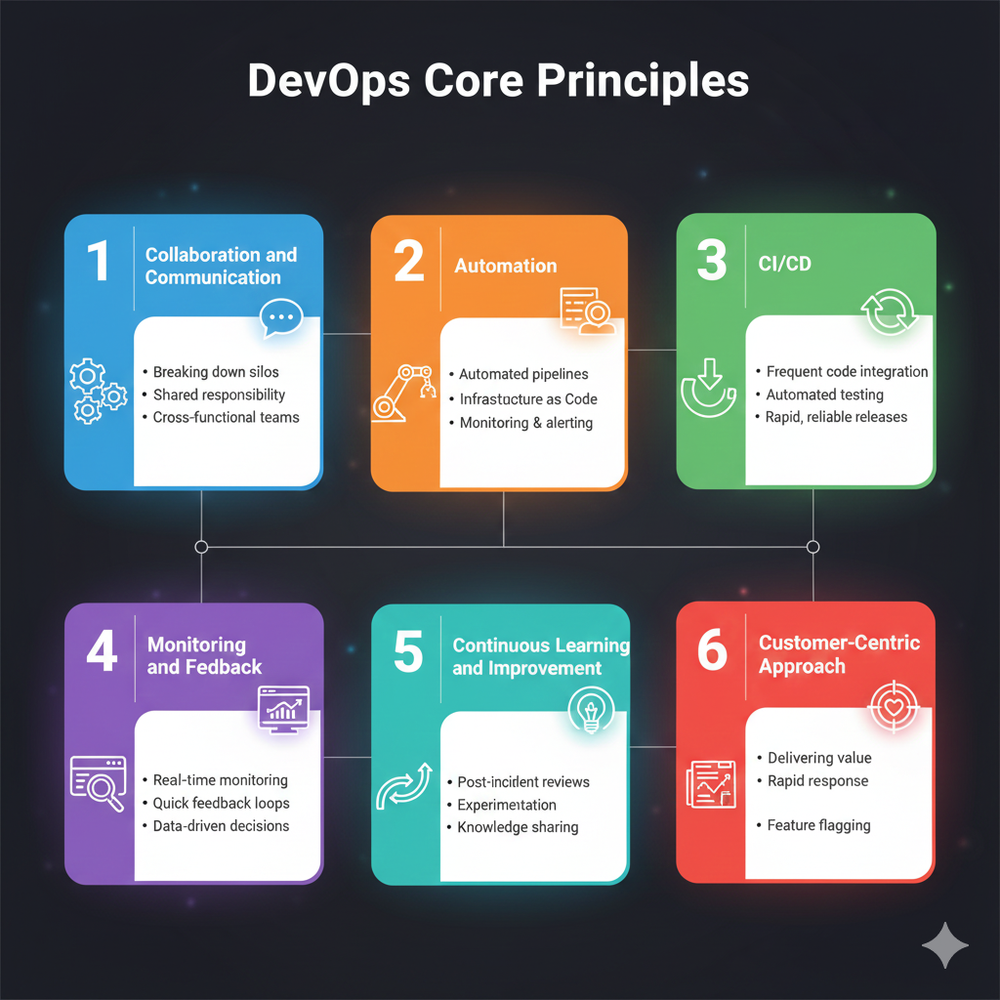

---

## DevOps Lifecycle

### The Infinite Loop Model
1. **Plan** - Requirements gathering, sprint planning, and backlog management
2. **Code** - Software development, version control, and code reviews
3. **Build** - Compilation, packaging, and artifact creation
4. **Test** - Automated testing, quality gates, and security scanning
5. **Release** - Release planning, approval workflows, and deployment preparation
6. **Deploy** - Automated deployment, blue-green deployments, and canary releases
7. **Operate** - Production monitoring, incident management, and capacity planning
8. **Monitor** - Performance tracking, logging analysis, and feedback collection

### Detailed Phase Breakdown

#### Plan Phase
- User story creation and backlog prioritization
- Sprint planning and capacity estimation
- Risk assessment and mitigation planning
- Architecture and design decisions

#### Code Phase
- Feature development and bug fixes
- Code reviews and pair programming
- Static code analysis and linting
- Documentation updates

#### Build Phase
- Automated compilation and packaging
- Dependency management and vulnerability scanning
- Artifact versioning and storage
- Build optimization and caching

#### Test Phase
- Unit testing and code coverage analysis
- Integration and API testing
- Performance and load testing
- Security and compliance testing

#### Release Phase
- Release notes and change documentation
- Approval workflows and sign-offs
- Environment preparation and validation
- Rollback planning and procedures

#### Deploy Phase
- Automated deployment pipelines
- Infrastructure provisioning
- Database migrations and updates
- Health checks and smoke tests

#### Operate Phase
- System monitoring and alerting
- Incident response and resolution
- Capacity management and scaling
- Backup and disaster recovery

#### Monitor Phase
- Application performance monitoring
- User experience tracking
- Business metrics analysis
- Feedback collection and analysis
- 
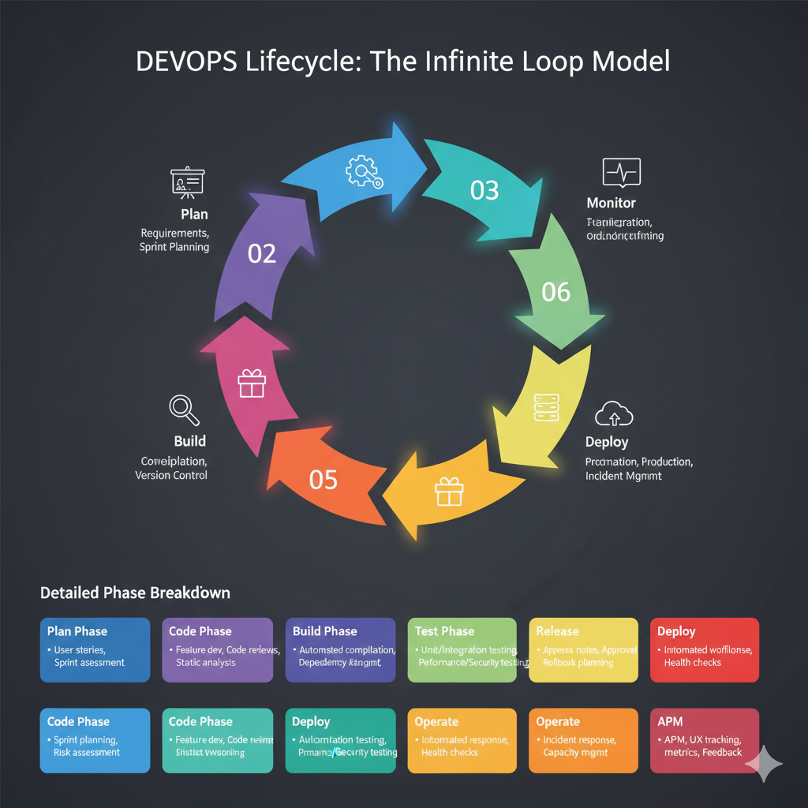
---

## Benefits

### For Organizations
- Faster time to market
- Improved software quality
- Reduced deployment failures
- Lower costs through automation
- Better customer satisfaction

### For Teams
- Improved collaboration
- Reduced manual work
- Faster problem resolution
- Increased deployment frequency
- Better work-life balance

### Quantifiable Benefits
- **Deployment Frequency**: Up to 200x more frequent deployments
- **Lead Time**: Reduced from months to hours or days
- **Recovery Time**: Faster mean time to recovery (MTTR)
- **Change Failure Rate**: Significantly lower failure rates
- **Employee Satisfaction**: Higher job satisfaction and retention

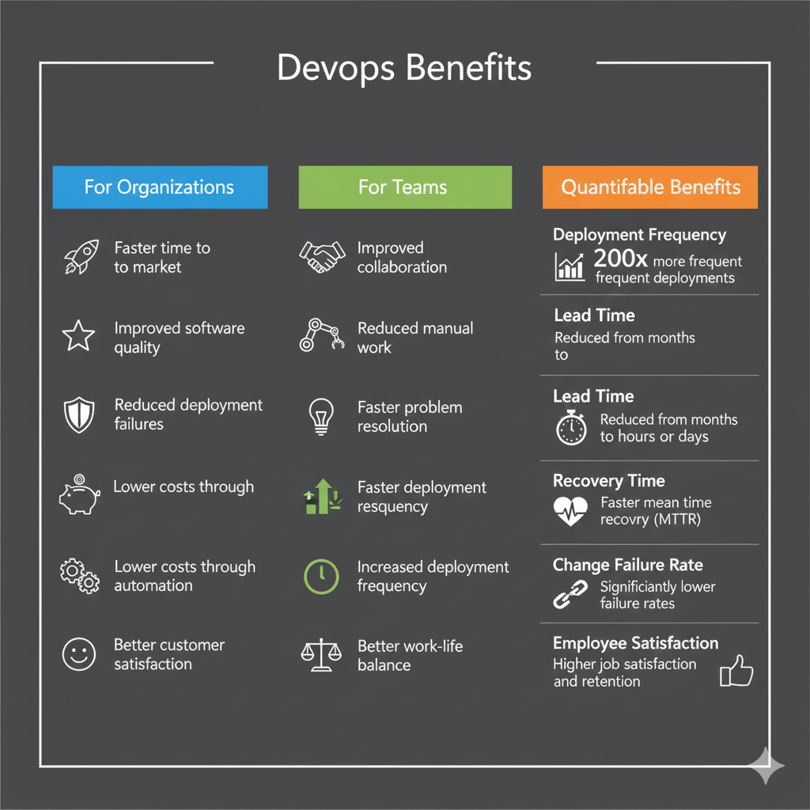

---

## Common Tools

### Version Control
- Git, GitHub, GitLab, Bitbucket

### CI/CD Platforms
- Jenkins, GitLab CI, GitHub Actions, Azure DevOps, CircleCI

### Configuration Management
- Ansible, Puppet, Chef, SaltStack

### Containerization
- Docker, Kubernetes, OpenShift

### Infrastructure as Code
- Terraform, CloudFormation, Pulumi

### Monitoring
- Prometheus, Grafana, ELK Stack, Datadog, New Relic

### Cloud Platforms
- AWS, Azure, Google Cloud Platform

### Security Tools
- SonarQube, Snyk, OWASP ZAP, Checkmarx

### Communication and Collaboration
- Slack, Microsoft Teams, Jira, Confluence

### Artifact Management
- Nexus, Artifactory, Docker Registry

### Testing Tools
- Selenium, JUnit, pytest, Postman, JMeter

### Database Management
- Flyway, Liquibase, MongoDB Atlas

### Service Mesh
- Istio, Linkerd, Consul Connect

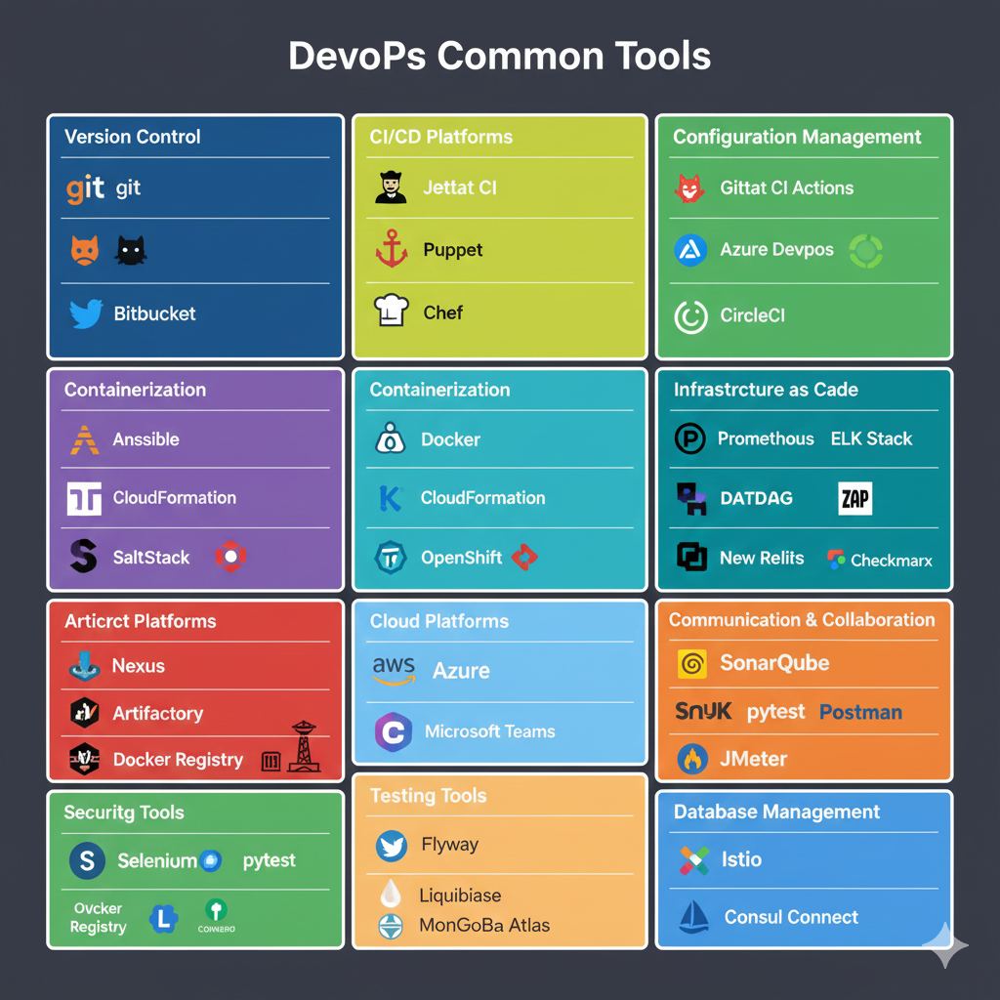

---
## DevOps vs Traditional IT

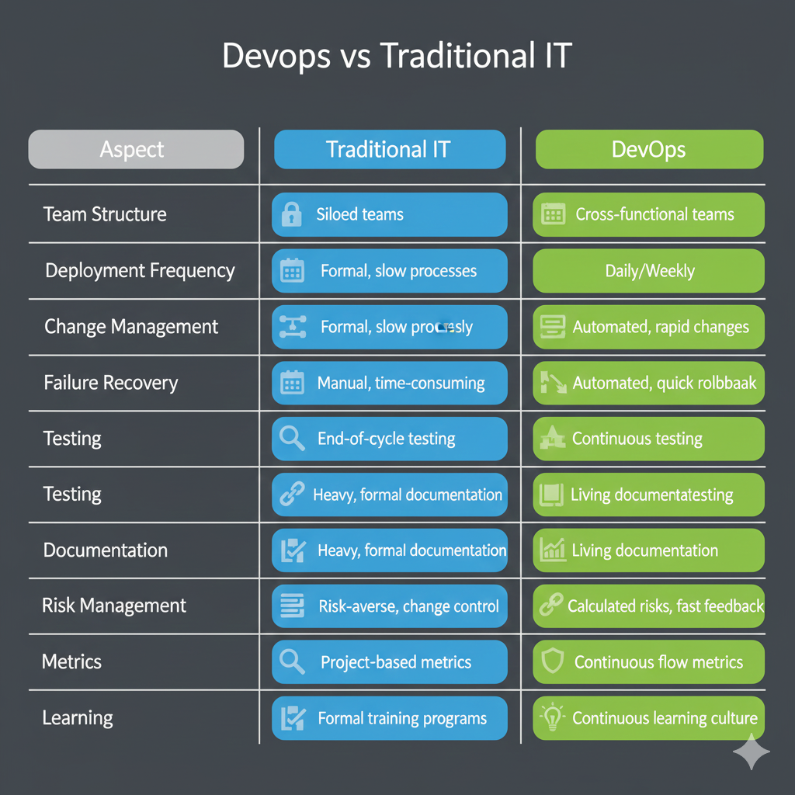

---

## Challenges and Solutions

### Common Challenges
- Cultural resistance to change
- Legacy system integration
- Security concerns
- Skill gaps in teams

### Solutions
- Gradual cultural transformation
- Incremental modernization approach
- DevSecOps integration
- Continuous learning and training

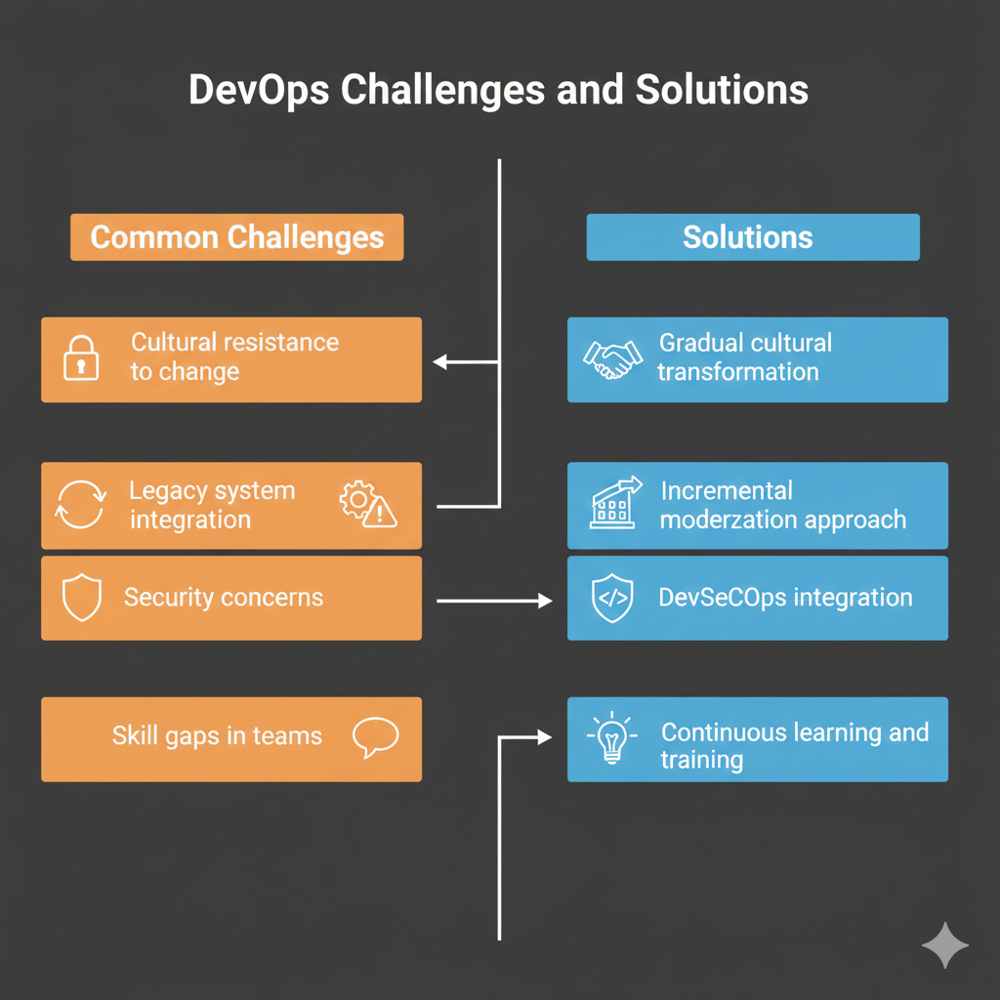

---

## DevOps Methodologies and Frameworks

### Agile and Scrum Integration
- Sprint-based development cycles
- Daily standups and retrospectives
- Cross-functional team collaboration
- Continuous improvement mindset

### Lean Principles
- Eliminate waste in processes
- Optimize the whole system
- Build quality in from the start
- Deliver fast with frequent feedback

### CALMS Framework
- **Culture**: Shared responsibility and collaboration
- **Automation**: Reduce manual processes
- **Lean**: Optimize flow and eliminate waste
- **Measurement**: Data-driven decisions
- **Sharing**: Knowledge and tool sharing

### Three Ways of DevOps
1. **Flow**: Optimize work flow from development to operations
2. **Feedback**: Create fast feedback loops
3. **Continuous Learning**: Foster experimentation and learning

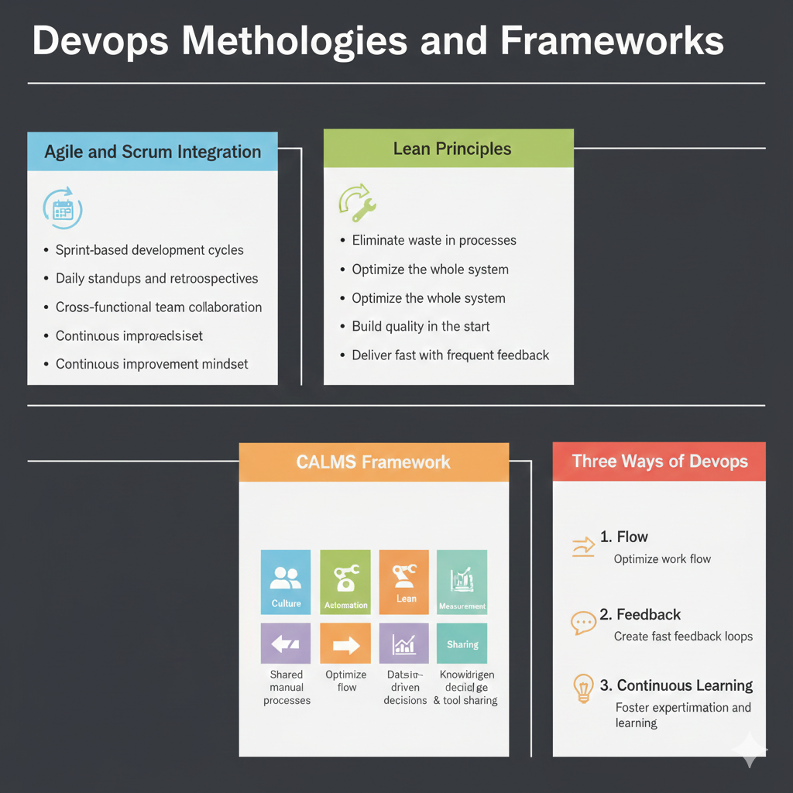

---

## Advanced DevOps Concepts

### GitOps
- Git as single source of truth for infrastructure and applications
- Declarative configuration management
- Automated synchronization between Git and production
- Pull-based deployment model

### Platform Engineering
- Internal developer platforms (IDPs)
- Self-service infrastructure provisioning
- Standardized development workflows
- Developer experience optimization

### Chaos Engineering
- Intentional failure injection
- System resilience testing
- Failure scenario planning
- Continuous reliability improvement

### Observability
- Three pillars: metrics, logs, and traces
- Distributed tracing for microservices
- Service level indicators (SLIs) and objectives (SLOs)
- Error budgets and reliability targets

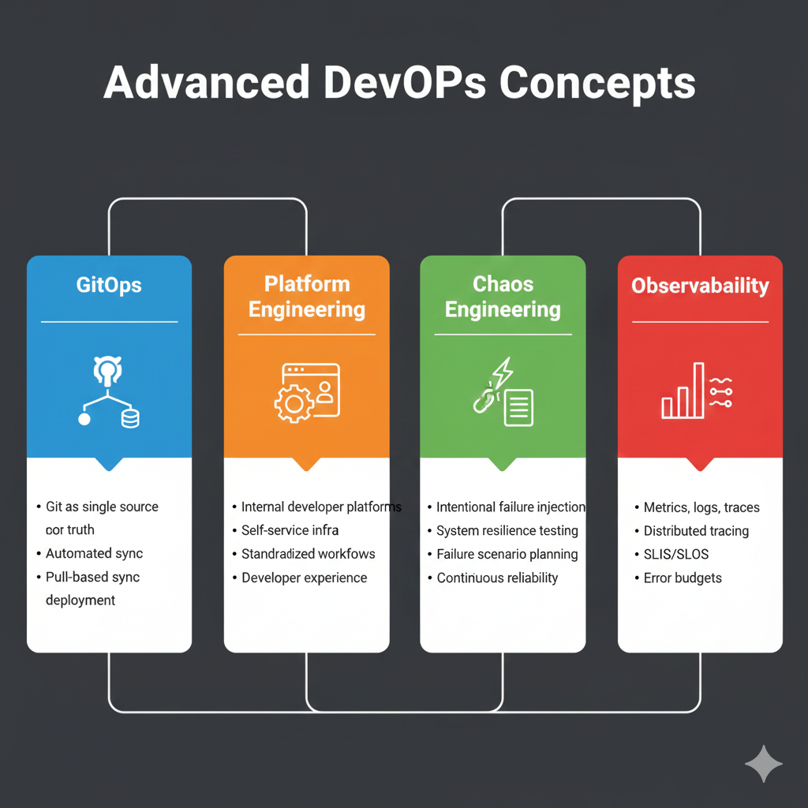

---

## Getting Started with DevOps

1. **Assess Current State** - Evaluate existing processes and tools
2. **Start Small** - Begin with pilot projects
3. **Automate Gradually** - Implement automation step by step
4. **Measure and Improve** - Use metrics to guide improvements
5. **Foster Culture** - Encourage collaboration and learning

## Metrics and KPIs

### Deployment Metrics
- Deployment frequency
- Lead time for changes
- Mean time to recovery (MTTR)
- Change failure rate

### Quality Metrics
- Code coverage
- Bug detection rate
- Customer satisfaction scores
- System uptime

### DORA Metrics (Four Key Metrics)
1. **Deployment Frequency**: How often code is deployed
2. **Lead Time for Changes**: Time from commit to production
3. **Change Failure Rate**: Percentage of deployments causing failures
4. **Time to Restore Service**: Time to recover from failures

### Business Metrics
- Revenue impact of releases
- Customer acquisition and retention
- Feature adoption rates
- Time to market for new features

### Operational Metrics
- Infrastructure utilization
- Cost per deployment
- Security incident frequency
- Compliance audit results

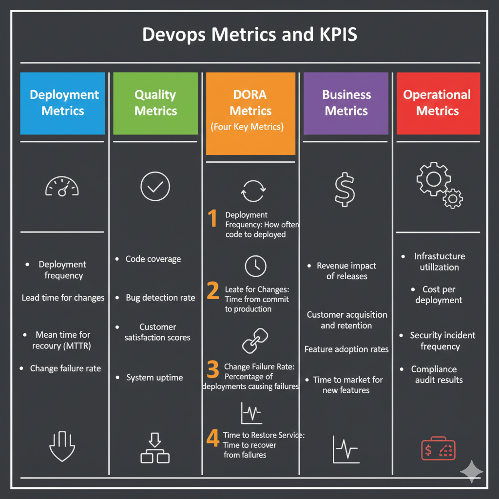

---

## DevOps Maturity Model

### Level 1: Initial
- Manual processes and ad-hoc deployments
- Siloed teams with limited collaboration
- Reactive approach to issues

### Level 2: Managed
- Basic automation and version control
- Some cross-team collaboration
- Defined processes and procedures

### Level 3: Defined
- Standardized CI/CD pipelines
- Infrastructure as Code adoption
- Proactive monitoring and alerting

### Level 4: Quantitatively Managed
- Metrics-driven decision making
- Advanced automation and orchestration
- Predictable and reliable processes

### Level 5: Optimizing
- Continuous improvement culture
- Innovation and experimentation
- Industry-leading practices

---

## DevOps Anti-patterns to Avoid

### Organizational Anti-patterns
- "DevOps Team" as a separate silo
- Treating DevOps as just tooling
- Ignoring cultural transformation
- Lack of executive support

### Technical Anti-patterns
- Manual deployment processes
- Shared mutable infrastructure
- Lack of automated testing
- Poor monitoring and observability

### Process Anti-patterns
- Waterfall development with DevOps tools
- Blame culture for failures
- Resistance to change
- Over-engineering solutions

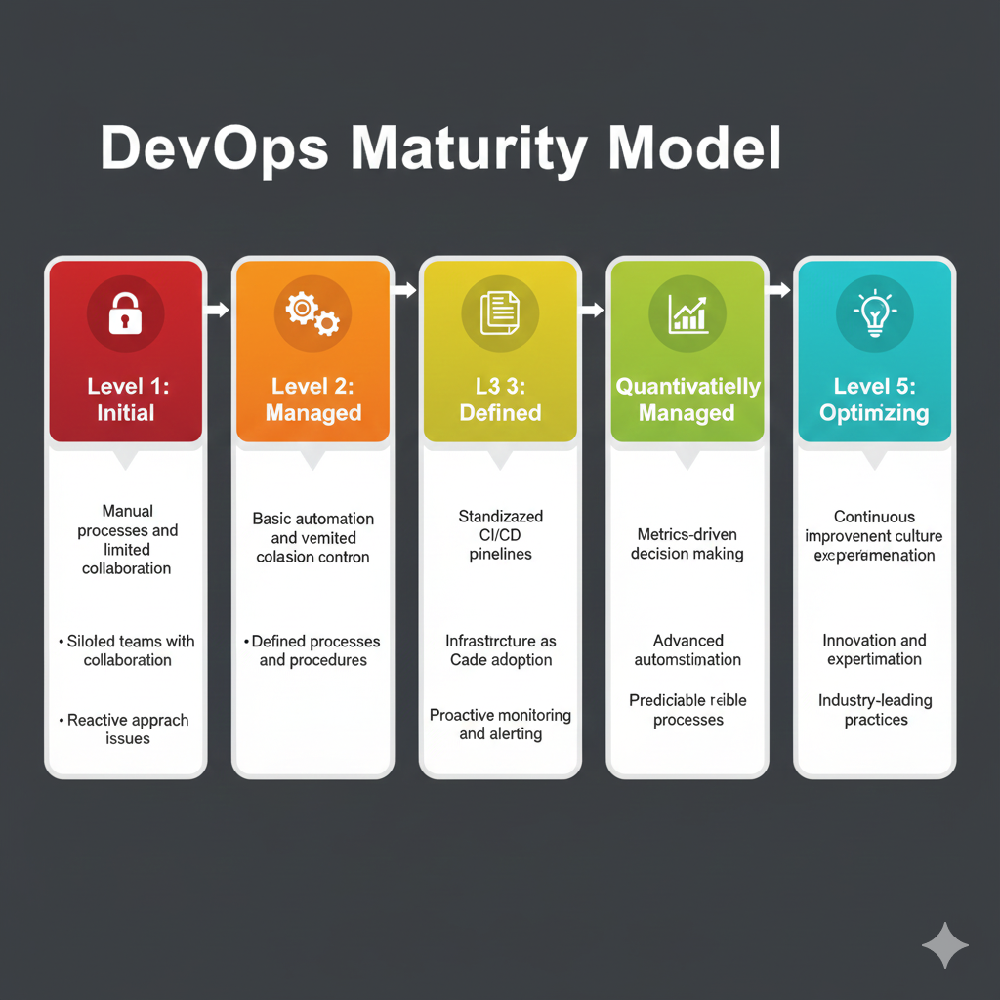

---

## Future of DevOps

### Emerging Trends
- **AI/ML Integration**: Intelligent automation and predictive analytics
- **Edge Computing**: Distributed deployment strategies
- **Serverless Architecture**: Function-as-a-Service (FaaS) adoption
- **Low-Code/No-Code**: Democratizing application development

### Industry Evolution
- Platform engineering as a discipline
- Developer experience (DevEx) focus
- Sustainability and green computing
- Quantum computing implications

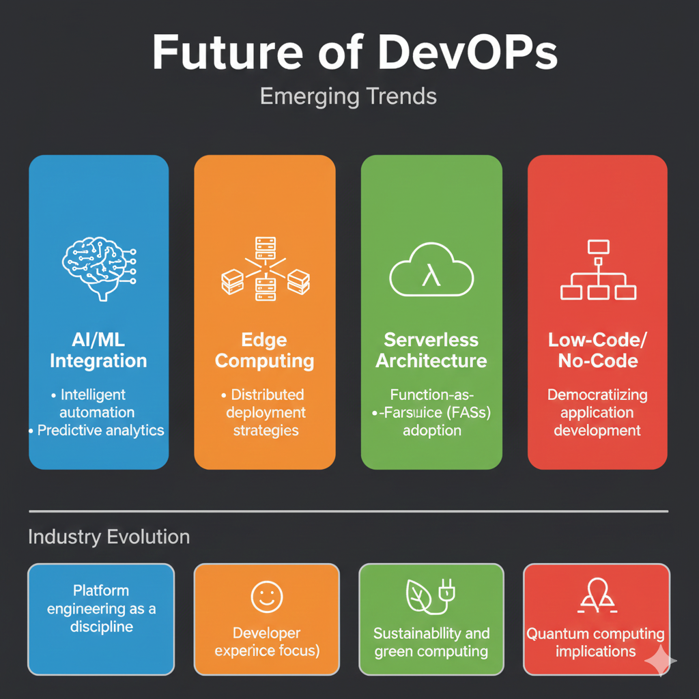

---

## Conclusion

DevOps represents a fundamental shift in how organizations develop, deploy, and operate software systems. It's not just about tools and technology; it's fundamentally about culture, collaboration, and continuous improvement. Success requires commitment from all levels of the organization and a willingness to embrace change, automation, and shared responsibility for software delivery and operations.

The journey to DevOps maturity is ongoing, requiring continuous learning, adaptation, and improvement. Organizations that successfully implement DevOps practices see significant improvements in deployment frequency, lead times, system reliability, and overall business outcomes.

As the technology landscape continues to evolve, DevOps principles remain constant: focus on flow, feedback, and continuous learning to deliver value to customers faster and more reliably than ever before.